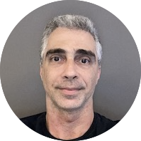

# Sobre o autor {-}

 

**Arthur de Sá Ferreira**

 

Obtive minha Graduação em Fisioterapia pela Universidade Federal do Rio de Janeiro (UFRJ, 1999), Formação em Acupuntura pela Academia Brasileira de Arte e Ciência Oriental (ABACO, 2001), Mestrado em Engenharia Biomédica pela Universidade Federal do Rio de Janeiro (UFRJ, 2002) e Doutorado em Engenharia Biomédica pela Universidade Federal do Rio de Janeiro (UFRJ, 2006).

Tenho experiência em docência no ensino superior, atuando com professor da graduação em cursos de Fisioterapia, Enfermagem e Odontologia, entre outros (2001-atual); pós-graduação lato sensu em Fisioterapia (2001-atual) e stricto sensu em Ciências da Reabilitação (2010-atual).

Sou professor adjunto do Centro Universitário Augusto Motta ([UNISUAM ](https://www.unisuam.edu.br)), pesquisador dos Programas de Pós-graduação em Ciências da Reabilitação ([PPGCR](https://www.unisuam.edu.br/programa-pos-graduacao-ciencias-da-reabilitacao)) e Desenvolvimento Local ([PPGDL](https://www.unisuam.edu.br/programa-pos-graduacao-desenvolvimento-local)) e Coordenador do Comitê de Ética em Pesquisa (CEP) (2020-atual).

Fundei o Laboratório de Simulação Computacional e Modelagem em Reabilitação (LSCMR), onde desenvolvo projetos de pesquisa principalmente nos seguintes temas: Bioestatística, Modelagem e simulação computacional, Processamento de sinais biomédicos, Movimento funcional humano, Medicina tradicional (chinesa), Distúrbios musculoesqueléticos, Doenças cardiovasculares e Doenças respiratórias.

Sou membro efetivo da Associação Brasileira de Pesquisa e Pós-Graduação em Fisioterapia ([ABRAPG-FT](https://abrapg-ft.org.br/portal/)) (2007-atual), Committee on Publication Ethics ([COPE](https://publicationethics.org)) (2018-atual), Consórcio Acadêmico Brasileiro de Saúde Integrativa ([CABSIN](https://cabsin.org.br)) (2019-atual) e Royal Statistical Society ([RSS](https://rss.org.uk)) (2021-atual).

Componho o corpo editoral dos periódicos internacionais e nacionais: [Scientific Reports](https://www.nature.com/srep/about/editors), [Frontiers in Rehabilitation Sciences](https://www.frontiersin.org/research-topics/26395/systemic-effects-and-disabilities-in-long-covid-syndrome-current-approaches-and-clinical-challenges), [Evidence-Based Complementary and Alternative Medicine](https://www.hindawi.com/journals/ecam/editors/), [Chinese Journal of Integrative Medicine](https://www.springer.com/journal/11655/editors), [Journal of Integrative Medicine](https://www.journals.elsevier.com/journal-of-integrative-medicine/editorial-board), [Fisioterapia e Pesquisa](https://www.scielo.br/journal/fp/about/#editors).

 

**Currículos externos**

<!--LATTES badge-->

  [&nbsp;5432142731317894](http://lattes.cnpq.br/5432142731317894) 

<!--ORCID badge-->

<a itemprop="sameAs" content="https://orcid.org/0000-0001-7014-2002" href="https://orcid.org/0000-0001-7014-2002" target="orcid.widget" rel="me noopener noreferrer" style="vertical-align:top;">0000-0001-7014-2002</a>

<!--PUBLONS badge-->

  [&nbsp;F-6831-2012](https://publons.com/researcher/F-6831-2012)</a>

