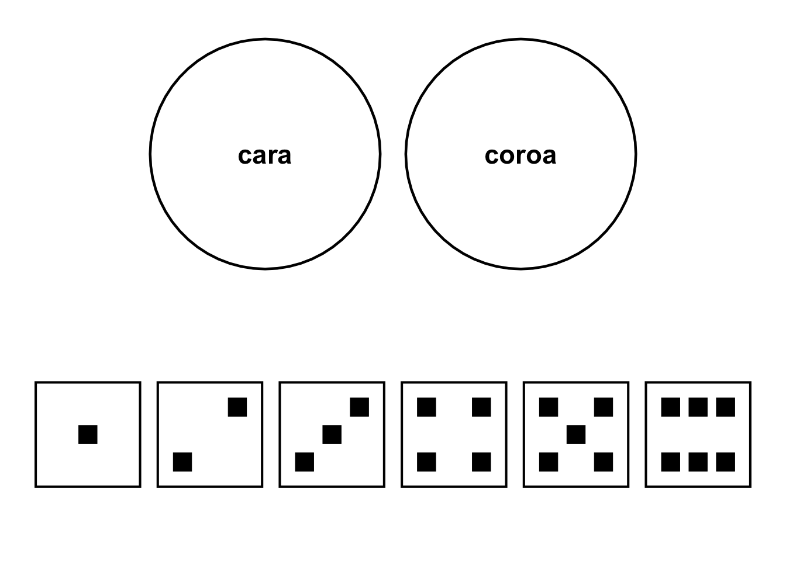
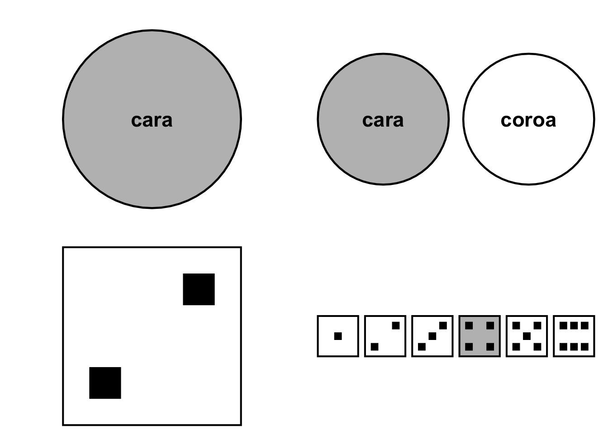
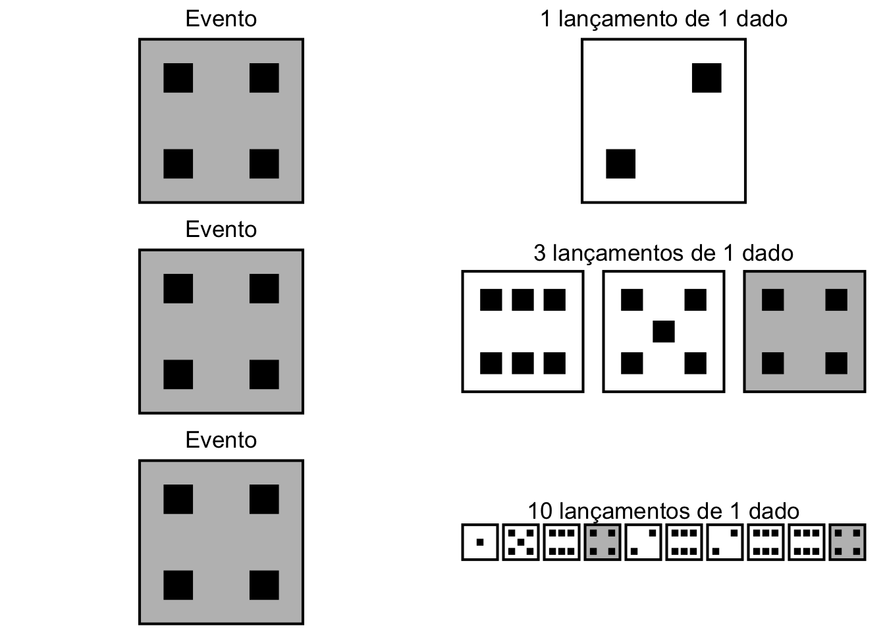
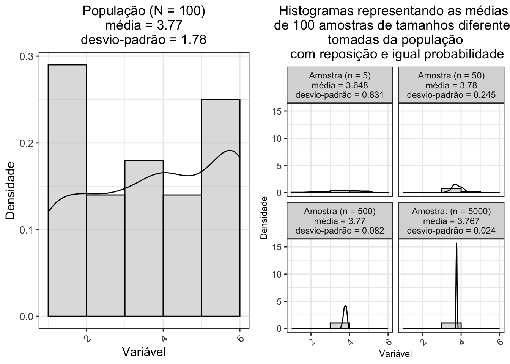
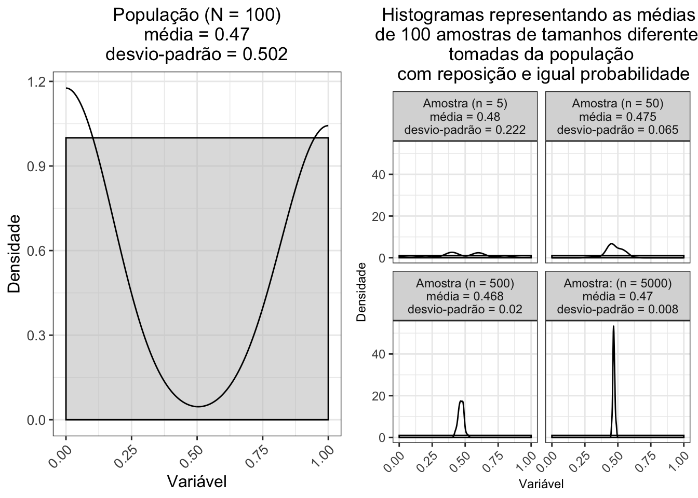
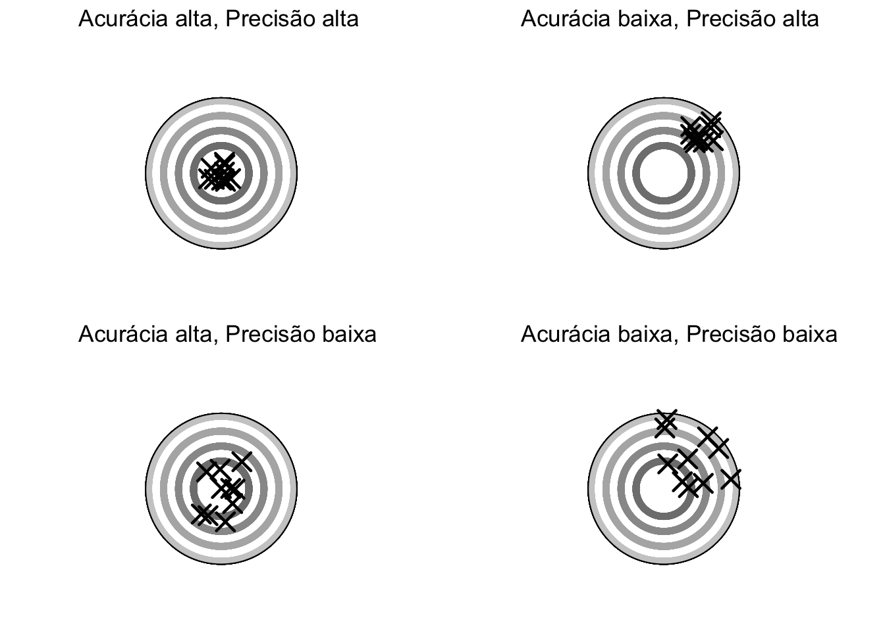
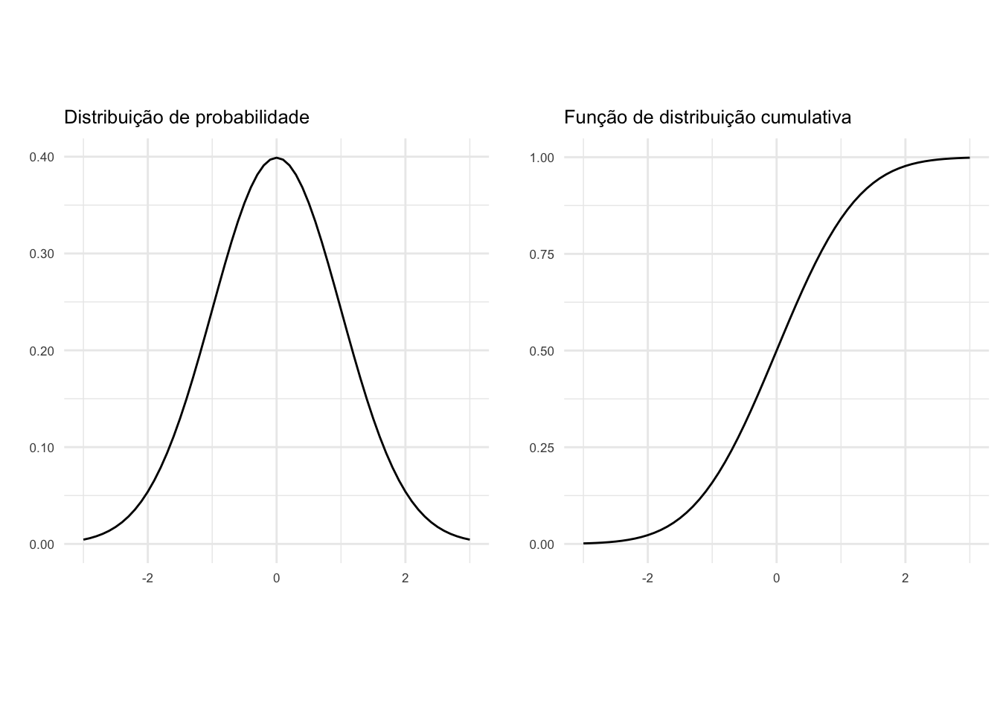
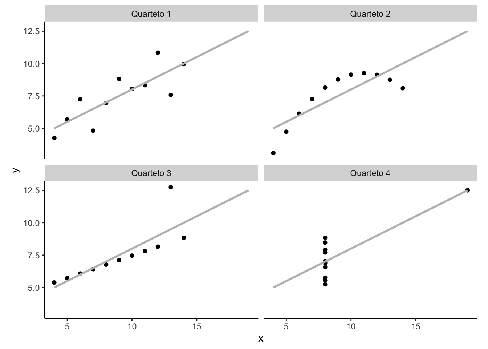

```{=latex}
\DisableFootNotes
```


# Capa {-}


<center>

</center>

```{=latex}
\clearpage
\markboth{}{}
```

<div class="boxBorder">

Ferreira, Arthur de Sá. **Ciência com R: Perguntas e respostas para pesquisadores e analistas de dados**. Rio de Janeiro: 1a edição, 2023. 192p. <a href="https://doi.org/10.5281/zenodo.8320232" style="vertical-align:middle;"></a>

</div>

```{=latex}
\vspace*{\fill}
```

<br>


<a rel="license" href="http://creativecommons.org/licenses/by-nc/4.0/"></a><br>A versão online desta obra está licenciada com uma Licença <a rel="license" href="http://creativecommons.org/licenses/by-nc/4.0/">Creative Commons Atribuição-NãoComercial 4.0 Internacional.</a><br><br><b>Ciência com R</b> por <b>Arthur de Sa Ferreira</b> está licenciada sob a <a rel="license" data-spdx="Apache-2.0></a>" href="https://www.apache.org/licenses/LICENSE-2.0">Apache License 2.0</a>.<br> Atualizado em 08/04/2024<br><br><center>[](https://hits.seeyoufarm.com)</center>

<!--chapter:end:index.Rmd-->

# Sobre o autor {.unnumbered}

```{=latex}
\markboth{}{}
```
<center>

 <br>

**Arthur de Sá Ferreira, DSc**

</center>

<br>

Obtive minha Graduação em Fisioterapia pela Universidade Federal do Rio de Janeiro (UFRJ, 1999), Formação em Acupuntura pela Academia Brasileira de Arte e Ciência Oriental (ABACO, 2001), Mestrado em Engenharia Biomédica pela Universidade Federal do Rio de Janeiro (UFRJ, 2002) e Doutorado em Engenharia Biomédica pela Universidade Federal do Rio de Janeiro (UFRJ, 2006).

Tenho experiência em docência no ensino superior, atuando com professor da graduação em cursos de Fisioterapia, Enfermagem e Odontologia, entre outros (2001-atual); pós-graduação lato sensu em Fisioterapia (2001-atual) e stricto sensu em Ciências da Reabilitação (2010-atual).

Sou professor adjunto do Centro Universitário Augusto Motta ([UNISUAM](https://www.unisuam.edu.br)), pesquisador dos Programas de Pós-graduação em Ciências da Reabilitação ([PPGCR](https://www.unisuam.edu.br/programa-pos-graduacao-ciencias-da-reabilitacao)) e Desenvolvimento Local ([PPGDL](https://www.unisuam.edu.br/programa-pos-graduacao-desenvolvimento-local)) e Coordenador do Comitê de Ética em Pesquisa (CEP) (2020-atual). Leciono as disciplinas Bioestatística I e II desde 2010 nesses Programas.

Fundei o Laboratório de Simulação Computacional e Modelagem em Reabilitação (LSCMR) em 2012, onde desenvolvo projetos de pesquisa principalmente nos seguintes temas: Bioestatística, Modelagem e simulação computacional, Processamento de sinais biomédicos, Movimento funcional humano, Medicina tradicional (chinesa), Distúrbios musculoesqueléticos, Doenças cardiovasculares e Doenças respiratórias.

Sou membro efetivo da Associação Brasileira de Pesquisa e Pós-Graduação em Fisioterapia ([ABRAPG-FT](https://abrapg-ft.org.br/portal/)) (2007-atual), Consórcio Acadêmico Brasileiro de Saúde Integrativa ([CABSIN](https://cabsin.org.br)) (2019-atual), Committee on Publication Ethics ([COPE](https://publicationethics.org)) (2018-atual) e Royal Statistical Society ([RSS](https://rss.org.uk)) (2021-atual).

Componho o corpo editorial e de revisores de periódicos nacionais e internacionais como [Scientific Reports](https://www.nature.com/srep/about/editors), [Frontiers in Rehabilitation Sciences](https://www.frontiersin.org/research-topics/26395/systemic-effects-and-disabilities-in-long-covid-syndrome-current-approaches-and-clinical-challenges), [Evidence-Based Complementary and Alternative Medicine](https://www.hindawi.com/journals/ecam/editors/), [Chinese Journal of Integrative Medicine](https://www.springer.com/journal/11655/editors), [Journal of Integrative Medicine](https://www.journals.elsevier.com/journal-of-integrative-medicine/editorial-board), [Fisioterapia e Pesquisa](https://www.scielo.br/journal/fp/about/#editors).

<br>

**Currículos externos**

<!--LATTES badge-->

<div>

 [ 5432142731317894](http://lattes.cnpq.br/5432142731317894)

</div>

<!--ORCID badge-->

::: {itemscope="" itemtype="https://schema.org/Person"}
<a itemprop="sameAs" content="https://orcid.org/0000-0001-7014-2002" href="https://orcid.org/0000-0001-7014-2002" target="orcid.widget" rel="me noopener noreferrer" style="vertical-align:top;">0000-0001-7014-2002</a>
:::

<!--Web of Science badge-->

<div>

<i class="ai ai-clarivate-square"></i> [ F-6831-2012](https://publons.com/researcher/F-6831-2012)</a>

</div>

<link rel="stylesheet" href="https://cdn.jsdelivr.net/gh/jpswalsh/academicons@1/css/academicons.min.css">

<!--chapter:end:rmd/autor.Rmd-->

# Dedicatória {-}

```{=latex}
\markboth{}{}
```

<br>

Esta obra é dedicada a todos que, em princípio, buscam conhecimento para melhorar a qualidade da pesquisa científica - seja a sua própria, a de colegas ou a de desconhecidos - mas, em última análise, desejam mesmo prover melhores condições de saúde e desenvolvimento da sociedade.

Dedico também ao leitor eventual que chegou aqui por acaso.

<br>

<!--chapter:end:rmd/dedicatoria.Rmd-->

# Agradecimentos {-}

```{=latex}
\markboth{}{}
```

<br>

Este trabalho não seria possível sem o apoio e suporte da minha esposa Daniele, minha irmã Mônica, meu pai José Victorino, minha mãe Angela (*in memoriam*) e meus filhos Giovanna, Victor e Lucas.

<br>

<!--chapter:end:rmd/agradecimentos.Rmd-->

# Prefácio {-}

```{=latex}
\markboth{}{}
```

<br>

No âmbito da análise estatística de dados, os processos envolvidos são marcados por uma série de escolhas críticas. Estas decisões abrangem considerações metodológicas e ações operacionais que moldam toda a jornada analítica. Deve-se selecionar, cuidadosamente, um delineamento de estudo para enfrentar os desafios únicos colocados por um projeto de pesquisa. Além disso, a escolha de métodos estatísticos adequados para lidar com os dados gerados pelo delineamento escolhido tem um peso importante. Estas decisões necessitam de uma base construída sobre as evidências mais convincentes da literatura existente e na adesão a práticas sólidas de investigação.

Interpretar os resultados destas análises não é uma tarefa simples. Confiar apenas na formação educacional convencional, no bom senso e na intuição para decifrar tabelas e gráficos pode revelar-se inadequado. Interpretações errôneas podem gerar consequências indesejáveis, incluindo a utilização de testes diagnósticos imprecisos ou o endosso de tratamentos ineficazes.

Este livro emerge do reconhecimento desses desafios.

A proposta gira em torno da organização de um compêndio abrangente de métodos e técnicas de ponta, para análise estatística de dados em pesquisa científica, apresentados em formato de perguntas e respostas. Esse formato promove um diálogo direto e objetivo com o leitor, respondendo a dúvidas comumente colocadas por alunos de graduação, pós-graduação, mestrado e doutorado, bem como por pesquisadores.

O objetivo geral de cada capítulo é elucidar as questões metodológicas fundamentais: *“O que é?”*, *“Por que usar?”*, *“Quando usar?”*, *“Quando não usar?”* e *“Como fazer?”*. Em cada capítulo, diversas questões específicas são propostas e respondidas sistematicamente, permitindo ao leitor uma melhor elaboração do conteúdo e resultado do seu trabalho.

Os capítulos foram organizados para seguir uma progressão de conceitos e aplicações. Embora sejam fragmentados para maior clareza instrucional, as referências cruzadas ajudam a mitigar a fragmentação do conteúdo e reforçar a interconexão dos tópicos.

O público-alvo compreende pesquisadores, professores, analistas de dados, profissionais e estudantes que regularmente lidam com a tomada de decisões em pesquisa. Os estudantes de pós-graduação encontrarão aqui uma obra repleta de exemplos para adaptar na análise dos dados de seus projetos de pesquisa. Professores de graduação e pós-graduação terão acesso a uma obra didática de referência, direcionada para seus alunos. Pesquisadores e analistas de dados iniciantes descobrirão um valioso acervo de informações e referências para a construção de projetos e manuscritos. Pesquisadores e os cientistas mais experientes podem recorrer às referências e esclarecimentos mais atuais sobre vieses, paradoxos, mitos e mal práticas em pesquisa. E mesmo os leitores não familiarizados ainda com as técnicas de análise de dados em pesquisa terão a oportunidade de apreciar o papel fundamental de colocar e responder suas perguntas na busca do conhecimento científico.

<br>

Arthur de Sá Ferreira, DSc

<br>

<!--chapter:end:rmd/prefacio.Rmd-->


```{=latex}
% normal chapter numbering and arabic page numbering
\mainmatter
```

```{=latex}
\cftaddtitleline{toc}{chapter}{\rule{\textwidth}{0.4pt}}{}
```

# *Parte 1 - Fundamentos* {-}

<!--script for generating HORIZONTAL LINE-->
<hr style="height:5px;border-width:0;color:black;background-color:black">

```{=latex}
\markboth{}{}
\par\noindent\rule{\textwidth}{0.05in}
```

```{=latex}
\EnableFootNotes
```

<!--chapter:end:rmd/parte-1.Rmd-->

# **Pensamento probabilístico** {#pensamento-probabilistico-cap}

<br>

## Experimento

<br>

### O que é um experimento?

-   Um experimento é um processo de simulação ou medição cujo resultado é chamado de desfecho.[@grami2023]

-   Tentativa se refere a uma repetição de um experimento aleatório.[@grami2023]

-   Em um experimento aleatório, o desfecho de cada tentativa é imprevisível.[@grami2023]

<br>

## Espaço amostral e eventos discretos {#espaco-eventos-discretos}

<br>

### O que é espaço amostral discreto?

-   O espaço amostral $S$ de um experimento aleatório é definido como o conjunto de todos os desfechos possíveis de um experimento.[@grami2023]

-   Em probabilidade discreta, o espaço amostral $S$ pode ser enumerado e contato.[@grami2023]

<br>

<div class="figure" style="text-align: center">

<p class="caption">(\#fig:espaco-amostral-dado)Exemplos de espaço amostral discreto. Superior: Todas as faces de uma moeda. Inferior: Todas as faces de um dado.</p>
</div>

<br>

### O que é evento discreto?

-   Um evento $E$ é um único desfecho ou uma coleção de desfechos.[@grami2023]

-   Um evento $E$ é um subconjunto do espaço amostral $S$ de um experimento.[@grami2023]

<br>

<div class="figure" style="text-align: center">

<p class="caption">(\#fig:evento-dado)Exemplos de evento de experimento. Superior: 1 lançamento de 1 moeda. Inferior: 1 lançamento de 1 dado.</p>
</div>

<br>

### O que é espaço de eventos discretos?

-   Um espaço de eventos $E_{s}$ também é um subconjunto do espaço amostral $S$ de um experimento.[@grami2023]

-   A união de dois eventos $E_{1} \cup E_{2}$ é o conjunto de todos os desfechos que estão em ambos.[@grami2023]

-   A intersecção de dois eventos $E_{1} \cap E_{2}$, ou evento conjunto, é o conjunto de todos os desfechos que estão em ambos os eventos.[@grami2023]

-   O complemento de um evento $E^C$ consiste em todos os desfechos que não estão incluídos no evento $E$.[@grami2023]

<br>

<div class="figure" style="text-align: center">

<p class="caption">(\#fig:espaco-eventos-dado)Espaço de eventos: União dos eventos face = 3 e face = 4 de um dado.</p>
</div>

<br>

## Espaço amostral e eventos contínuos {#espacos-eventos-continuos}

<br>

### O que é espaço amostral contínuo?

-   .[REF]

<br>

### O que é evento contínuo?

-   .[REF]

<br>

### O que é espaço de eventos contínuo?

-   .[REF]

<br>

## Probabilidade {#probabilidade}

<br>

### O que é probabilidade?

-   Com um espaço amostral $S$ finito e não vazio de desfechos igualmente prováveis, a probabilidade $P$ de um evento $E$ é a razão entre o número de desfechos no evento $E$ e o número de desfechos no espaço amostral $S$.[@grami2023]

-   Um evento $E$ impossível não contém um desfecho e, portanto, nunca ocorre: $P(E)=0$.[@Viti2015; @grami2023]

-   Um evento $E$ é certo consiste em qualquer um dos desfechos possíveis e, portanto, sempre ocorre: $P(E)=1$.[@grami2023]

<br>

### Quais são os axiomas da probabilidade?

-   A probabilidade de um evento é um número real que satisfaz os seguintes axiomas descritos por Andrei Nikolaevich Kolmogorov em 1950:[@Viti2015; @grami2023]

    -   Axioma I. Probabilidades de um evento $E$ são números não-negativos: $P(E)≥0$.

    -   Axioma II. Probabilidade de todos os eventos do espaço amostral $A$ ocorrerem é 100%: $P(S)=1$.

    -   Axioma III. A probabilidade de um conjunto *k* de eventos mutuamente exclusivos é igual a soma da probabilidade de cada evento: $P(E_{1} \cup E_{2} \cup ... E_{k}) = P(E_{1}) + P(E_{2}) + ... + P(E_{k})$.

-   Os axiomas possuem as seguintes consequências:[@grami2023]

    -   A soma da probabilidade de dois eventos que dividem o espaço amostral é 100%: $P(E)+P(E)^C=1$.

    -   O valor máximo de probabilidade de um evento é 100%: $P(S)≤1$.

    -   A probabilidade é uma função não decrescente do número de desfechos de um evento.

<br>

## Independência e probabilidade {#independencia-probabilidade}

<br>

### O que é independência em estatística?

-   Em experimentos aleatórios, é comum assumir que os eventos de tentativas separadas são independentes devido a independência física de eventos e experimentos.[@grami2023]

-   Se a ocorrência do evento $E_{1}$ não tiver efeito na ocorrência do evento $E_{2}$, os eventos $E_{1}$ e $E_{2}$ são considerados estatisticamente independentes.

-   Eventos são mutuamente exclusivos, ou disjuntos, se a ocorrência de um exclui a ocorrência dos outros.[@grami2023]

-   Se dois eventos $E_{1}$ e $E_{2}$ são mutuamente exclusivos, então os eventos $E_{1}$ e $E_{2}$ não podem ocorrer ao mesmo tempo e, portanto, são eventos dependentes.

-   Em experimentos independentes, o desfecho de uma tentativa é independente dos desfechos de outras tentativas, passadas e/ou futuras. Uma tentativa em um experimento aleatório é independente se a probabilidade de cada desfecho possível não mudar de tentativa para tentativa.[@grami2023]

<br>

<div class="figure" style="text-align: center">

<p class="caption">(\#fig:independencia-dado)Esquerda: Evento (face = 4). Direita: Experimentos de 1 lançamento de 1 dado (superior), 3 lançamentos de 1 dado (central), 10 lançamentos de 1 dado (inferior).</p>
</div>

<br>

### O que é probabilidade marginal?

-   Probabilidade marginal é a probabilidade de ocorrência de um evento $E$ independentemente da(s) probabilidade(s) de outro(s) evento(s).[@grami2023]

<br>

### O que é probabilidade conjunta?

-   Probabilidade conjunta é a probabilidade de ocorrência de dois ou mais eventos independentes $E_{1}$, $E_{2}$, ..., $E_{k}$, independentemente da(s) probabilidade(s) de outro(s) evento(s).[@grami2023]

-   Se a probabilidade conjunta dos eventos é nula ($E_{1} \cup E_{2} = 0$), esses dois eventos $E_{1}$ e $E_{2}$ são mutuamente exclusivos ou disjuntos.[@grami2023]

<br>

### O que é probabilidade condicional?

-   Probabilidade condicional é a probabilidade de ocorrência do evento $E_{2}$ quando se sabe que o evento $E_{1}$ já ocorreu $P(E_{2} | E_{1})$.[@grami2023]

-   A probabilidade condicional $P(E_{2} | E_{1})$ representa que a ocorrência do evento $E_{1}$ fornece informação sobre a ocorrência do evento $E_{2}$.[@grami2023]

-   Se a ocorrência do evento $E_{1}$ tiver alguma influência na ocorrência do evento $E_{2}$, então a probabilidade condicional do evento $E_{2}$ dado o evento $E_{1}$ pode ser maior ou menor do que a probabilidade marginal.[@grami2023]

<br>

## Leis dos números anômalos {#lei-numeros-anomals}

<br>

### O que é a lei dos números anômalos?

-   A lei dos números anômalos - lei de Benford - é uma distribuição de probabilidade que descreve a frequência de ocorrência do primeiro dígito em muitos conjuntos de dados do mundo real.[REF]

<br>

## Leis dos pequenos números {#lei-pequenos-numeros}

<br>

### O que é a lei dos pequenos números?

-   A crença exagerada na probabilidade de replicar com sucesso os achados de um estudo, pela tendência de se considerar uma amostra como representativa da população.[@tversky1971]

-   A crença na lei dos pequenos números se refere à tendência de superestimar a estabilidade das estimativas provenientes de estudos com amostras pequenas.[@bishop2022]

-   Quando se percebe um padrão, pode não ser possível identificar se tal padrão é real.[@guy1988]

<br>

### Quais são as versões da lei dos pequenos números?

-   1a Lei Forte dos Pequenos Números: "Não há pequenos números suficientes para atender às muitas demandas que lhes são feitas".[@guy1988]

-   2a Lei Forte dos Pequenos Números: "Quando dois números parecem iguais, não são necessariamente assim".[@guy1990]

<br>

## Leis dos grandes números {#lei-grandes-numeros}

<br>

### O que é a lei dos grandes números?

-   A lei dos grandes números descreve que, ao realizar o mesmo experimento $E$ um grande número de vezes ($n$), a média $\mu$ dos resultados obtidos tende a se aproximar do valor esperado $E[\bar{X}]$ à medida que mais experimentos forem realizados ($n \to \infty$).[REF]

-   De acordo com a lei dos grandes números, a média amostral converge para a média populacional à medida que o tamanho da amostra aumenta.[REF]

<br>

### Quais são as versões da lei dos grandes números?

-   Lei Fraca dos Grandes Números (de Poisson): "".[REF]

-   Lei Fraca dos Grandes Números (de Bernoulli): "".[REF]

-   Lei Forte dos Grandes Números: "".[REF]

<br>

## Teorema central do limite {#teorema-central-limite}

<br>

### O que é teorema central do limite?

-   O teorema central do limite - equação \@ref(eq:central-limit-theorem) - afirma que, para uma amostra aleatória de tamanho $n$ de uma população com valor esperado igual à média $E[\bar{X_{i}}] = \mu$ e variância $Var[\bar{X_{i}}]$ igual a $\sigma^{2}$, a distribuição amostral da média de uma variável $\bar{X}$ se aproxima de uma distribuição normal $N$ com média $\mu$ e variância $\sigma^{2}/n$ à medida que $n$ aumenta ($n \to \infty$):[@kwak2017]

<br>

```{=tex}
\begin{equation}
(\#eq:central-limit-theorem)
\sqrt{n}(\bar{X} - \mu) \xrightarrow{n \to \infty} N(0, \sigma^2)
\end{equation}
```
<br>

-   O teorema central do limite demonstra que se o tamanho da amostra $n$ for suficientemente grande, a distribuição amostral das médias obtidas utilizando reamostragem com substituição será aproximadamente normal, com média $\mu$ e variância $\sigma^{2}/n$, independentemente da distribuição da população.[@kwak2017]


-   No exemplo abaixo, uma variável aleatória numérica com distribuição uniforme no espaço amostral $S=[18;65]$ tem média $\mu$ = 38.53 e variância $\sigma^{2}$ = 172.433. A distribuição amostral da média de 100 amostras de tamanho 5, 50, 500 e 5000 tomadas da população com reposição e igual probabilidade se aproxima de uma distribuição normal com média $\mu$ = 38.493 e variância $\sigma^{2}$ = 0.038, independentemente da distribuição da população:

<br>

<div class="figure" style="text-align: center">

<p class="caption">(\#fig:teorema-central-limite-continua-plot)Esquerda: Histogramas de uma variável aleatória com distribuição uniforme (N = 100). Direita: Histogramas da média de 100 amostras de tamanhos 5, 50, 500 e 5000 tomadas da população com reposição e igual probabilidade.</p>
</div>


<br>

-   Em outro exemplo, o lançamento de um dado com distribuição uniforme no espaço amostral $S=\{1,2,3,4,5,6\}$ tem média $\mu$ = 3.77 e variância $\sigma^{2}$ = 3.169. A distribuição amostral da média de 100 amostras de tamanho 5, 50, 500 e 5000 tomadas da população com reposição e igual probabilidade se aproxima de uma distribuição normal com média $\mu$ = 3.767 e variância $\sigma^{2}$ = 0.001, independentemente da distribuição da população:

<br>

<div class="figure" style="text-align: center">

<p class="caption">(\#fig:teorema-central-limite-dado-plot)Esquerda: Histogramas de lançament de 1 dado com distribuição uniforme (N = 100). Direita: Histogramas da média de 100 amostras de tamanhos 5, 50, 500 e 5000 tomadas da população com reposição e igual probabilidade.</p>
</div>


<br>

-   Mais um exemplo, o lançamento de uma moeda com distribuição uniforme no espaço amostral $S=\{0,1\}$ --- codificado para $sucesso = 1$ e $insucesso = 0$ --- tem média $\mu$ = 0.49 e variância $\sigma^{2}$ = 0.252. A distribuição amostral da média de 100 amostras de tamanho 5, 50, 500 e 5000 tomadas da população com reposição e igual probabilidade se aproxima de uma distribuição normal com média $\mu$ = 0.49 e variância $\sigma^{2}$ = 0, independentemente da distribuição da população:

<br>

<div class="figure" style="text-align: center">

<p class="caption">(\#fig:teorema-central-limite-moeda-plot)Esquerda: Histogramas de lançament de 1 moeda com distribuição uniforme (N = 100). Direita: Histogramas da média de 100 amostras de tamanhos 5, 50, 500 e 5000 tomadas da população com reposição e igual probabilidade.</p>
</div>

<br>

### Quais as condições de validade do teorema central do limite?

-   As condições de validade do teorema central do limite são:[@kwak2017]

    -   As variáveis aleatórias devem ser independentes e identicamente distribuídas (*independent and identically distributed* ou i.i.d.);

    -   As variáveis aleatórias devem ter média $\mu$ e variância $\sigma^{2}$ finitas;

    -   O tamanho da amostra deve ser suficientemente grande (geralmente, $n \geq 30$).

<br>

### Qual a relação entre a lei dos grandes números e o teorema central do limite?

-   A lei dos grandes números é um precursor do teorema central do limite, pois estabelece que a média da amostra se torna cada vez mais próxima da média populacional (isto é, mais representativa) à medida que o tamanho da amostra aumenta, e o teorema central do limite demonstra que o a distribuição da soma das variáveis aleatórias se aproxima de uma distribuição normal também à medida que o tamanho da amostra aumenta.[REF]

<br>

### Qual a relevância do teorema central do limite para a análise estatística?

-   O teorema central do limite explica porque os testes paramétricos têm maior poder estatístico do que os testes não paramétricos, os quais não requerem suposições de distribuição de probabilidade.[@kwak2017]

-   O teorema central do limite implica que os métodos estatísticos que se aplicam a distibuições normais podem ser aplicados a outras distribuições quando suas suposições são satisfeitas.[@kwak2017]

-   Como o teorema central do limite determina a distribuição amostral $Z$ - equação \@ref(eq:central-limit-theorem-z) - das médias com tamanho amostral suficientemente grande, a média pode ser padronizada para uma distribuição normal com média 0 e variância 1, $N(0,1)$:[@kwak2017]

<br>

```{=tex}
\begin{equation}
(\#eq:central-limit-theorem-z)
Z = \frac{\bar{X} - \mu}{\sigma / \sqrt{n}}
\end{equation}
```
<br>

-   Para amostras com $n \geq 30$, a distribuição amostral Student-*t* se aproxima da distribuição normal padrão $Z$ e, portanto, as suposições sobre a distribuição populacional não são mais necessárias de acordo com o teorema central do limite. Neste cenário, a suposição de distribuição normal pode ser usada para a distribuição de probabilidade.[@kwak2017]

<br>

## Regressão para a média {#regressao-media}

<br>

### O que é regressão para a média?

-   Regressão para a média[@galton1886] é um fenômeno estatístico que ocorre quando uma variável aleatória $X$ é medida na mesma unidade de análise em dois ou mais momentos diferentes, $X_{1}$, $X_{2}$, ..., $X_{t}$ e $X_{t}$ é mais próximo da média populacional do que $X_{1}$, ou seja, $E(X_{t})$ é mais próxima de $E(X)$ do que $E(X_{1})$ é de $E(X)$.[@barnett2004]

-   Regressão para a média pode ocorem em qualquer pesquisa cujo delineamento envolva medidas repetidas.[@senn2011]

-   Em medidas repetidas, a média de várias observações é mais próxima da média verdadeira do que qualquer observação individual, pois o erro aleatório é reduzido pela média.[@barnett2004]

-   Valores extremos - em direção ao mínimo ou máximo - em uma medição inicial tendem a ser seguidos por valores mais próximos da média (valor real) na medição subsequente.[@barnett2004]

-   O valor real - sem erros aleatório ou sistemático - em geral não é conhecido, mas pode ser estimado pela média de várias observações. A média de várias observações é mais próxima da média verdadeira do que qualquer observação individual, pois o erro aleatório é reduzido pela média.[@barnett2004]


-   No exemplo abaixo, a 2a medida (dado 2 = 121) é mais próxima da média (valor real = 120) do que a 1a medida (dado 1 = 118):

<br>

<div class="figure" style="text-align: center">

<p class="caption">(\#fig:regressao-media-plot)Representação gráfica da regressão para a média em medidas repetidas. A segunda medida (dado 2) é mais próxima da média (valor real) do que a primeira medida (dado 1).</p>
</div>

<br>

### Qual a causa da regressão para a média?

-   A regressão para a média pode ser atribuída ao erro aleatório, que é a variação não sistemática nos valores observados em torno de uma média verdadeira (por exemplo, erro de medição aleatório ou variações aleatórias em um participante).[@barnett2004]

-   Regrssão para a média é uma consequência da observação de que dados extremos não se repetem com frequência (isto é, em média).[@senn2011]

-   Deve-se assumir que a regressão para a média ocorreu até que os dados mostrem o contrário.[@barnett2004]

<br>

### Por que detectar o fenômeno de regressão para a média?

-   A regressão para a média pode levar a conclusões errôneas sobre a eficácia de uma intervenção, pois a mudança observada pode ser devida ao erro aleatório e não ao tratamento.[@senn2011]

<br>

### Com detectar o fenômeno de regressão para a média?

-   O fenômeno de regressão para a média pode ser detectado por meio de gráfico de dispersão da diferença (estudos transversais) ou mudança (estudos longitudinais) versus os valores da 1a medida.[@barnett2004]

<br>

::: {.infobox .Rlogo data-latex="{images/Rlogo}"}
O pacote *regtomean*[@regtomean] fornece as funções [*cordata*](https://www.rdocumentation.org/packages/regtomean/versions/1.1/topics/cordata) para calcular a correlação entre medidas tipo antes--e-depois e [*meechua_reg*](https://www.rdocumentation.org/packages/regtomean/versions/1.1/topics/meechua_reg) para ajustar modelos lineares de regressão.
:::

<br>

### Como o fenômeno de regressão para a média pode ser evitado?

-   Aloque os participantes de modo aleatório nos grupos de tratamento e controle pode reduzir o fenômeno de regressão para a média.[@barnett2004]

-   Selecine participantes com base em medidas repetidas ao invés de medidas únicas.[@barnett2004]

<br>

<!--chapter:end:rmd/pensamento-probabilistico.Rmd-->

# **Pensamento estatístico** {#pensamento-estatistico-cap}

<br>

## População {#populacao}

<br>

### O que é população?

-   População - ou população-alvo - refere-se ao conjunto completo sobre o qual se pretende obter informações.[@Banerjee2010]

-   População é metodologicamente delimitada pelos critérios de inclusão e exclusão do estudo.[@Banerjee2010]

-   Em estudos observacionais, inicialmente as características geográficas e/ou demográficas, por exemplo, definem a população a ser estudada.[@Banerjee2010]

-   Em estudos analíticos, a população é inicialmente definida pelos objetivos da pesquisa e, posteriormente, as observações são realizadas na amostra.[@Banerjee2010]

<br>

## Amostra {#amostra}

<br>

### O que é amostra?

-   Amostra é uma parte finita da população do estudo.[@Banerjee2010]

-   Em pesquisa científica, utilizam-se dados de uma amostra de participantes (ou outras unidades de análise) para realizar inferências sobre a população.[@Bland2015]

<br>

### Por que usar dados de amostras?

-   Dados de uma amostra de tamanho suficiente e características representativas podem ser utilizados para inferência sobre uma população.[@kwak2017]

- Em geral, amostras de tamanhos maiores possuem médias mais próximas da média populacional e menores variâncias.[@kwak2017]

<br>

## Unidade de análise {#unidade-analise}

<br>

### O que é unidade de análise?

-   A unidade de análise (ou unidade experimental) de pesquisas na área de saúde geralmente é o indivíduo.[@Altman1997]

-   A unidade de análise também pode ser a instituição em estudos multicêntricos (ex.: hospitais, clínicas) ou um estudo publicado em meta-análise (ex.: ensaios clínicos).[@Altman1997]

<br>

### Por que identificar a unidade de análise de um estudo?

-   É fundamental identificar corretamente a unidade de análise para evitar inflação do tamanho da amostra (ex.: medidas bilaterais resultando em o dobro de participantes), violações de suposições dos testes de hipótese (ex.: independência entre medidas e/ou unidade de análise) e resultados espúrios em testes de hipótese (ex.: P-valores menores que aqueles observados se a amostra não estivesse inflada).[@Altman1997; @Matthews1990]

<br>

### Que medidas podem ser obtidas da unidade de análise de um estudo?

-   Da unidade de análise podem ser coletadas informações em medidas únicas, repetidas, seriadas ou múltiplas.

<br>

## Amostragem {#amostragem}

<br>

### O que é amostragem?

-   .[REF]

<br>

### Quais métodos de amostragem são usados para obter uma amostra da população?

-   O método de amostragem é geralmente definido pelas condições de viabilidade do estudo, no que diz respeito a acesso aos participantes, ao tempo de execução e aos custos envolvidos, entre outras.[@Banerjee2010]

-   Não-probabilísticas ou intencionais:[@Banerjee2010]

    -   Bola de neve.

    -   Conveniência.

    -   Participantes encaminhados

-   Probabilísticas:[@Banerjee2010]

    -   Simples.

    -   Sistemática.

    -   Multiestágio.

    -   Estratificada.

    -   Agregada.

<br>

### O que é erro de amostragem?

-   .[REF]

<br>

## Reamostragem {#reamostragem}

<br>

### O que é reamostragem?

-   Reamostragem é um procedimento que cria vários conjuntos de dados sorteados a partir de um conjunto de dados real - a amostra da população - sem a necessidade de fazer suposições sobre os dados e suas distribuições.[@Bland2015]

-   O procedimento é repetido várias vezes para usar a variabilidade dos resultados para obter um intervalo de confiança do parâmetro.[@Bland2015]

<br>

### Por que utilizar reamostragem?

-   Quando se dispõe de dados de apenas 1 amostra, as diversas suposições que são feitas podem não ser atingidas.[@Bland2015]

-   Procedimentos de reamostragem produzem um conjunto de observações escolhidas aleatoriamente da amostra, igualmente representativo da população original.[@Bland2015]

-   Procedimentos de reamostragem permitem estimar o erro-padrão e intervalos de confiança sem a necessidade de tais suposições, sendo, portanto, um conjunto de procedimentos não-paramétricos.[@Bland2015]

<br>

### Quais procedimentos de reamostragem podem ser realizados?

-   *Bootstrap*: Cada iteração gera uma amostra *bootstrap* do mesmo tamanho do conjunto de dados original escolhendo aleatoriamente observações reais, uma de cada vez. Cada observação tem chances iguais de ser escolhida a cada vez, portanto, algumas observações serão escolhidas mais de uma vez e outras nem serão escolhidas.[@Bland2015]

<br>

## Subamostragem e superamostragem {#subamostragem-superamostragem}

<br>

### O que é subamostragem?

-   .[REF]

<br>

### O que é superamostragem?

-  .[REF]

<br>

<!--chapter:end:rmd/pensamento-estatistico.Rmd-->

# **Pensamento metodológico** {#pensamento-metodologico-cap}

<br>

## Metodologia da pesquisa

<br>

### O que é metodologia da pesquisa?

-   A utilização de um vocabulário próprio --- incluindo termos frequentemente usados em metodologia, epidemiologia e estatística --- facilita a discussão na comunidade científica e melhora a compreensão das publicações.[@amatuzzi2006; @amatuzzi2006a]

<br>

## Relação Estatística-Metodologia

<br>

### Qual a relação entre estatística e metodologia da pesquisa?

-   .[@munafò2017]

<br>

<div class="figure" style="text-align: center">

```{=html}
<div class="DiagrammeR html-widget html-fill-item" id="htmlwidget-5b104f00cfea1fc9d494" style="width:672px;height:480px;"></div>
<script type="application/json" data-for="htmlwidget-5b104f00cfea1fc9d494">{"x":{"diagram":"\n\ngraph TB\n\nA(Projeto <br/>de pesquisa) --- B(Geração e especificação <br/> de hipóteses)\nB(Geração e especificação <br/> de hipóteses)-->C(Delineamento <br/> do estudo)\nC(Delineamento do estudo)-->D(Realização do estudo <br/> e coleta de dados)\nD(Realização do estudo e coleta de dados)-->E(Análise de dados e teste de hipóteses)\nE(Análise de dados <br/> e teste de hipóteses)-->F(Interpretação de resultados)\nF(Interpretação <br/> de resultados)-->G(Publicação e/ou realização <br/> do próximo experimento)\n\nH(Elaboração das hipóteses <br/> nula e alternativa)-.->B(Geração e especificação <br/> de hipóteses)\nI(Seleção das análises <br/> descritiva/inferencial e testes)-.->C(Delineamento <br/> do estudo)\nJ(Análise inicial <br/> de dados)-.->D(Realização do estudo <br/> e coleta de dados)\nK(Análise <br/> inferencial)-.->E(Análise de dados <br/> e teste de hipóteses)\nL(Tamanho do efeito <br/> e P-valor)-.->F(Interpretação <br/> de resultados)\nM(Redação <br/> dos resultados)-.->G(Publicação e/ou realização <br/> do próximo experimento)\n\nH-->I\nI-->J\nJ-->K\nK-->L\nL-->M\n\nstyle H fill:#FFFFFF00;\nstyle I fill:#FFFFFF00;\nstyle J fill:#FFFFFF00;\nstyle K fill:#FFFFFF00;\nstyle L fill:#FFFFFF00;\nstyle M fill:#FFFFFF00;\n\n"},"evals":[],"jsHooks":[]}</script>
```

<p class="caption">(\#fig:unnamed-chunk-2)Mapa mental da relação entre o pensamento estatístico e o pensamento metodológico.</p>
</div>

<br>

## Reprodutibilidade

<br>

### O que é reprodutibilidade?

-   Reprodutibilidade é a habilidade de se obter resultados iguais ou similares quando uma análise ou teste estatístico é repetido.[@resnik2016; @hofner2015; @mair2016]

<br>

### Por que reprodutibilidade é importante?

-   Analisar a reprodutibilidade pode fornecer evidências a respeito da objetividade e confiabilidade dos achados, em detrimento de terem sido obtidos devido a vieses ou ao acaso.[@resnik2016]

-   A reprodutibilidade não é apenas uma questão metodológica, mas também ética, uma vez que pode envolver mal práticas científicas como fabricação e/ou falsificação de dados.[@resnik2016]

-   Reprodutibilidade pode ser considerada um padrão mínimo em pesquisa científica.[@hofner2015]

<br>

## Robustez

<br>

### O que é robustez?

-   .[REF]

<br>

## Replicabilidade

<br>

### O que é replicabilidade?

-   Replicabilidade é a habilidade de se obter conclusões iguais ou similares quando um experimento é repetido.[@hofner2015; @mair2016]

<br>

## Generalização

<br>

### O que é generalização?

-   Generalização de uma população refere-se à extrapolação das conclusões do estudo, observados na amostra, para a população.[@Banerjee2010]

<br>

<!--chapter:end:rmd/pensamento-metodologico.Rmd-->

# **Vieses e paradoxos estatísticos** {#vieses-paradoxos-estatísticos-cap}

<br>

## Vieses estatísticos {#vieses-estatisticos}

<br>

### O que são vieses estatísticos?

-   .[REF]

<br>

## Paradoxos estatísticos {#paradoxos}

<br>

### O que são paradoxos estatísticos?

-   .[REF]

<br>

### O que é o paradoxo de Abelson? {#abelson}

-   .[@abelson1985]

<br>

### O que é o paradoxo de Berkson? {#Berkson}

-   .[@berkson1946]

<br>

### O que é o paradoxo de Ellsberg? {#ellsberg}

-   .[@ellsberg1961]

<br>

### O que é o paradoxo de Freedman? {#freedman}

-   .[@freedman1983; @freedman1989]

<br>

### O que é o paradoxo de Hand? {#hand}

-   .[@hand1992]

<br>

### O que é o paradoxo de Lindley? {#lindley}

-   .[@lindley1957]

<br>

### O que é o paradoxo de Lord? {#lord}

-   .[@lord1967; @lord1969]

<br>

### O que é o paradoxo de Proebsting? {#proebsting}

-   .[REF]

<br>

### O que é o paradoxo de Simpson? {#simpson}

-   .[@simpson1951; @blyth1972]

<br>

### O que é o paradoxo de Stein? {#stein}

-   .[@stein1956]

<br>

### O que é o paradoxo de Okie? {#okie}

-   .[REF]

<br>

### O que é o paradoxo da acurácia? {#acuracia}

-   .[REF]

<br>

### O que é o paradoxo do falso positivo? {#falso-positivo}

-   .[REF]

<br>

### O que é o paradoxo da caixa de Bertrand? {#Bertrand}

-   .[REF]

<br>

### O que é o paradoxo do elevador? {#elevador}

-   .[@de1996]

<br>

### O que é o paradoxo da amizade? {#amizade}

-   .[@feld1991]

<br>

### O que é o paradoxo do menino ou menina? {#menino-menina}

-   .[@de1996]

<br>

### O que é o paradoxo do teste surpresa? {#teste-surpresa}

-   .[REF]

<br>

### O que é o paradoxo do nó da gravata? {#no-gravata}

-   .[REF]

<br>

### O que é o paradoxo da Bela Adormecida? {#bela-adormecida}

-   .[REF]

<br>

<!--chapter:end:rmd/vieses-paradoxos-estatisticos.Rmd-->

# **Vieses metodológicos** {#vieses-metodologicos-cap}

<br>

## Vieses metodológicos {#vieses-metodologicos}

<br>

### O que são vieses metodológicos?

- .[REF]

<br>

<!--chapter:end:rmd/vieses-metodologicos.Rmd-->


```{=latex}
\cftaddtitleline{toc}{chapter}{\rule{\textwidth}{0.4pt}}{}
```

# *Parte 2 - Estatística Básica* {-}

<!--script for generating HORIZONTAL LINE-->
<hr style="height:5px;border-width:0;color:black;background-color:black">

```{=latex}
\markboth{}{}
\par\noindent\rule{\textwidth}{0.05in}
```

<!--chapter:end:rmd/parte-2.Rmd-->

# **Computação estatística** {#computacao-estatistica-cap}

<br>

## Programas de computador {#programas-computador}

<br>

### O que é R?

-   R é um programa de computador de código aberto com linguagem computacional direcionada para análise estatística.[@ihaka1996; @introduc2020]

-   R version 4.3.3 (2024-02-29) está disponível gratuitamente em [Comprehensive R Archive Network (CRAN)]((https://cran.r-project.org)).

<br>

### O que é RStudio?

-   RStudio é um ambiente de desenvolvimento integrado (*integrated development environment*, IDE) desenvolvido visando a reprodutibilidade e a simplicidade para a criação e disseminação de conhecimento.[@racine2011; @introduc2020]

-   O ambiente do RStudio é dividido em paineis:

    -   *Source/Script editor*: para edição de R scripts.[@introduc2020]

    -   *Console*: para execução de códigos simples, .[@introduc2020]

    -   *Environments*: para visualização de objetos criados durante a sessão de trabalho.[@introduc2020]

    -   *Output*: para visualização de gráficos criados durante a sessão de trabalho.[@introduc2020]

<br>

<div class="figure" style="text-align: center">

<p class="caption">(\#fig:rstudio-interface)Interface do RStudio. Fonte: https://docs.posit.co/ide/user/</p>
</div>

<br>

-   As principais características do RStudio incluem um ambiente de edição com abas para acesso rápido a arquivos, comandos e resultados; histórico de comandos previamente utilizados; ferramentas para visualização de bancos de dados e elaboração de scripts e gráficos e tabelas.[@racine2011; @introduc2020]

-   RStudio está disponível gratuitamente em [Posit](https://posit.co/download/rstudio-desktop/).

<br>

### Por que usar R?

-   R é o software de maior abrangência de métodos estatísticos, possui sintaxe que permite análises estatísticas reproduzíveis e está disponível gratuitamente no [Comprehensive R Archive Network (CRAN)]((https://cran.r-project.org)).[@mair2016]

<br>

### Que programas de computador podem ser usados para análise estatística com R?

-   [JASP](https://jasp-stats.org).[@love2019]

-   [jamovi](https://www.jamovi.org).[@sahin2020]

-   [BlueSky](https://www.blueskystatistics.com).

<br>

::: {.infobox .Rlogo data-latex="{images/Rlogo}"}
Os pacotes *jmv*[@jmv] e *jmvconnect*[@jmvconnect] fornecem funções para análise descritiva e inferencial com interface com jamovi.
:::

<br>

## Scripts computacionais

<br>

### O que são scripts?

-   "Scripts são dados".[@hinsen2011]

-   Scripts permitem ao usuário se concentrar nas tarefas mais importantes da computação e utilizar pacotes ou bibliotecas para executar as funções mais básicas com maior eficiência.[@hinsen2011]

-   Um script é um arquivo de texto contendo (quase) os mesmos comandos que você digitaria na linha de comando do R. (Quase) refere-se ao fato de que se você estiver usando *sink()* para enviar a saída para um arquivo, você terá que incluir alguns comandos em *print()* para obter a mesma saída da linha de comando ([CRAN](https://cran.r-project.org/doc/contrib/Lemon-kickstart/kr_scrpt.html)).

<br>

### O que são pacotes?

-   Pacotes são conjuntos de scripts programados pela comunidade e compartilhados para uso público.[@introduc2020]

-   Os pacotes ficam armazenados no [Comprehensive R Archive Network (CRAN)]((https://cran.r-project.org)) e podem ser instalados diretamente no RStudio.[@introduc2020]

-   Na mais recente atualização deste livro, o [Comprehensive R Archive Network (CRAN)]((https://cran.r-project.org)) possui 351186 pacotes disponíveis.[@introduc2020]

<br>

::: {.infobox .Rlogo data-latex="{images/Rlogo}"}
O pacote *utils*[@utils] fornece a função [*install.packages*](https://www.rdocumentation.org/packages/utils/versions/3.6.2/topics/install.packages) para instalar os pacotes no computador.
:::

<br>

::: {.infobox .Rlogo data-latex="{images/Rlogo}"}
O pacote *utils*[@utils] fornece a função [*library*](https://www.rdocumentation.org/packages/utils/versions/3.6.2/topics/library) para carregar os pacotes instalados no computador.
:::

<br>

::: {.infobox .Rlogo data-latex="{images/Rlogo}"}
O pacote *utils*[@utils] fornece a função [*require*](https://www.rdocumentation.org/packages/utils/versions/3.6.2/topics/require) para indicar se o pacote requisitado está disponível.
:::

<br>

::: {.infobox .Rlogo data-latex="{images/Rlogo}"}
O pacote *utils*[@utils] fornece a função [*installed.packages*](https://www.rdocumentation.org/packages/utils/versions/3.6.2/topics/installed.packages) para listar os pacotes instalados no computador.
:::

<br>

::: {.infobox .Rlogo data-latex="{images/Rlogo}"}
O pacote *utils*[@utils] fornece a função [*update.packages*](https://www.rdocumentation.org/packages/utils/versions/3.6.2/topics/update.packages) para atualizar os pacotes instalados no computador.
:::

<br>

### Quais práticas são recomendadas na redação de scripts?

-   Use nomes consistentes para as variáveis.[@SchwabSimon2021]

-   Defina os tipos de variáveis adequadamente no banco de dados.[@SchwabSimon2021]

-   Defina constantes - isto é, variáveis de valor fixo - ao invés de digitar valores.[@SchwabSimon2021]

-   Use e cite os pacotes disponíveis para suas análises.[@SchwabSimon2021]

-   Controle as versões do script.[@Eglen2017; @SchwabSimon2021]

-   Teste o script antes de sua utilização.[@SchwabSimon2021]

-   Conduza revisão por pares do código durante a redação (digitação em dupla).[@SchwabSimon2021]

<br>

::: {.infobox .Rlogo data-latex="{images/Rlogo}"}
O pacote *formatR*[@formatR] fornece a função [*tidy_source*](https://www.rdocumentation.org/packages/formatR/versions/1.14/topics/tidy_source) para formatar um R script.
:::

<br>

::: {.infobox .Rlogo data-latex="{images/Rlogo}"}
O pacote *styler*[@styler] fornece a função [*style_file*](https://www.rdocumentation.org/packages/styler/versions/1.10.1/topics/style_file) para formatar um R script.
:::

<br>

::: {.infobox .Rlogo data-latex="{images/Rlogo}"}
O pacote *lintr*[@lintr] fornece a função [*lint*](https://www.rdocumentation.org/packages/lintr/versions/3.1.0/topics/lint) para verificar a adesão de um script a um determinado estilo, identificando erros de sintaxe e possíveis problemas semânticos.
:::

<br>

## Manuscritos reproduzíveis {#relatórios-dinamicos}

<br>

### O que são manuscritos reproduzíveis?

-   Manuscritos reproduzíveis - manuscritos executáveis ou relatórios dinâmicos - permitem a produção de um manuscrito completo a partir da integração do banco de dados da(s) amostra(s), do(s) script(s) de análise estatística (incluindo comentários para sua interpretação), dos pacotes ou bibliotecas utilizados, das fontes e referências bibliográficas citadas, além dos demais elementos textuais (tabelas, gráficos) - todos gerados dinamicamente.[@hinsen2011]

-   O trabalho com RMarkdown[@R-rmarkdown] permite um fluxo de dados totalmente transparente, desde o conjunto de dados coletados até o manuscrito finalizado. Todos os aspectos do fluxo de dados podem ser incorporados em blocos de R script (*chunk*), exibindo tanto o R script quando o respectivo texto, tabelas e figuras formatadas no estilo científico de interesse.[@holmes2021]

-   O RMarkdown[@R-rmarkdown] foi projetado especificamente para relatórios dinâmicos onde a análise é realizada em R e oferece uma flexibilidade incrível por meio de uma linguagem de marcação.[@mair2016]

<br>

### Como contribuir para a reprodutibilidade?

-   Disponibilize publicamente os bancos de dados, respeitando as considerações éticas vigentes (ex.: autorização dos participantes e do Comitê de Ética em Pesquisa) e internacionalmente.[@mair2016]

-   Produza manuscritos reprodutíveis - manuscritos executáveis ou relatórios dinâmicos - que permitem a integração do banco de dados da(s) amostra(s), do(s) script(s) de análise estatística (incluindo comentários para sua interpretação), dos pacotes ou bibliotecas utilizados, das fontes e referências bibliográficas citadas, além dos demais elementos textuais (tabelas, gráficos) - todos gerados dinamicamente.[@hinsen2011]

<br>

::: {.infobox .Rlogo data-latex="{images/Rlogo}"}
O pacote *rmarkdown*[@rmarkdown] fornece a função [*render*](https://www.rdocumentation.org/packages/rmarkdown/versions/2.24/topics/render) para criar manuscritos reprodutíveis a partir de arquivos .Rmd.
:::

<br>

::: {.infobox .Rlogo data-latex="{images/Rlogo}"}
O pacote *bookdown*[@bookdown-2] fornece as funções [*gitbook*](https://www.rdocumentation.org/packages/bookdown/versions/0.35/topics/gitbook), [*pdf_book*](https://www.rdocumentation.org/packages/bookdown/versions/0.35/topics/pdf_book), [*epub_book*](https://www.rdocumentation.org/packages/bookdown/versions/0.35/topics/epub_book) e [*html_document2*](https://www.rdocumentation.org/packages/bookdown/versions/0.35/topics/html_document2) para criar documentos reprodutíveis em diversos formatos (Git, PDF, EPUB e HTML, respectivamente).
:::

<br>

### Por que usar manuscritos reproduzíveis?

-   No processo tradicional de redação científica há muitas etapas de copiar e colar não reproduzíveis envolvidas. Documentos dinâmicos combinam uma ferramenta de processamento de texto com o R script que produz o texto/tabela/figura a ser incorporado no manuscrito.[@mair2016]

-   Ao trabalhar com relatórios dinâmicos, é possível extrair o mesmo script usado para análise estatística. Os documentos podem ser compilados em vários formatos de saída e salvos como DOCX, PPTX e PDF.[@mair2016]

-   Muitos erros de análise poderiam ser evitados com a adoção de boas práticas de programação em manuscritos reproduzíveis.[@trisovic2022]

<br>

::: {.infobox .Rlogo data-latex="{images/Rlogo}"}
O pacote *rmarkdown*[@rmarkdown] fornece as funções [*render*](https://www.rdocumentation.org/packages/rmarkdown/versions/2.24/topics/render) para criar manuscritos reprodutíveis a partir de arquivos .Rmd.
:::

<br>

::: {.infobox .Rlogo data-latex="{images/Rlogo}"}
O pacote *officedown*[@officedown] fornece as funções [*rdocx_document*](https://www.rdocumentation.org/packages/officedown/versions/0.3.0/topics/rdocx_document) e [*rpptx_document*](https://www.rdocumentation.org/packages/officedown/versions/0.3.0/topics/rpptx_document) para criar arquivos DOCX e PPTX, respectivamente, com o conteúdo criado no manuscrito reprodutível.
:::

<br>

::: {.infobox .Rlogo data-latex="{images/Rlogo}"}
O pacote *bookdown*[@bookdown-2] fornece as funções [*gitbook*](https://www.rdocumentation.org/packages/bookdown/versions/0.35/topics/gitbook), [*pdf_book*](https://www.rdocumentation.org/packages/bookdown/versions/0.35/topics/pdf_book), [*epub_book*](https://www.rdocumentation.org/packages/bookdown/versions/0.35/topics/epub_book) e [*html_document2*](https://www.rdocumentation.org/packages/bookdown/versions/0.35/topics/html_document2) para criar documentos reprodutíveis em diversos formatos (Git, PDF, EPUB e HTML, respectivamente).
:::

<br>

### Como manuscritos reprodutíveis contribuem para a ciência?

-   O compartilhamento de bancos de dados e seus scripts de análise estatística permitem a adoção de práticas reprodutíveis, tais como a reanálise dos dados.[@ioannidis2014]

<br>

::: {.infobox .Rlogo data-latex="{images/Rlogo}"}
O pacote *projects*[@projects] fornece a função [*setup_projects*](https://www.rdocumentation.org/packages/projects/versions/2.1.3/topics/setup_projects) para criar um projeto com arquivos organizados em diretórios.
:::

<br>

## Compartilhamento

<br>

### Por que compartilhar scripts?

-   Compartilhar o script --- principalmente junto aos dados --- pode facilitar a replicação direta do estudo, a detecção de eventuais erros de análise, a detecção de pesquisas fraudulentas.[@schultze2023]

<br>

### O que pode ser compartilhado?

-   Idealmente, todos os scripts, pacotes/bibliotecas e dados necessários para outros reproduzirem seus dados.[@Eglen2017]

-   Minimamente, partes importantes incluindo implementações de novos algoritmos e dados que permitam reproduzir um resultado importante.[@Eglen2017]

<br>

### Como preparar dados para compartilhamento?

-   .[REF]

<br>

### Como preparar scripts para compartilhamento?

-   Providencie a documentação sobre seu script (ex.: arquivo README).[@Eglen2017]

-   Inclua a versão dos pacotes usados no seu script por meio de um script inicial para instalação de pacotes (ex.: 'instalar.R').[@trisovic2022]

-   Documente em um arquivo README os arquivos disponíveis e os pré-requisitos necessários para executar o código (ex.: pacotes e respectivas versões). Uma lista de configurações (hardware e software) que foram usadas para rodar o código pode ajudar na reprodução dos resultados.[@hofner2015]

-   Use endereços de arquivos relativos.[@trisovic2022]

-   Crie links persistentes para versões do seu script.[@Eglen2017]

-   Defina uma semente para o gerador de números aleatórios em scripts com métodos computacionais que dependem da geração de números pseudoaleatórios.[@hofner2015]

<br>

::: {.infobox .Rlogo data-latex="{images/Rlogo}"}
O pacote *base*[@base-6] fornece a função [*set.seed*](https://www.rdocumentation.org/packages/base/versions/3.6.2/topics/Random) para especificar uma semente para reprodutibilidade de computações que envolvem números aleatórios.
:::

<br>

-   Escolha uma [licença](https://choosealicense.com/licenses/) apropriada para garantir os direitos de criação e como outros poderão usar seus scripts.[@Eglen2017]

-   Teste o script em uma nova sessão antes de compartilhar.[@trisovic2022]

-   Cite todos os pacotes relacionados à sua análise.[@Zhao2023]

<br>

::: {.infobox .Rlogo data-latex="{images/Rlogo}"}
O pacote *utils*[@utils] fornece a função [*citation*](https://www.rdocumentation.org/packages/utils/versions/3.6.2/topics/citation) para citar o programa R e os pacotes da sessão atual.
:::

<br>

::: {.infobox .Rlogo data-latex="{images/Rlogo}"}
O pacote *grateful*[@grateful] fornece a função [*cite_packages*](https://www.rdocumentation.org/packages/grateful/versions/0.2.0/topics/cite_packages) para citar os pacotes utilizados em um projeto R.
:::

<br>

-   Inclua a informação da sessão em que os scripts foram rodados.[@trisovic2022]

<br>

::: {.infobox .Rlogo data-latex="{images/Rlogo}"}
O pacote *utils*[@utils] fornece a função [*sessionInfo*](https://www.rdocumentation.org/packages/utils/versions/3.6.2/topics/sessionInfo) para descrever as características do programa, pacotes e plataforma da sessão atual.
:::

<br>

### O que incluir no arquivo README?

-   Título do manuscrito.[@hofner2015]

-   Autores do manuscrito.[@hofner2015]

-   Principais responsáveis pela escrita do script e quaisquer outras pessoas que fizeram contribuições substanciais para o desenvolvimento do script.[@hofner2015]

-   Endereço de e-mail do autor ou contribuidor a quem devem ser direcionadas dúvidas, comentários, sugestões e bugs sobre o script.[@hofner2015]

-   Lista de configurações nas quais o script foi testado, tais com nome e versão do programa, pacotes e plataforma.[@hofner2015]

<br>

<!--chapter:end:rmd/computacao-estatistica.Rmd-->

# **Medidas e instrumentos** {#medidas-instrumentos-cap}

<br>

## Escalas {#escalas}

<br>

### O que são escalas?

-   .[REF]

<br>

### O que são medidas grosseiras?

-   Uma escala de medição grosseira representa um construto de natureza contínua medido por itens tais que diferentes pontuações são agrupadas na mesma categoria no ato da coleta de dados.[@aguinis2008]

-   Em escalas grosseiras, erros são introduzidos porque as variações contínunas do constructo são colapsadas em uma mesma categorias ou separadas entre categorias próximas.[@aguinis2008]

-   Exemplos típicos são as escalas tipo Likert com 5, em que as categorias são: "discordo totalmente", "discordo parcialmente", "nem concordo nem discordo", "concordo parcialmente", e "concordo totalmente". A escala é grosseira porque as diferenças entre as categorias não são iguais. Por exemplo, a diferença entre "discordo totalmente" e "discordo parcialmente" não é a mesma que a diferença entre "concordo parcialmente" e "concordo totalmente".[@aguinis2008]

<br>

::: {.infobox .Rlogo data-latex="{images/Rlogo}"}
O pacote *likert*[@likert] fornece a função [*likert*](https://www.rdocumentation.org/packages/likert/versions/1.3.5/topics/likert) para analisar respostas de instrumentos em escala Likert.
:::

<br>

-   O erros em escalas grosseiras é considerado sistemático mas não pode ser corrigido em nível da unidade de análise.[@aguinis2008]

<br>

## Medidas {#medidas}

<br>

### O que são medidas diretas?

-   .[REF]

<br>

### O que são medidas derivadas?

-   .[REF]

<br>

### O que são medidas por teoria?

-   .[REF]

<br>

### O que são medidas únicas?


-   A medida única da pressão arterial sistólica no braço esquerdo resulta em um valor pontual.[REF]

-   Medidas únicas obtidas de diferentes unidades de análise podem ser consideradas independentes se observadas outras condições na coleta de dados.[REF]

-   O valor pontual será considerado representativo da variável para a unidade de análise (ex.: **120 mmHg** para o participante **\#9**).

<br>

<table class="table table-striped table-hover table-condensed table-responsive" style="margin-left: auto; margin-right: auto;">
<caption>(\#tab:medidas-unicas)Tabela de dados brutos com medidas únicas.</caption>
 <thead>
  <tr>
   <th style="text-align:center;font-weight: bold;border-top: 1px solid; border-bottom: 1px solid"> Unidade de análise </th>
   <th style="text-align:center;font-weight: bold;border-top: 1px solid; border-bottom: 1px solid"> Pressão arterial, braço esquerdo (mmHg) </th>
  </tr>
 </thead>
<tbody>
  <tr>
   <td style="text-align:center;"> 1 </td>
   <td style="text-align:center;"> 118 </td>
  </tr>
  <tr>
   <td style="text-align:center;"> 2 </td>
   <td style="text-align:center;"> 113 </td>
  </tr>
  <tr>
   <td style="text-align:center;"> 3 </td>
   <td style="text-align:center;"> 116 </td>
  </tr>
  <tr>
   <td style="text-align:center;"> 4 </td>
   <td style="text-align:center;"> 110 </td>
  </tr>
  <tr>
   <td style="text-align:center;"> 5 </td>
   <td style="text-align:center;"> 111 </td>
  </tr>
  <tr>
   <td style="text-align:center;"> 6 </td>
   <td style="text-align:center;"> 116 </td>
  </tr>
  <tr>
   <td style="text-align:center;"> 7 </td>
   <td style="text-align:center;"> 120 </td>
  </tr>
  <tr>
   <td style="text-align:center;"> 8 </td>
   <td style="text-align:center;"> 111 </td>
  </tr>
  <tr>
   <td style="text-align:center;font-weight: bold;background-color: rgba(230, 230, 230, 255) !important;"> 9 </td>
   <td style="text-align:center;font-weight: bold;background-color: rgba(230, 230, 230, 255) !important;"> 120 </td>
  </tr>
  <tr>
   <td style="text-align:center;border-bottom: 1px solid"> 10 </td>
   <td style="text-align:center;border-bottom: 1px solid"> 112 </td>
  </tr>
</tbody>
</table>

<br>

### O que são medidas repetidas?


-   As medidas repetidas podem ser tabuladas separadamente, por exemplo para análise da confiabilidade de obtenção dessa medida.[REF]

-   A medida repetida da pressão arterial no braço esquerdo resulta em um conjunto de valores pontuais (ex.: **110 mmHg**, **118 mmHg** e **116 mmHg** para o participante **\#5**).

<br>

<table class="table table-striped table-hover table-condensed table-responsive" style="margin-left: auto; margin-right: auto;">
<caption>(\#tab:medidas-repetidas-separadas)Tabela de dados brutos com medidas repetidas.</caption>
 <thead>
  <tr>
   <th style="text-align:center;font-weight: bold;border-top: 1px solid; border-bottom: 1px solid"> Unidade de análise </th>
   <th style="text-align:center;font-weight: bold;border-top: 1px solid; border-bottom: 1px solid"> Pressão arterial, braço esquerdo (mmHg) #1 </th>
   <th style="text-align:center;font-weight: bold;border-top: 1px solid; border-bottom: 1px solid"> Pressão arterial, braço esquerdo (mmHg) #2 </th>
   <th style="text-align:center;font-weight: bold;border-top: 1px solid; border-bottom: 1px solid"> Pressão arterial, braço esquerdo (mmHg) #3 </th>
  </tr>
 </thead>
<tbody>
  <tr>
   <td style="text-align:center;"> 1 </td>
   <td style="text-align:center;"> 114 </td>
   <td style="text-align:center;"> 112 </td>
   <td style="text-align:center;"> 112 </td>
  </tr>
  <tr>
   <td style="text-align:center;"> 2 </td>
   <td style="text-align:center;"> 115 </td>
   <td style="text-align:center;"> 120 </td>
   <td style="text-align:center;"> 113 </td>
  </tr>
  <tr>
   <td style="text-align:center;"> 3 </td>
   <td style="text-align:center;"> 115 </td>
   <td style="text-align:center;"> 110 </td>
   <td style="text-align:center;"> 120 </td>
  </tr>
  <tr>
   <td style="text-align:center;"> 4 </td>
   <td style="text-align:center;"> 117 </td>
   <td style="text-align:center;"> 116 </td>
   <td style="text-align:center;"> 114 </td>
  </tr>
  <tr>
   <td style="text-align:center;font-weight: bold;background-color: rgba(230, 230, 230, 255) !important;"> 5 </td>
   <td style="text-align:center;font-weight: bold;background-color: rgba(230, 230, 230, 255) !important;"> 110 </td>
   <td style="text-align:center;font-weight: bold;background-color: rgba(230, 230, 230, 255) !important;"> 118 </td>
   <td style="text-align:center;font-weight: bold;background-color: rgba(230, 230, 230, 255) !important;"> 116 </td>
  </tr>
  <tr>
   <td style="text-align:center;"> 6 </td>
   <td style="text-align:center;"> 110 </td>
   <td style="text-align:center;"> 120 </td>
   <td style="text-align:center;"> 113 </td>
  </tr>
  <tr>
   <td style="text-align:center;"> 7 </td>
   <td style="text-align:center;"> 118 </td>
   <td style="text-align:center;"> 114 </td>
   <td style="text-align:center;"> 117 </td>
  </tr>
  <tr>
   <td style="text-align:center;"> 8 </td>
   <td style="text-align:center;"> 111 </td>
   <td style="text-align:center;"> 112 </td>
   <td style="text-align:center;"> 119 </td>
  </tr>
  <tr>
   <td style="text-align:center;"> 9 </td>
   <td style="text-align:center;"> 120 </td>
   <td style="text-align:center;"> 112 </td>
   <td style="text-align:center;"> 117 </td>
  </tr>
  <tr>
   <td style="text-align:center;border-bottom: 1px solid"> 10 </td>
   <td style="text-align:center;border-bottom: 1px solid"> 110 </td>
   <td style="text-align:center;border-bottom: 1px solid"> 115 </td>
   <td style="text-align:center;border-bottom: 1px solid"> 115 </td>
  </tr>
</tbody>
</table>


<br>

-   As medidas repetidas podem ser agregadas por algum parâmetro --- ex.: média, mediana, máximo, mínimo, entre outros ---, observando-se a relevância biológica, clínica e/ou metodológica desta escolha.[REF]

-   Medidas agregadas obtidas de diferentes unidades de análise podem ser consideradas independentes se observadas outras condições na coleta de dados.[REF]

-   O valor agregado será considerado representativo da variável para a unidade de análise (ex.: média = **115 mmHg** para o participante **\#5**).

<br>

<table class="table table-striped table-hover table-condensed table-responsive" style="margin-left: auto; margin-right: auto;">
<caption>(\#tab:medidas-repetidas-agregadas)Tabela de dados brutos com medidas repetidas agregadas.</caption>
 <thead>
  <tr>
   <th style="text-align:center;font-weight: bold;border-top: 1px solid; border-bottom: 1px solid"> Unidade de análise </th>
   <th style="text-align:center;font-weight: bold;border-top: 1px solid; border-bottom: 1px solid"> Pressão arterial, braço esquerdo (mmHg) média </th>
  </tr>
 </thead>
<tbody>
  <tr>
   <td style="text-align:center;"> 1 </td>
   <td style="text-align:center;"> 113 </td>
  </tr>
  <tr>
   <td style="text-align:center;"> 2 </td>
   <td style="text-align:center;"> 116 </td>
  </tr>
  <tr>
   <td style="text-align:center;"> 3 </td>
   <td style="text-align:center;"> 115 </td>
  </tr>
  <tr>
   <td style="text-align:center;"> 4 </td>
   <td style="text-align:center;"> 116 </td>
  </tr>
  <tr>
   <td style="text-align:center;font-weight: bold;background-color: rgba(230, 230, 230, 255) !important;"> 5 </td>
   <td style="text-align:center;font-weight: bold;background-color: rgba(230, 230, 230, 255) !important;"> 115 </td>
  </tr>
  <tr>
   <td style="text-align:center;"> 6 </td>
   <td style="text-align:center;"> 114 </td>
  </tr>
  <tr>
   <td style="text-align:center;"> 7 </td>
   <td style="text-align:center;"> 116 </td>
  </tr>
  <tr>
   <td style="text-align:center;"> 8 </td>
   <td style="text-align:center;"> 114 </td>
  </tr>
  <tr>
   <td style="text-align:center;"> 9 </td>
   <td style="text-align:center;"> 116 </td>
  </tr>
  <tr>
   <td style="text-align:center;border-bottom: 1px solid"> 10 </td>
   <td style="text-align:center;border-bottom: 1px solid"> 113 </td>
  </tr>
</tbody>
</table>

<br>

::: {.infobox .Rlogo data-latex="{images/Rlogo}"}
O pacote *stats*[@stats-2] fornece a função [*aggregate*](https://www.rdocumentation.org/packages/stats/versions/3.6.2/topics/aggregate) para agregar medidas repetidas utilizando uma função personalizada.
:::

<br>

### O que são medidas seriadas?


-   Medidas seriadas são possivelmente relacionadas e, portanto, dependentes na mesma unidade de análise.[REF]

-   Por exemplo, a medida seriada da pressão arterial no braço esquerdo, em intervalos tipicamente regulares (ex.: **114 mmHg**, **120 mmHg** e **110 mmHg** em **1 min**, **2 min** e **3 min**, respectivamente, para o participante **#1**).

<br>

<table class="table table-striped table-hover table-condensed table-responsive" style="margin-left: auto; margin-right: auto;">
<caption>(\#tab:medidas-seriadas-separadas)Tabela de dados brutos com medidas seriadas não agregadas.</caption>
 <thead>
  <tr>
   <th style="text-align:center;font-weight: bold;border-top: 1px solid; border-bottom: 1px solid"> Unidade de análise </th>
   <th style="text-align:center;font-weight: bold;border-top: 1px solid; border-bottom: 1px solid"> Tempo (min) </th>
   <th style="text-align:center;font-weight: bold;border-top: 1px solid; border-bottom: 1px solid"> Pressão arterial, braço esquerdo (mmHg) </th>
  </tr>
 </thead>
<tbody>
  <tr>
   <td style="text-align:center;font-weight: bold;background-color: rgba(230, 230, 230, 255) !important;"> 1 </td>
   <td style="text-align:center;font-weight: bold;background-color: rgba(230, 230, 230, 255) !important;"> 1 </td>
   <td style="text-align:center;font-weight: bold;background-color: rgba(230, 230, 230, 255) !important;"> 114 </td>
  </tr>
  <tr>
   <td style="text-align:center;font-weight: bold;background-color: rgba(230, 230, 230, 255) !important;"> 1 </td>
   <td style="text-align:center;font-weight: bold;background-color: rgba(230, 230, 230, 255) !important;"> 2 </td>
   <td style="text-align:center;font-weight: bold;background-color: rgba(230, 230, 230, 255) !important;"> 120 </td>
  </tr>
  <tr>
   <td style="text-align:center;font-weight: bold;background-color: rgba(230, 230, 230, 255) !important;"> 1 </td>
   <td style="text-align:center;font-weight: bold;background-color: rgba(230, 230, 230, 255) !important;"> 3 </td>
   <td style="text-align:center;font-weight: bold;background-color: rgba(230, 230, 230, 255) !important;"> 110 </td>
  </tr>
  <tr>
   <td style="text-align:center;"> 2 </td>
   <td style="text-align:center;"> 1 </td>
   <td style="text-align:center;"> 119 </td>
  </tr>
  <tr>
   <td style="text-align:center;"> 2 </td>
   <td style="text-align:center;"> 2 </td>
   <td style="text-align:center;"> 120 </td>
  </tr>
  <tr>
   <td style="text-align:center;"> 2 </td>
   <td style="text-align:center;"> 3 </td>
   <td style="text-align:center;"> 114 </td>
  </tr>
  <tr>
   <td style="text-align:center;"> 3 </td>
   <td style="text-align:center;"> 1 </td>
   <td style="text-align:center;"> 116 </td>
  </tr>
  <tr>
   <td style="text-align:center;"> 3 </td>
   <td style="text-align:center;"> 2 </td>
   <td style="text-align:center;"> 114 </td>
  </tr>
  <tr>
   <td style="text-align:center;"> 3 </td>
   <td style="text-align:center;"> 3 </td>
   <td style="text-align:center;"> 116 </td>
  </tr>
  <tr>
   <td style="text-align:center;border-bottom: 1px solid"> 4 </td>
   <td style="text-align:center;border-bottom: 1px solid"> 1 </td>
   <td style="text-align:center;border-bottom: 1px solid"> 113 </td>
  </tr>
</tbody>
</table>


<br>

-   Medidas seriadas também agregadas por parâmetros --- ex.: máximo, mínimo, amplitude --- são consideradas representativas da variação temporal ou de uma característica de interesse (ex.: amplitude = **10 mmHg** para o participante **#1**).

<br>

<table class="table table-striped table-hover table-condensed table-responsive" style="margin-left: auto; margin-right: auto;">
<caption>(\#tab:medidas-seriadas-agregadas)Tabela de dados brutos com medidas seriadas não agregadas.</caption>
 <thead>
  <tr>
   <th style="text-align:center;font-weight: bold;border-top: 1px solid; border-bottom: 1px solid"> Unidade de análise </th>
   <th style="text-align:center;font-weight: bold;border-top: 1px solid; border-bottom: 1px solid"> Pressão arterial, braço esquerdo (mmHg) amplitude </th>
  </tr>
 </thead>
<tbody>
  <tr>
   <td style="text-align:center;font-weight: bold;background-color: rgba(230, 230, 230, 255) !important;"> 1 </td>
   <td style="text-align:center;font-weight: bold;background-color: rgba(230, 230, 230, 255) !important;"> 10 </td>
  </tr>
  <tr>
   <td style="text-align:center;"> 2 </td>
   <td style="text-align:center;"> 6 </td>
  </tr>
  <tr>
   <td style="text-align:center;"> 3 </td>
   <td style="text-align:center;"> 2 </td>
  </tr>
  <tr>
   <td style="text-align:center;"> 4 </td>
   <td style="text-align:center;"> 6 </td>
  </tr>
  <tr>
   <td style="text-align:center;"> 5 </td>
   <td style="text-align:center;"> 1 </td>
  </tr>
  <tr>
   <td style="text-align:center;"> 6 </td>
   <td style="text-align:center;"> 8 </td>
  </tr>
  <tr>
   <td style="text-align:center;"> 7 </td>
   <td style="text-align:center;"> 9 </td>
  </tr>
  <tr>
   <td style="text-align:center;"> 8 </td>
   <td style="text-align:center;"> 10 </td>
  </tr>
  <tr>
   <td style="text-align:center;"> 9 </td>
   <td style="text-align:center;"> 7 </td>
  </tr>
  <tr>
   <td style="text-align:center;border-bottom: 1px solid"> 10 </td>
   <td style="text-align:center;border-bottom: 1px solid"> 5 </td>
  </tr>
</tbody>
</table>

<br>

::: {.infobox .Rlogo data-latex="{images/Rlogo}"}
O pacote *stats*[@stats-2] fornece a função [*aggregate*](https://www.rdocumentation.org/packages/stats/versions/3.6.2/topics/aggregate) para agregar medidas repetidas utilizando uma função personalizada.
:::

<br>

### O que são medidas múltiplas?


-   Medidas múltiplas também são possivelmente relacionadas e, portanto, são dependentes na mesma unidade de análise. Medidas múltiplas podem ser obtidas de modo repetido para análise agregada ou seriada.[REF]

-   A medida de pressão arterial bilateral resulta em um conjunto de valores pontuais (ex.: braço esquerdo = **114 mmHg**, braço direito = **118 mmHg** para o participante **\#8**). Neste caso, ambos os valores pontuais são considerados representativos daquela unidade de análise.

<br>

<table class="table table-striped table-hover table-condensed table-responsive" style="margin-left: auto; margin-right: auto;">
<caption>(\#tab:medidas-multiplas)Tabela de dados brutos com medidas múltiplas.</caption>
 <thead>
  <tr>
   <th style="text-align:center;font-weight: bold;border-top: 1px solid; border-bottom: 1px solid"> Unidade de análise </th>
   <th style="text-align:center;font-weight: bold;border-top: 1px solid; border-bottom: 1px solid"> Pressão arterial, braço esquerdo (mmHg) </th>
   <th style="text-align:center;font-weight: bold;border-top: 1px solid; border-bottom: 1px solid"> Pressão arterial, braço direito (mmHg) </th>
  </tr>
 </thead>
<tbody>
  <tr>
   <td style="text-align:center;"> 1 </td>
   <td style="text-align:center;"> 117 </td>
   <td style="text-align:center;"> 115 </td>
  </tr>
  <tr>
   <td style="text-align:center;"> 2 </td>
   <td style="text-align:center;"> 120 </td>
   <td style="text-align:center;"> 118 </td>
  </tr>
  <tr>
   <td style="text-align:center;"> 3 </td>
   <td style="text-align:center;"> 112 </td>
   <td style="text-align:center;"> 118 </td>
  </tr>
  <tr>
   <td style="text-align:center;"> 4 </td>
   <td style="text-align:center;"> 112 </td>
   <td style="text-align:center;"> 112 </td>
  </tr>
  <tr>
   <td style="text-align:center;"> 5 </td>
   <td style="text-align:center;"> 116 </td>
   <td style="text-align:center;"> 112 </td>
  </tr>
  <tr>
   <td style="text-align:center;"> 6 </td>
   <td style="text-align:center;"> 112 </td>
   <td style="text-align:center;"> 118 </td>
  </tr>
  <tr>
   <td style="text-align:center;"> 7 </td>
   <td style="text-align:center;"> 115 </td>
   <td style="text-align:center;"> 113 </td>
  </tr>
  <tr>
   <td style="text-align:center;font-weight: bold;background-color: rgba(230, 230, 230, 255) !important;"> 8 </td>
   <td style="text-align:center;font-weight: bold;background-color: rgba(230, 230, 230, 255) !important;"> 114 </td>
   <td style="text-align:center;font-weight: bold;background-color: rgba(230, 230, 230, 255) !important;"> 118 </td>
  </tr>
  <tr>
   <td style="text-align:center;"> 9 </td>
   <td style="text-align:center;"> 119 </td>
   <td style="text-align:center;"> 114 </td>
  </tr>
  <tr>
   <td style="text-align:center;border-bottom: 1px solid"> 10 </td>
   <td style="text-align:center;border-bottom: 1px solid"> 112 </td>
   <td style="text-align:center;border-bottom: 1px solid"> 116 </td>
  </tr>
</tbody>
</table>

<br>

::: {.infobox .Rlogo data-latex="{images/Rlogo}"}
O pacote *stats*[@stats-2] fornece a função [*aggregate*](https://www.rdocumentation.org/packages/stats/versions/3.6.2/topics/aggregate) para agregar medidas repetidas utilizando uma função personalizada.
:::

<br>

## Erros de medida {#erro-medida}

<br>

### O que são erros de medida?

-   .[REF]

-   A natureza dos erros de medida são em geral atribuídos aos (1) instrumentos utilizados e variações no protocolo, na medida em que o seu tamanho médio pode ser reduzido por modificações e melhorias nesses instrumentos; e (2) variações genuínas medida em de curto prazo.[@healy1978]

<br>

### Quais fontes de variabilidade são comumente investigadas?

-   Intra/Entre participantes (isto é, unidades de análise).[@altman1983]

-   Intra/Entre repetições.[@altman1983]

-   Intra/Entre observadores.[@altman1983]

<br>

## Instrumentos {#instrumentos}

<br>

### O que são instrumentos?

-   .[REF]

<br>

## Acurácia e precisão

<br>

### O que é acurácia?

-   .[REF]

<br>

### O que é precisão?

-   .[REF]

<br>

<div class="figure" style="text-align: center">

<p class="caption">(\#fig:acuracia-precisao)Acurácia e precisão como propriedades de uma medida.</p>
</div>

<br>

## Viés e variabilidade {#vies-variabilidade}

<br>

### Qual é a relação entre viés e variabilidade?

-   .[REF]

<br>

<div class="figure" style="text-align: center">

<p class="caption">(\#fig:vies-variabilidade)Viés e variabilidade de uma medida.</p>
</div>

<br>

<!--chapter:end:rmd/medidas-instrumentos.Rmd-->

# **Dados, metadados e *big data* ** {#dados-metadados-bigdata-cap}

<br>

## Dados

<br>

### O que são dados?

-   "Tudo são dados".[@Olson2021]

-   Dados coletados em um estudo geralmente contêm erros de mensuração e/ou classificação, dados perdidos e são agrupados por alguma unidade de análise.[@van2022a]

<br>

### O que são dados primários e secundários?

-   Dados primários são dados originais coletados intencionalmente para uma determinada análise exploratória ou inferencial planejada a priori.[@vetter2017]

-   Dados secundários compreendem dados coletados inicialmente para análises de um estudo, e são subsequentemente utilizados para outras análises.[@vetter2017]

<br>

### O que são dados quantitativos e qualitativos?

-   .[REF]

<br>

## Dados perdidos {#dados-perdidos}

<br>

### O que são dados perdidos?

-   Dados perdidos são dados não coletados de um ou mais participantes, para uma ou mais variáveis.[@Altman2007]

<br>

::: {.infobox .Rlogo data-latex="{images/Rlogo}"}
O pacote *base*[@base-6] fornece a função [*is.na*](https://www.rdocumentation.org/packages/base/versions/3.6.2/topics/na) para identificar que elementos de um objeto são dados perdidos.
:::

<br>

### Qual o problema de um estudo ter dados perdidos?

-   Uma grande quantidade de dados perdidos pode comprometer a integridade científica do estudo, considerando-se que o tamanho da amostra foi estimado para observar um determinado tamanho de efeito mínimo.[@Altman2007]

-   Perda de participantes no estudo por dados perdidos pode reduzir o poder estatístico (erro tipo II).[@Altman2007]

-   Não existe solução globalmente satisfatória para o problema de dados perdidos.[@Altman2007]

<br>

### Quais os mecanismos geradores de dados perdidos?

-   Dados perdidos completamente ao acaso (*missing completely at random*, MCAR), em que os dados perdidos estão distribuídos aleatoriamente nos dados da amostra.[@Heymans2022; @carpenter2021]

-   Dados perdidos ao acaso (*missing at random*, MAR), em que a probabilidade de ocorrência de dados perdidos é relacionada a outras variáveis medidas.[@Heymans2022; @carpenter2021]

-   Dados perdidos não ao acaso (*missing not at random*, MNAR), em que a probabilidade da ocorrência de dados perdidos é relacionada com a própria variável.[@Heymans2022; @carpenter2021]

<br>

### Como identificar o mecanismo gerador de dados perdidos em um banco de dados?

-   Por definição, não é possível avaliar se os dados foram perdidos ao acaso (MAR) ou não (MNAR).[@Heymans2022]

-   Testes t e regressões logísticas podem ser aplicados para identificar relações entre variáveis com e sem dados perdidos, criando um fator de análise ('dado perdido' = 1, 'dado observado' = 0).[@Heymans2022]

<br>

::: {.infobox .Rlogo data-latex="{images/Rlogo}"}
O pacote *misty*[@misty] fornece a função [*na.test*](https://www.rdocumentation.org/packages/misty/versions/0.5.0/topics/na.test) para executar o Little's Missing Completely at Random (MCAR) test[@little1988].
:::

<br>

### Que estratégias podem ser utilizadas na coleta de dados quando há expectativa de perda amostral?

-   Na expectativa de ocorrência de perda amostral, com consequente ocorrência de dados perdidos, recomenda-se ampliar o tamanho da amostra com um percentual correspondente a tal estimativa (ex.: 10%), embora ainda não corrija potenciais vieses pela perda.[@Altman2007]

<br>

### Que estratégias podem ser utilizadas na análise quando há dados perdidos?

-   Na ocorrência de dados perdidos, a análise mais comum compreende apenas os 'casos completos', com exclusão de participantes com algum dado perdido nas variáveis do estudo. Em casos de grande quantidade de dados perdidos, pode-se perder muito poder estatístico (erro tipo II elevado).[@Altman2007]

-   A análise de dados completos é válida quando pode-se argumentar que que a probabilidade de o participante ter dados completos depende apenas das covariáveis e não dos desfechos.[@carpenter2021]

-   A análise de dados completos é eficiente quando todos os dados perdidos estão no desfecho, ou quando cada participante com dados perdidos nas covariáveis também possui dados perdidos nos desfechos.[@carpenter2021]

<br>

::: {.infobox .Rlogo data-latex="{images/Rlogo}"}
O pacote *base*[@base-6] fornece a função [*na.omit*](https://www.rdocumentation.org/packages/base/versions/3.6.2/topics/na.fail) para remover dados perdidos de um objeto em um banco de dados.
:::

<br>

::: {.infobox .Rlogo data-latex="{images/Rlogo}"}
O pacote *stats*[@stats] fornece a função [*complete.cases*](https://www.rdocumentation.org/packages/stats/versions/3.6.2/topics/complete.cases) para identificar os casos completos - isto é, sem dados perdidos - em um banco de dados.
:::

<br>

-   A análise com imputação de dados pode ser útil quando pode-se argumentar que os dados foram perdidos ao acaso (MAR); quando o desfecho foi observado e os dados perdidos estão nas covariáveis; e variáveis auxiliares --- preditoras do desfecho e não dos dados perdidos --- estão disponíveis.[@carpenter2021]

-   Na ocorrência de dados perdidos, a imputação de dados (substituição por dados simulados plausíveis preditos pelos dados presentes) pode ser uma alternativa para manter o erro tipo II estipulado no plano de análise.[@Altman2007]

-   Modelos lineares e logísticos podem ser utilizados para imputar dados perdidos em variáveis contínuas e dicotômicas, respectivamente.[@austin2023]

-   Os métodos de imputação de dados mais robustos incluem a imputação multivariada por equações encadeadas (*multivariate imputation by chained equations*, MICE)[@mice] e a correspondência média preditiva (*predictive mean matching*, PMM)[@rubin1986; @little1988a].

<br>

::: {.infobox .Rlogo data-latex="{images/Rlogo}"}
Os pacotes *mice*[@mice] e *miceadds*[@miceadds] fornecem funções [*mice*](https://www.rdocumentation.org/packages/mice/versions/3.16.0/topics/mice) e [*mi.anova*](https://www.rdocumentation.org/packages/miceadds/versions/3.16-18/topics/mi.anova) para imputação multivariada por equações encadeadas, respectivamente, para imputação de dados.
:::

<br>

### Que estratégias podem ser utilizadas na redação de estudos em que há dados perdidos?

-   Informar: o número de participantes com dados perdidos; diferenças nas taxas de dados perdidos entre os braços do estudo; os motivos dos dados perdidos; o fluxo de participantes; quaisquer diferenças entre os participantes com e sem dados perdidos; o padrão de ausência (por exemplo, se é aleatória); os métodos para tratamento de dados perdidos das variáveis em análise; os resultados de quaisquer análises de sensibilidade; as implicações dos dados perdidos na interpretação do resultados.[@Akl2015]

<br>

## Dados anonimizados

<br>

### O que são dados anonimizados?

-   .[REF]

<br>

### Com anonimizar os dados de um banco?

-   .[REF]

<br>

::: {.infobox .Rlogo data-latex="{images/Rlogo}"}
O pacote *ids*[@ids] fornece a função [*random_id*](https://www.rdocumentation.org/packages/ids/versions/1.0.1/topics/random_id) para criar identificadores aleatórios por criptografia.
:::

<br>

::: {.infobox .Rlogo data-latex="{images/Rlogo}"}
O pacote *hash*[@hash] fornece a função [*hash*](https://www.rdocumentation.org/packages/hash/versions/3.0.1/topics/hash) para criar identificadores por objetos *hash*.
:::

<br>

::: {.infobox .Rlogo data-latex="{images/Rlogo}"}
O pacote *anonimizer*[@anonymizer] fornece a função [*anonymize*](https://www.rdocumentation.org/packages/anonymizer/versions/0.2.0/topics/anonymize) para criar uma versão anônima de variáveis em um banco de dados.
:::

<br>

::: {.infobox .Rlogo data-latex="{images/Rlogo}"}
O pacote *digest*[@digest] fornece a função [*digest*](https://www.rdocumentation.org/packages/digest/versions/0.6.33/topics/digest) para criar identificadores por objetos *hash* criptografados ou não.
:::

<br>

### O que são dados sintéticos?

-   .[REF]

<br>

::: {.infobox .Rlogo data-latex="{images/Rlogo}"}
O pacote *synthpop*[@synthpop] fornece a função [*syn*](https://www.rdocumentation.org/packages/synthpop/versions/1.8-0/topics/syn) para criar bancos de dados sintéticos a partir de um banco de dados real.
:::

<br>

## *Big data*

<br>

### O que são *big data*?

-   .[REF]

<br>

## Metadados

<br>

### O que são metadados?

-   Metadados são informações técnicas relacionadas às variáveis do estudo, tais como rótulos, limites de valores plausíveis, códigos para dados perdidos e unidades de medida.[@Baillie2022]

-   Metadados também são informações relacionadas ao delineamento e/ou protocolo do estudo, recrutamento dos participantes, e métodos para realização das medidas.[@Baillie2022]

<br>

### Quais são as recomendações para os metadados de um banco de dados?

-   Utilize rótulos padronizados para variáveis e fatores para facilitar o reuso (reprodutibilidade) do conjuntos de dados e scripts de análise.[@buttliere2021]

-   Crie rótulos de variáveis concisos, claros e mutuamente exclusivos.[@buttliere2021]

-   Evite muitas letras maiúsculas ou outros caracteres especiais que usam a *shift*.[@buttliere2021]

-   Na existência de versões de instrumentos publicadas em diferentes anos, use o ano de publicação das escalas no rótulo.[@buttliere2021]

-   Divida o rótulo da variável ou fator em partes e ordene-as do mais geral para o mais particular geral (ex.: experimento -\> repetição -\> escala -\> item).[@buttliere2021]

<br>

::: {.infobox .Rlogo data-latex="{images/Rlogo}"}
O pacote *base*[@base-6] fornece a função [*names*](https://www.rdocumentation.org/packages/base/versions/3.6.2/topics/names) para declarar o nome de uma variável.
:::

<br>

::: {.infobox .Rlogo data-latex="{images/Rlogo}"}
O pacote *base*[@base-6] fornece a função [*labels*](https://www.rdocumentation.org/packages/base/versions/3.6.2/topics/labels) para declarar o rótulo de uma variável.
:::

<br>

::: {.infobox .Rlogo data-latex="{images/Rlogo}"}
O pacote *units*[@units] fornece a função [*units*](https://www.rdocumentation.org/packages/units/versions/0.8-3/topics/units) para declarar as unidades de medida de uma variável.
:::

<br>

::: {.infobox .Rlogo data-latex="{images/Rlogo}"}
O pacote *units*[@units] fornece a função [*valid_udunits*](https://www.rdocumentation.org/packages/units/versions/0.8-3/topics/valid_udunits) para listar as opções de unidades de medida de uma variável.
:::

<br>

::: {.infobox .Rlogo data-latex="{images/Rlogo}"}
O pacote *janitor*[@janitor] fornece a função [*clean_names*](https://www.rdocumentation.org/packages/janitor/versions/2.2.0/topics/clean_names) para formatar de modo padronizado o nome das variáveis utilizando apenas caracteres, números e o símbolo '\_'.
:::

<br>

::: {.infobox .Rlogo data-latex="{images/Rlogo}"}
O pacote *Hmisc*[@Hmisc] fornece a função [*contents*](https://www.rdocumentation.org/packages/Hmisc/versions/5.1-0/topics/contents) para criar um objeto com os metadados (nomes, rótulos, unidades, quantidade e níveis das variáveis categóricas, e quantidade de dados perdidos) de um dataframe.
:::

<br>

<!--chapter:end:rmd/dados-metadados-bigdata.Rmd-->

# **Tabulação de dados** {#tabulacao-dados-cap}

<br>

## Planilhas eletrônicas {#planilhas}

<br>

### Qual a organização de uma tabela de dados?

- As informações podem ser organizadas em formato de dados retangulares (ex.: matrizes, tabelas, quadro de dados) ou não retangulares (ex.: listas).[REF]

-   Cada variável possui sua própria coluna (vertical).[@tierney2023]

-   Cada observação possui sua própria linha (horizontal).[@tierney2023]

-   Cada valor possui sua própria célula especificada em um par (linha, coluna).[@tierney2023]

-   Cada célula possui seu próprio dado.[@tierney2023]

<br>

::: {.infobox .Rlogo data-latex="{images/Rlogo}"}
O pacote *DataEditR*[@DataEditR] fornece a função [*data_edit*](https://www.rdocumentation.org/packages/DataEditR/versions/0.1.5/topics/dataInput) para interativamente criar, editar e salvar a tabela de dados.

:::

<br>

### Qual a estrutura básica de uma tabela para análise estatística?

-   Use apenas 1 (uma) planilha eletrônica para conter todas as informações coletadas. Evite múltiplas abas no mesmo arquivo, assim como múltiplos arquivos quando possível.[@broman2018]

-   Use apenas 1 (uma) linha de cabeçalho para nomear os fatores e variáveis do seu estudo.[@broman2018]

-   Tipicamente, cada linha representa um participante e cada coluna representa uma variável ou fator do estudo. Estudos com medidas repetidas dos participantes podem conter múltiplas linhas para o mesmo participante (repetindo os dados na mesma coluna, conhecido como *formato curto*) ou só uma linha para o participante (repetindo os dados em colunas separadas, conhecido como *formato longo* ).[@Juluru2015]

<br>

<table class="table table-striped table-hover table-condensed table-responsive" style="margin-left: auto; margin-right: auto;">
<caption>(\#tab:tabela-0)Estrutura básica de uma tabela de dados.</caption>
 <thead>
  <tr>
   <th style="text-align:center;font-weight: bold;border-top: 1px solid; border-bottom: 1px solid"> V1 </th>
   <th style="text-align:center;font-weight: bold;border-top: 1px solid; border-bottom: 1px solid"> V2 </th>
   <th style="text-align:center;font-weight: bold;border-top: 1px solid; border-bottom: 1px solid"> V3 </th>
   <th style="text-align:center;font-weight: bold;border-top: 1px solid; border-bottom: 1px solid"> V4 </th>
  </tr>
 </thead>
<tbody>
  <tr>
   <td style="text-align:center;"> $x_{1,1}$ </td>
   <td style="text-align:center;"> $x_{1,2}$ </td>
   <td style="text-align:center;"> $x_{1,3}$ </td>
   <td style="text-align:center;"> $x_{1,4}$ </td>
  </tr>
  <tr>
   <td style="text-align:center;"> $x_{2,1}$ </td>
   <td style="text-align:center;"> $x_{2,2}$ </td>
   <td style="text-align:center;"> $x_{2,3}$ </td>
   <td style="text-align:center;"> $x_{2,4}$ </td>
  </tr>
  <tr>
   <td style="text-align:center;"> $x_{3,1}$ </td>
   <td style="text-align:center;"> $x_{3,2}$ </td>
   <td style="text-align:center;"> $x_{3,3}$ </td>
   <td style="text-align:center;"> $x_{3,4}$ </td>
  </tr>
  <tr>
   <td style="text-align:center;"> $x_{4,1}$ </td>
   <td style="text-align:center;"> $x_{4,2}$ </td>
   <td style="text-align:center;"> $x_{4,3}$ </td>
   <td style="text-align:center;"> $x_{4,4}$ </td>
  </tr>
  <tr>
   <td style="text-align:center;font-weight: bold;border-bottom: 1px solid"> $x_{5,1}$ </td>
   <td style="text-align:center;font-weight: bold;border-bottom: 1px solid"> $x_{5,2}$ </td>
   <td style="text-align:center;font-weight: bold;border-bottom: 1px solid"> $x_{5,3}$ </td>
   <td style="text-align:center;font-weight: bold;border-bottom: 1px solid"> $x_{5,4}$ </td>
  </tr>
</tbody>
</table>

<br>

### O que usar para organizar tabelas para análise computadorizada?

-   Seja consistente em: códigos para as variáveis categóricas; códigos para dados perdidos; nomes das variáveis; identificadores de participantes; nome dos arquivos; formato de datas; uso de caracteres de espaço.[@broman2018; @Juluru2015]

-   Crie um dicionário de dados (metadados) em um arquivo separado contendo: nome da variável, descrição da variável, unidades de medida e valores extremos possíveis.[@broman2018]

-   Use recursos para validação de dados antes e durante a digitação de dados.[@broman2018; @Juluru2015]

<br>

::: {.infobox .Rlogo data-latex="{images/Rlogo}"}
O pacote *data.table*[@data.table] fornece a função [*melt.data.table*](https://www.rdocumentation.org/packages/data.table/versions/1.14.8/topics/melt.data.table) para reorganizar a tabela em diferentes formatos.
:::

<br>

### O que não usar para organizar tabelas para análise computadorizada?

-   Não deixe células em branco: substitua dados perdidos por um código sistemático (ex.: NA [*not available*]).[@broman2018]

-   Não inclua análises estatísticas ou gráficos nas tabelas de dados brutos.[@broman2018]

-   Não utilize cores como informação. Se necessário, crie colunas adicionais - variáveis instrumentais ou auxiliares - para identificar a informação de modo que possa ser analisada.[@broman2018]

-   Não use células mescladas.

-   Delete linhas e/ou colunas totalmente em branco (sem unidades de análise e/ou sem variáveis).

<br>

### O que é recomendado e o que deve ser evitado na organização das tabelas para análise?


<table class="table table-striped table-hover table-condensed table-responsive" style="margin-left: auto; margin-right: auto;">
<caption>(\#tab:tabela-recomendada)Formatação recomendada para tabela de dados.</caption>
 <thead>
  <tr>
   <th style="text-align:left;font-weight: bold;border-top: 1px solid; border-bottom: 1px solid"> ID </th>
   <th style="text-align:left;font-weight: bold;border-top: 1px solid; border-bottom: 1px solid"> Data.Coleta </th>
   <th style="text-align:left;font-weight: bold;border-top: 1px solid; border-bottom: 1px solid"> Estado.Civil </th>
   <th style="text-align:left;font-weight: bold;border-top: 1px solid; border-bottom: 1px solid"> Numero.Filhos </th>
  </tr>
 </thead>
<tbody>
  <tr>
   <td style="text-align:left;"> 1 </td>
   <td style="text-align:left;"> 09-04-2024 </td>
   <td style="text-align:left;"> casado </td>
   <td style="text-align:left;"> NA </td>
  </tr>
  <tr>
   <td style="text-align:left;"> 2 </td>
   <td style="text-align:left;"> 10-04-2024 </td>
   <td style="text-align:left;"> casado </td>
   <td style="text-align:left;"> 1 </td>
  </tr>
  <tr>
   <td style="text-align:left;"> 3 </td>
   <td style="text-align:left;"> 11-04-2024 </td>
   <td style="text-align:left;"> casado </td>
   <td style="text-align:left;"> NA </td>
  </tr>
  <tr>
   <td style="text-align:left;"> 4 </td>
   <td style="text-align:left;"> 12-04-2024 </td>
   <td style="text-align:left;"> solteiro </td>
   <td style="text-align:left;"> NA </td>
  </tr>
  <tr>
   <td style="text-align:left;"> 5 </td>
   <td style="text-align:left;"> 13-04-2024 </td>
   <td style="text-align:left;"> casado </td>
   <td style="text-align:left;"> NA </td>
  </tr>
  <tr>
   <td style="text-align:left;"> 6 </td>
   <td style="text-align:left;"> 14-04-2024 </td>
   <td style="text-align:left;"> solteiro </td>
   <td style="text-align:left;"> 0 </td>
  </tr>
  <tr>
   <td style="text-align:left;"> 7 </td>
   <td style="text-align:left;"> 15-04-2024 </td>
   <td style="text-align:left;"> solteiro </td>
   <td style="text-align:left;"> NA </td>
  </tr>
  <tr>
   <td style="text-align:left;"> 8 </td>
   <td style="text-align:left;"> 16-04-2024 </td>
   <td style="text-align:left;"> solteiro </td>
   <td style="text-align:left;"> NA </td>
  </tr>
  <tr>
   <td style="text-align:left;"> 9 </td>
   <td style="text-align:left;"> 17-04-2024 </td>
   <td style="text-align:left;"> casado </td>
   <td style="text-align:left;"> NA </td>
  </tr>
  <tr>
   <td style="text-align:left;border-bottom: 1px solid"> 10 </td>
   <td style="text-align:left;border-bottom: 1px solid"> 18-04-2024 </td>
   <td style="text-align:left;border-bottom: 1px solid"> solteiro </td>
   <td style="text-align:left;border-bottom: 1px solid"> NA </td>
  </tr>
</tbody>
</table>

<br>

<table class="table table-striped table-hover table-condensed table-responsive" style="margin-left: auto; margin-right: auto;">
<caption>(\#tab:tabela-evite)Formatação não recomendada para tabela de dados.</caption>
 <thead>
  <tr>
   <th style="text-align:left;font-weight: bold;border-top: 1px solid; border-bottom: 1px solid"> ID </th>
   <th style="text-align:left;font-weight: bold;border-top: 1px solid; border-bottom: 1px solid"> Data de Coleta </th>
   <th style="text-align:left;font-weight: bold;border-top: 1px solid; border-bottom: 1px solid"> Estado Civil </th>
   <th style="text-align:left;font-weight: bold;border-top: 1px solid; border-bottom: 1px solid"> Número de Filhos </th>
  </tr>
 </thead>
<tbody>
  <tr>
   <td style="text-align:left;"> 1 </td>
   <td style="text-align:left;"> 09-04-2024 </td>
   <td style="text-align:left;"> casado </td>
   <td style="text-align:left;"> NA </td>
  </tr>
  <tr>
   <td style="text-align:left;"> 2 </td>
   <td style="text-align:left;"> 10-04-2024 </td>
   <td style="text-align:left;"> Casado </td>
   <td style="text-align:left;"> 1 </td>
  </tr>
  <tr>
   <td style="text-align:left;"> 3 </td>
   <td style="text-align:left;"> 11-04-2024 </td>
   <td style="text-align:left;"> casado </td>
   <td style="text-align:left;"> NaN </td>
  </tr>
  <tr>
   <td style="text-align:left;"> 4 </td>
   <td style="text-align:left;"> 12-04-2024 </td>
   <td style="text-align:left;"> Solteiro </td>
   <td style="text-align:left;"> N/A </td>
  </tr>
  <tr>
   <td style="text-align:left;"> 5 </td>
   <td style="text-align:left;"> 13-04-2024 </td>
   <td style="text-align:left;"> Casado </td>
   <td style="text-align:left;"> N.A. </td>
  </tr>
  <tr>
   <td style="text-align:left;"> 6 </td>
   <td style="text-align:left;"> 14-04-2024 </td>
   <td style="text-align:left;"> solteiro </td>
   <td style="text-align:left;"> 0 </td>
  </tr>
  <tr>
   <td style="text-align:left;"> 7 </td>
   <td style="text-align:left;"> 15-04-2024 </td>
   <td style="text-align:left;"> solteiro </td>
   <td style="text-align:left;">  </td>
  </tr>
  <tr>
   <td style="text-align:left;"> 8 </td>
   <td style="text-align:left;"> 16-04-2024 </td>
   <td style="text-align:left;"> Solteiro </td>
   <td style="text-align:left;"> na </td>
  </tr>
  <tr>
   <td style="text-align:left;"> 9 </td>
   <td style="text-align:left;"> 17-04-2024 </td>
   <td style="text-align:left;"> casado </td>
   <td style="text-align:left;"> n.a. </td>
  </tr>
  <tr>
   <td style="text-align:left;border-bottom: 1px solid"> 10 </td>
   <td style="text-align:left;border-bottom: 1px solid"> 18-04-2024 </td>
   <td style="text-align:left;border-bottom: 1px solid"> Solteiro </td>
   <td style="text-align:left;border-bottom: 1px solid"> 999 </td>
  </tr>
</tbody>
</table>

<br>

<!--chapter:end:rmd/tabulacao-dados.Rmd-->

# **Variáveis e fatores** {#variaveis-fatores-cap}

<br>

## Variáveis {#variaveis}

<br>

### O que são variáveis?

-   Variáveis são informações que podem variar entre medidas em diferentes indivíduos e/ou repetições.[@Altman1999]

-   Variáveis definem características de uma amostra extraída da população, tipicamente observados por aplicação de métodos de amostragem (isto é, seleção) da população de interesse.[@vetter2017]

<br>

### Como são classificadas as variáveis?

-   Quanto à informação:[@Ali2016; @vetter2017; @Dettori2018; @kaliyadan2019]

    -   Quantitativa

    -   Qualitativa

-   Quanto ao conteúdo:[@barkan2015; @Ali2016; @vetter2017; @Dettori2018; @kaliyadan2019]

    -   Contínua: representam ordem e magnitude entre valores.
    
        - Contínua (números inteiros) vs. Discreta (números racionais). 

        - Intervalo (valor '0' é arbitrário) vs. Razão (valor '0' verdadeiro).
        
    -   Categórica ordinal (numérica ou nominal): representam ordem, mas não magnitude entre valores.

    -   Categórica nominal (multinominal ou dicotômica): não representam ordem ou magnitude, apenas categorias.

-   Quanto à interpretação:[@Ali2016; @vetter2017; @Dettori2018; @kaliyadan2019]

    -   Dependente (desfecho)

    -   Independente (preditora, covariável, confundidora, controle)

    -   Mediadora

    -   Moderadora

    -   Modificadora

    -   Auxiliar

    -   Indicadora

<br>

::: {.infobox .Rlogo data-latex="{images/Rlogo}"}
O pacote *base*[@base-6] fornece a função [*class*](https://www.rdocumentation.org/packages/base/versions/3.6.2/topics/class) para identificar qual é o tipo do objeto.
:::

<br>

::: {.infobox .Rlogo data-latex="{images/Rlogo}"}
O pacote *base*[@base-6] fornece as funções [*as.numeric*](https://www.rdocumentation.org/packages/base/versions/3.6.2/topics/numeric) e [*as.character*](https://www.rdocumentation.org/packages/base/versions/3.6.2/topics/character) para criar objetos numéricos e categóricos, respectivamente.
:::

<br>

::: {.infobox .Rlogo data-latex="{images/Rlogo}"}
O pacote *base*[@base-6] fornece as funções [*as.Date*](https://www.rdocumentation.org/packages/base/versions/3.6.2/topics/as.Date) e [*as.logical*](https://www.rdocumentation.org/packages/base/versions/3.6.2/topics/logical) para criar objetos em formato de data e lógicos (VERDADEIRO, FALSO), respectivamente.
:::

### Por que é importante classificar as variáveis?

-   Identificar corretamente os tipos de variáveis da pesquisa é uma das etapas da escolha dos métodos estatísticos adequados para as análises e representações no texto, tabelas e gráficos.[@Dettori2018]

<br>

## Transformação de variáveis {#transformacao}

<br>

### O que é transformação de variáveis?

-   Transformação significa aplicar uma função matemática à variável medida em sua unidade original.[@Bland1996]

-   A transformação visa atender aos pressupostos dos modelos estatísticos quanto à distribuição da variável, em geral a distribuição gaussiana.[@Bland1996; @vetter2017]

-   A dicotomização pode ser interpretada como um caso particular de agrupamento.[@Fedorov2009]

<br>

### Por que transformar variáveis?

-   Muitos procedimentos estatísticos supõem que as variáveis - ou seus termos de erro, mais especificamente - são normalmente distribuídas. A violação dessa suposição pode aumentar suas chances de cometer um erro do tipo I ou II.[@osborne2010]

-   Mesmo quando se está usando análises consideradas robustas para violações dessas suposições ou testes não paramétricos (que não assumem explicitamente termos de erro normalmente distribuídos), atender a essas questões pode melhorar os resultados das análises (por exemplo, Zimmerman, 1995).[@osborne2010]

<br>

### Quais transformações podem ser aplicadas?

-   Distribuições com assimetria à direita:[@osborne2010]

    -   Raiz quadrada

    -   Logaritmo natural

    -   Logaritmo base 10

    -   Transformação inversa

-   Distribuições com assimetria à esquerda:[@osborne2010]

    -   Reflexão e raiz quadrada

    -   Reflexão e logaritmo natural

    -   Reflexão e logaritmo base 10

    -   Reflexão e transformação inversa

-   Transformação arco-seno.[@osborne2010]

-   Transformação de Box-Cox.[@box1964]

-   Transformação de escore padrão (Z-score ou padronização).

- Escala Mínimo-Máximo (0,1).

-   Normalização (normas L1, L2).

- Diferenciação.

- Categorização.

-   Dicotomização.

<br>

::: {.infobox .Rlogo data-latex="{images/Rlogo}"}
O pacote *MASS*[@MASS] fornece a função [*boxcox*](https://www.rdocumentation.org/packages/MASS/versions/7.3-58.3/topics/boxcox) para executar a transformação de Box-Cox.[@box1964]
:::

<br>

## Categorização de variáveis contínuas {#categorizacao}

<br>

### O que é categorização de uma variável?

-   .[REF]

<br>

### Por que não é recomendado categorizar variáveis contínuas?

-   Nenhum dos argumentos usados para defender a categorização de variáveis se sustenta sob uma análise técnica rigorosa.[@MacCallum2002]

-   Categorizar variáveis não é necessário para conduzir análises estatísticas. Ao invés de categorizar, priorize as variáveis contínuas.[@Altman2006; @Royston2006; @Collins2016]

-   Em geral, não existe uma justificativa racional (plausibilidade biológica) para assumir que as categorias artificiais subjacentes existam.[@Altman2006; @Royston2006; @Collins2016]

-   Caso exista um ponto de corte ou limiar verdadeiro que discrimine três ou mais grupos independentes, identificar tal ponto de corte ainda é um desafio.[@Prince2017]

-   Categorização de variáveis contínuas aumenta a quantidade de testes de hipótese para comparações pareadas entre os quantis, inflando, portanto, o erro tipo I.[@Bennette2012]

-   Categorização de variáveis contínuas requer uma função teórica que pressupõe a homogeneidade da variável dentro dos grupos, levando tanto a uma perda de poder como a uma estimativa imprecisa.[@Bennette2012]

-   Categorização de variáveis contínuas pode dificultar a comparação de resultados entre estudos devido aos pontos de corte baseados em dados de um banco usados para definir as categorias.[@Bennette2012]

<br>

::: {.infobox .Rlogo data-latex="{images/Rlogo}"}
O pacote *questionr*[@questionr] fornece a função [*irec*](https://www.rdocumentation.org/packages/questionr/versions/0.7.8/topics/irec) para executar uma interface interativa para codificação de variáveis categóricas.
:::

<br>

### Quais são as alternativas à categorização de variáveis contínuas?

-   Análise com os dados das variáveis na escala de medida original.[@MacCallum2002]

-   Análise com modelos de regressão com pesos locais (*lowess*) tais como *splines* e polinômios fracionais.[@MacCallum2002]

<br>

## Dicotomização de variáveis contínuas {#dicotomizacao}

<br>

### O que são variáveis dicotômicas?

-   Variáveis dicotômicas (ou binárias) podem representar categorias naturais tipo "presente/ausente", "sim/não".[REF]

-   Variáveis dicotômicas podem representar categorias fictícias, criadas a partir de variáveis multinominais, em que cada nível é convertido em uma variável dicotômica *dummy*.[REF]

- Dicotomização é considerado um artefato da análise de dados, uma vez que é realizada após a coleta de dados.[@aguinis2008]

-   Geralmente são representadas por "1" e "0".[REF]

<br>

### Quais argumentos são usados para defender a categorização ou dicotomização de variáveis contínuas?

-   O argumento principal para dicotomização de variáveis é que tal procedimento facilita e simplifica a apresentação dos resultados, principalmente para o público em geral.[@Fedorov2009]

-   Os pesquisadores não conhecem as consequências estatísticas da dicotomização.[@MacCallum2002]

-   Os pesquisadores não conhecem os métodos adequados de análise não-paramétrica, não-linear e robusta.[@MacCallum2002]

-   As categorias representam características existentes dos participantes da pesquisa, de modo que as análises devam ser feitas por grupos e não por indivíduos.[@MacCallum2002]

-   A confiabilidade da(s) variável(eis) medida(s) é baixa e, portanto, categorizar os participantes resultaria em uma medida mais confiável.[@MacCallum2002]

<br>

### Por que não é recomendado dicotomizar variáveis contínuas?

-   Nenhum dos argumentos usados para defender a dicotomização de variáveis se sustenta sob uma análise técnica rigorosa.[@MacCallum2002]

-   Dicotomizar variáveis não é necessário para conduzir análises estatísticas. Ao invés de dicotomizar, priorize as variáveis contínuas.[@Altman2006; @Royston2006; @Collins2016]

-   Em geral, não existe uma justificativa racional (plausibilidade biológica) para assumir que as categorias artificiais subjacentes existam.[@Altman2006; @Royston2006; @Collins2016]

-   Dicotomização causa perda de informação e consequentemente perda de poder estatístico para detectar efeitos.[@MacCallum2002; @Altman2006]

-   Dicotomização também classifica indivíduos com valores próximos na variável contínua como indivíduos em pontos opostos e extremos, artificialmente sugerindo que são muito diferentes.[@Altman2006]

-   Dicotomização pode diminuir a variabilidade das variáveis.[@Altman2006]

-   Dicotomização pode ocultar não-linearidades presentes na variável contínua.[@MacCallum2002; @Altman2006]

-   A média ou a mediana, embora amplamente utilizadas, não são bons parâmetros para dicotomizar variáveis.[@Altman2006; @Fedorov2009]

-   Caso exista um ponto de corte ou limiar verdadeiro que discrimine dois grupos independentes, identificar tal ponto de corte ainda é um desafio.[@Prince2017]

<br>

### Quais cenários legitimam a dicotomização das variáveis contínuas?

-   Quando existem dados e/ou análises que suportem a existência - não apenas a suposição ou teorização - de categorias com um ponto de corte claro e com significado entre elas.[@MacCallum2002]

-   Quando a distribuição da variável contínua é muito assimétrica, de modo que uma grande quantidade de observações está em um dos extremos da escala.[@MacCallum2002]

<br>

### Quais métodos são usados para dicotomizar variáveis contínuas?

-   Em termos de tabelas de contingência 2x2, os seguintes métodos permitem[@Prince2017] a identificação do limiar verdadeiro:

    -   Youden.[@YOUDEN1950]

    -   Gini Index.[@strobl2007]

    -   Estatística qui-quadrado ($\chi^2$).[@pearson1900]

    -   Risco relativo ($RR$).[@Greiner2000]

    -   Kappa ($\kappa$).[@fleiss1971].

<br>

## Fatores {#fatores}

<br>

### O que são fatores?

-   Fator é um sinônimo de variável categórica.[REF]

-   Na modelagem, fator é sinônimo de variável preditora, em particular quando se refere à modelagem de efeitos fixos e aleatórios -- os fatores (variáveis) são fatores fixos ou fatores aleatórios.[REF]

-   Fatores são variáveis controladas pelos pesquisadores em um experimento para determinar seu efeito na(s) variável(ies) de resposta. Um fator pode assumir apenas um pequeno número de valores, conhecidos como níveis. Os fatores podem ser uma variável categórica ou baseados em uma variável contínua, mas usam apenas um número limitado de valores escolhidos pelos experimentadores.[REF]

<br>

::: {.infobox .Rlogo data-latex="{images/Rlogo}"}
O pacote *base*[@base-6] fornece a função [*as.factor*](https://www.rdocumentation.org/packages/base/versions/3.6.2/topics/factor) para converter uma variável em fator.
:::

<br>

### O que são níveis de um fator?

-   Níveis de um fator são as possíveis categorias que descrevem um fator.[REF]

<br>

::: {.infobox .Rlogo data-latex="{images/Rlogo}"}
O pacote *base*[@base-6] fornece as funções [*levels*](https://www.rdocumentation.org/packages/base/versions/3.6.2/topics/levels) e [*nlevels*](https://www.rdocumentation.org/packages/base/versions/3.6.2/topics/nlevels) para listar os níveis e a quantidade deles em um fator.
:::

<br>

<!--chapter:end:rmd/variaveis-fatores.Rmd-->

# **Distribuições e parâmetros** {#distribuicoes-parametros-cap}

<br>

## Distribuições de probabilidade {#distribuicoes}

<br>

### O que são distribuições de probabilidade?

-   Uma distribuição de probabilidade é uma função que descreve os valores possíveis ou o intervalo de valores de uma variável (eixo horizontal) e a frequência com que cada valor é observado (eixo vertical).[@vetter2017]

<br>

### Quais características definem uma distribuição?

-   Uma distribuição pode ser definida por modelos matemáticos e caracterizada por parâmetros de tendência central, dispersão, simetria e curtose.

<br>

### Quais são as distribuições mais comuns?

- Distribuções discretas:

    - Uniforme: resultados (finitos) que são igualmente prováveis. [REF]
    
    - Binomial: número de sucessos em *k* tentativas. [REF]
    
    - Poisson: número de eventos em um intervalo de tempo fixo.[REF]
    
    - Bernoulli: .[REF]
    
    - Geométrica: número de testes até o 1o sucesso.[REF]
    
    - Binomial negativa: número de testes até o *k*-ésimo sucesso.[REF]
    
    - Hipergeométrica: número de indivíduos na amostra tomados sem reposição. [REF]

- Distribuições contínuas:

    - Uniforme: resultados que possuem a mesma densidade.[REF]
    
    - Exponencial: tempo entre eventos.[REF]
    
    - Normal: .[REF]
    
    - Normal padrão: .[REF]
    
    - Aproximação binomial: número de sucessos em uma grande quantidade de tentativas.[REF]
    
    - Aproximação Poisson: número de ocorrências em um intervalo de tempo fixo.[REF]
    
    - Qui-quadrado: .[REF]
    
    - t-Student: .[REF]
    
    - Weibull: .[REF]
    
    - Log-normal: .[REF]
    
    - Beta: .[REF]
    
    - Gama: .[REF]
    
    - Logística: .[REF]
    
    - Pareto. [REF]
    
<br>

### Quais são as funções de uma distribuição?

-   Função de massa de probabilidade (*probability mass function*, pmf).[REF]

-   Função de distribuição cumulativa (*cumulative distribution function*, cdf).[REF]

-   Função quantílicas (*quantile function*, qf).[REF]

-   Função geradora de números aleatórios (*random function*, rf).[REF]

<br>

::: {.infobox .Rlogo data-latex="{images/Rlogo}"}
O pacote *stats*[@stats-3] fornece funções de distribuição de probabilidade (p), funções de densidade (d), funções quantílicas (q) e funções geradores de números aleatórios (r) para as distribuições [normal](https://www.rdocumentation.org/packages/stats/versions/3.6.2/topics/Normal), [Student t](https://www.rdocumentation.org/packages/stats/versions/3.6.2/topics/TDist), [binomial](https://www.rdocumentation.org/packages/stats/versions/3.6.2/topics/Binomial), [qui-quadrado](https://www.rdocumentation.org/packages/stats/versions/3.6.2/topics/Chisquare), [uniforme](https://www.rdocumentation.org/packages/stats/versions/3.6.2/topics/Uniform), dentre outras.
:::

<br>

::: {.infobox .Rlogo data-latex="{images/Rlogo}"}
O pacote *ggfortify*[@ggfortify] fornece a função [ggdistribution](https://www.rdocumentation.org/packages/ggfortify/versions/0.4.16/topics/ggdistribution) para criar gráficos de distribuição de probabilidade (p), funções de densidade (d), funções quantílicas (q) e funções geradores de números aleatórios (r) para as distribuições.
:::

<br>

### O que é a distribuição normal?

-   A distribuição normal (ou gaussiana) é uma distribuição com desvios simétricos positivos e negativos em torno de um valor central.[@Ali2016]

-   Em uma distribuição normal, o intervalo de 1 desvio-padrão (±1DP) inclui cerca de 68% dos dados; de 2 desvios-padrão (±2DP) cerca de 95% dos dados; e no intervalo de 3 desvios-padrão (±3DP) cerca de 99% dos dados.[@Ali2016]

<br>

<div class="figure" style="text-align: center">

<p class="caption">(\#fig:distribuicao-normal)Distribuições e funções de probabilidade</p>
</div>

<br>

### Que métodos podem ser utilizados para identificar a normalidade da distribuição?

-   Histogramas.[@vetter2017]

-   Gráficos Q-Q.[@vetter2017]

-   Testes de hipótese nula:[@vetter2017]

    -   Kolmogorov-Smirnov

    -   Shapiro-Wilk

    -   Anderson-Darling

<br>

### O que são distribuições não-normais?

-   .[REF]

<br>

## Parâmetros {#parametros}

<br>

### O que são parâmetros?

-   Parâmetros são informações que definem um modelo teórico, como propriedades de uma coleção de indivíduos.[@Altman1999]

-   Parâmetros definem características de uma população inteira, tipicamente não observados por ser inviável ter acesso a todos os indivíduos que constituem tal população.[@vetter2017]

<br>

::: {.infobox .Rlogo data-latex="{images/Rlogo}"}
O pacote *base*[@base-6] fornece a função [*summary*](https://www.rdocumentation.org/packages/base/versions/3.6.2/topics/summary) para calcular diversos parâmetros descritivos.
:::

<br>

### Que parâmetros podem ser estimados?

-   Parâmetros de tendência central.[@kanji2006; @Ali2016]

-   Parâmetros de dispersão.[@kanji2006; @Ali2016; @Curran-Everett2008]

-   Parâmetros de proporção.[@Altman1994; @kanji2006; @Ali2016; @Altman1994]

-   Parâmetros de distribuição.[@kanji2006]

-   Parâmetros de extremos.[@Ali2016]

<br>

::: {.infobox .Rlogo data-latex="{images/Rlogo}"}
O pacote *base*[@base-6] fornece a função [*summary*](https://www.rdocumentation.org/packages/base/versions/3.6.2/topics/summary) para calcular diversos parâmetros descritivos.
:::

<br>

### O que é uma análise paramétrica?

-   Testes paramétricos possuem suposições sobre as características e/ou parâmetros da distribuição dos dados na população.[@vetter2017]

-   Testes paramétricos assumem que: a variável é quantitativa numérica (contínua); os dados foram amostrados de uma população com distribuição normal; a variância da(S) amostra(s) é igual à da população; as amostras foram selecionadas de modo aleatório na população; os valores de cada amostra são independentes entre si.[@Ali2016; @vetter2017]

- Testes paramétricos são baseados na suposição de que os dados amostrais provêm de uma população com parâmetros fixos determinando sua distribuição de probabilidade.[@kwak2017]

<br>

### O que é uma análise não paramétrica?

-   Testes não-paramétricos fazem poucas suposições, ou menos rigorosas, sobre as características e/ou parâmetros da distribuição dos dados na população.[@Ali2016; @vetter2017]

-   Testes não-paramétricos são úteis quando as suposições de normalidade não podem ser sustentadas.[@Ali2016]

<br>

### Por que as análises paramétricas são preferidas?

-   Em geral, testes paramétricos são mais robustos (isto é, possuem menores erros tipo I e II) que seus testes não-paramétricos correspondentes.[@greenhalgh1997; @vetter2017]

-   Testes não-paramétricos apresentam menor poder estatístico (maior erro tipo II) comparados aos testes paramétricos correspondentes.[@Ali2016]

<br>

## Valores esperados {#valores-esperados}

<br>

### Que parâmetros de tendência central podem ser estimados?

-   *Média*.[@kanji2006; @Ali2016]

-   *Mediana*.[@kanji2006; @Ali2016]

-   *Moda*.[@kanji2006; @Ali2016]

<br>

::: {.infobox .Rlogo data-latex="{images/Rlogo}"}
O pacote *base*[@base-6] fornece a função [*summary*](https://www.rdocumentation.org/packages/base/versions/3.6.2/topics/summary) para calcular diversos parâmetros descritivos.
:::

<br>

### Que parâmetros de dispersão podem ser estimados?

-   *Variância*.[@kanji2006; @Ali2016]

-   *Desvio-padrão*: Estima a variabilidade entre as observações e a média amostra, e estima a variabilidade na população.[@Curran-Everett2008]

-   *Erro-padrão*: Estima a variabilidade teórica entre médias amostrais.[@Curran-Everett2008]

-   *Amplitude*.[@kanji2006; @Ali2016]

-   *Intervalo interquartil*.[@kanji2006; @Ali2016]

-   *Intervalo de confiança*.[@kanji2006; @Ali2016]

<br>

::: {.infobox .Rlogo data-latex="{images/Rlogo}"}
O pacote *base*[@base-6] fornece a função [*summary*](https://www.rdocumentation.org/packages/base/versions/3.6.2/topics/summary) para calcular diversos parâmetros descritivos.
:::

<br>

::: {.infobox .Rlogo data-latex="{images/Rlogo}"}
O pacote *stats*[@stats-4] fornece a função [*confint*](https://www.rdocumentation.org/packages/stats/versions/3.6.2/topics/confint) para calcular o intervalo de confiança em um nível de significância $\alpha$.
:::

<br>

### Que parâmetros de proporção podem ser estimados?

-   *Frequência absoluta*.[@Altman1994; @kanji2006; @Ali2016]

-   *Frequência relativa*.[@Altman1994; @kanji2006; @Ali2016]

-   *Percentil*.[@Altman1994; @kanji2006; @Ali2016]

-   *Quantil*: é o ponto de corte que define a divisão da amostra em grupos de tamanhos iguais. Portanto, não se referem aos grupos em si, mas aos valores que os dividem:[@Altman1994]

    - Tercil: 2 valores que dividem a amostra em 3 grupos de tamanhos iguais.[@Altman1994]
    
    - Quartil: 3 valores que dividem a amostra em 4 grupos de tamanhos iguais.[@Altman1994]
    
    - Quintil: 4 valores que dividem a amostra em 5 grupos de tamanhos iguais.[@Altman1994]
    
    - Decil: 9 valores que dividem a amostra em 10 grupos de tamanhos iguais.[@Altman1994]
    

<br>

::: {.infobox .Rlogo data-latex="{images/Rlogo}"}
O pacote *base*[@base-6] fornece a função [*summary*](https://www.rdocumentation.org/packages/base/versions/3.6.2/topics/summary) para calcular diversos parâmetros descritivos.
:::

<br>

::: {.infobox .Rlogo data-latex="{images/Rlogo}"}
O pacote *base*[@base-6] fornece a função [*table*](https://www.rdocumentation.org/packages/base/versions/3.6.2/topics/table) para calcular proporções.
:::

<br>

::: {.infobox .Rlogo data-latex="{images/Rlogo}"}
O pacote *stats*[@base] fornece a função [*quantile*](https://www.rdocumentation.org/packages/stats/versions/3.6.2/topics/quantile) para executar análise de percentis.
:::

<br>

### Que parâmetros de distribuição podem ser estimados?

-   *Assimetria*.[@kanji2006]

-   *Curtose*.[@kanji2006]

<br>

### Que parâmetros extremos podem ser estimados?

-   *Mínimo*.[@Ali2016]

-   *Máximo*.[@Ali2016]

<br>

::: {.infobox .Rlogo data-latex="{images/Rlogo}"}
O pacote *base*[@base-6] fornece a função [*summary*](https://www.rdocumentation.org/packages/base/versions/3.6.2/topics/summary) para calcular diversos parâmetros descritivos.
:::

<br>

## Valores discrepantes {#outliers}

<br>

### O que são valores discrepantes (*outliers*)?

-   Em termos gerais, um valor discrepante - "fora da curva" ou *outlier* - é uma observação que possui um valor relativamente grande ou pequeno em comparação com a maioria das observações.[@zuur2009]

-   Mais especificamente, um valor discrepante é uma observação incomum que exerce influência indevida em uma análise.[@zuur2009]

<br>

### Como conduzir análises com valores discrepantes?

-   Erros de observação e de medição são uma justificativa válida para descartar observações discrepantes.[@zuur2009]

-   Valores discrepantes na variável de desfecho podem exigir uma abordagem mais refinada, especialmente quando representam uma variação real na variável que está sendo medida.[@zuur2009]

-   Valores discrepantes em uma (co)variável podem surgir devido a um projeto experimental inadequado; nesse caso, abandonar a observação ou transformar a covariável são opções adequadas.[@zuur2009]

-   É importante reportar se existem valores discrepantes e como foram tratados.[@zuur2009]

<br>

::: {.infobox .Rlogo data-latex="{images/Rlogo}"}
O pacote *outliers*[@outliers] fornece a função [*outlier*](https://www.rdocumentation.org/packages/outliers/versions/0.15/topics/outlier) para identificar os valores mais distantes da média.
:::

<br>

::: {.infobox .Rlogo data-latex="{images/Rlogo}"}
O pacote *outliers*[@outliers] fornece a função [*rm.outlier*](https://www.rdocumentation.org/packages/outliers/versions/0.15/topics/rm.outlier) para remover os valores mais distantes da média detectados por testes de hipótese e/ou substitui-los pela média ou mediana.
:::

<br>

<!--chapter:end:rmd/distribuicoes-parametros.Rmd-->

# **Análise inicial de dados** {#analise-inicial-dados-cap}

<br>

## Análise inicial de dados {#analise-inicial}

<br>

### O que é análise inicial de dados?

-   Análise inicial de dados[@chatfield1986] é uma sequência de procedimentos que visam principalmente a transparência e integridade das pré-condições do estudo para conduzir a análise estatística apropriada de modo responsável para responder aos problemas da pesquisa.[@Baillie2022]

-   O objetivo da análise inicial de dados é propiciar dados prontos para análise estatística, incluindo informações confiáveis sobre as propriedades dos dados.[@Baillie2022]

-   A análise inicial de dados pode ser dividida nas seguintes etapas:[@Baillie2022]

    -   Configuração dos metadados

    -   Limpeza dos dados

    -   Verificação dos dados

    -   Relatório inicial dos dados

    -   Refinamento e atualização do plano de análise estatística

    -   Documentação e relatório da análise inicial de dados

-   A análise inicial de dados não deve ser confundida com análise exploratória[@Ferketich1986], nem deve ser utilizada para hipotetizar após os dados serem coletados (conhecido como *Hypothesizing After Results are Known*, HARKing)[@Kerr1998].

<br>

### Como conduzir uma análise inicial de dados?

-   Desenvolva um plano de análise inicial de dados consistente com os objetivos da pesquisa. Por exemplo, verifique a distribuição e escala das variáveis, procure por observações não-usuais ou improváveis, avalie possíveis padrões de dados perdidos.[@Baillie2022]

-   Não altere diretamente os dados de uma tabela obtida de uma fonte. Use scripts para implementar eventuais alterações, de modo a manter o registro de todas as modificações realizadas no banco de dados.[@Baillie2022]

-   Use os metadados do estudo para guiar a análise inicial dos dados e compartilhe com os dados para maior transparência e reprodutibilidade.[@Baillie2022]

-   Representação gráfica dos dados pode ajudar a identificar características e padrões no banco de dados, tais como suposições e tendências.[@Baillie2022]

-   Verifique a frequência e proporção de dados perdidos em cada variável, e depois examine por padrões de dados perdidos simultaneamente por duas ou mais variáveis.[@Baillie2022]

-   Verifique a frequência e proporção de dados perdidos em cada variável, e depois examine por padrões de dados perdidos simultaneamente por duas ou mais variáveis.[@Baillie2022]

-   Exclusão de dados *ad hoc* baseada no desfecho pode influenciar os resultados do estudo, portanto os critérios de exclusão de dados antes da análise estatística (descritiva e/ou inferencial) devem ser reportados.[@Landis2012]

<br>

### Quais problemas podem ser detectados na análise inicial de dados?

- Ocorrência de dados perdidos, que podem ser excluídos ou imputados para não reduzir o poder do estudo.[REF] 

<br>

::: {.infobox .Rlogo data-latex="{images/Rlogo}"}
O pacote *stats*[@stats-2] fornece a função [*na.omit*](https://www.rdocumentation.org/packages/stats/versions/3.6.2/topics/na.fail) para retornar os dados sem os dados perdidos.
:::

<br>

::: {.infobox .Rlogo data-latex="{images/Rlogo}"}
O pacote *stats*[@stats] fornece a função [*complete.cases*](https://www.rdocumentation.org/packages/stats/versions/3.6.2/topics/complete.cases) para identificar os casos completos - isto é, sem dados perdidos - em um banco de dados.
:::

<br>

-   Registros duplicados, que devem ser excluídos para não inflar a amostra.[@huebner2016]

<br>

::: {.infobox .Rlogo data-latex="{images/Rlogo}"}
O pacote *base*[@base-6] fornece a função [*duplicated*](https://www.rdocumentation.org/packages/base/versions/3.6.2/topics/duplicated) para identificar elementos duplcados de um banco de dados.
:::

<br>

-   Codificação 0 ou 1 para variáveis dicotômicas para representar a direção esperada da associação entre elas.[@huebner2016]

-   Ordenação cronológica de variáveis com registros temporais (retrospectivos ou prospectivos).[@huebner2016]

-   A distribuição das variáveis para verificação das suposições das análises planejadas.[@huebner2016]

-   Ocorrência de efeitos teto e piso nas variáveis.[@huebner2016]

<br>

<!--chapter:end:rmd/analise-inicial.Rmd-->

# **Análise exploratória de dados** {#analise-exploratoria-dados-cap}

<br>

## Análise exploratória de dados {#analise-exploratoria}

<br>

### O que é análise exploratória de dados?

-   Análise exploratória de dados consiste em um processo iterativo de elaboração e interpretação da síntese de dados, tabelas e gráficos, considerando os aspectos teóricos do estudo.[@Ferketich1986]

-   Análise exploratória deve ser separada da análise inferencial de testes de hipóteses; a decisão sobre os modelos a testar deve ser feita *a priori*.[@zuur2009]

<br>

### Por que conduzir a análise exploratória de dados?

-   A condução de análise exploratória de dados pode ajudar a identificar padrões e pode orientar trabalhos futuros, mas os resultados não devem ser interpretados como inferências sobre uma população.[@zuur2009]

-   A análise exploratória não deve ser usada para definir as questões e hipóteses científicas do estudo.[@zuur2009]

<br>

::: {.infobox .Rlogo data-latex="{images/Rlogo}"}
O pacote *explore*[@explore] fornece a função [*explore*](https://www.rdocumentation.org/packages/explore/versions/1.0.2/topics/explore) para análise exploratória de um banco de dados.
:::

<br>

::: {.infobox .Rlogo data-latex="{images/Rlogo}"}
O pacote *dataMaid*[@dataMaid] fornece a função [*makeDataReport*](https://www.rdocumentation.org/packages/dataMaid/versions/1.4.1/topics/makeDataReport) para criar um relatório de análise exploratória de um banco de dados.
:::

<br>

::: {.infobox .Rlogo data-latex="{images/Rlogo}"}
O pacote *DataExplorer*[@DataExplorer-2] fornece a função [*create_report*](https://www.rdocumentation.org/packages/DataExplorer/versions/0.8.2/topics/create_report) para criar um relatório de análise exploratória de um banco de dados.
:::

<br>

::: {.infobox .Rlogo data-latex="{images/Rlogo}"}
O pacote *SmartEDA*[@SmartEDA] fornece a função [*ExpReport*](https://www.rdocumentation.org/packages/SmartEDA/versions/0.3.9/topics/ExpReport) para criar um relatório de análise exploratória de um banco de dados.
:::

<br>

::: {.infobox .Rlogo data-latex="{images/Rlogo}"}
O pacote *gtExtras*[@gtExtras] fornece a função [*gt_plt_summary*](https://www.rdocumentation.org/packages/gtExtras/versions/0.5.0/topics/gt_plt_summary) para criar uma tabela descritiva síntese com histogramas ou gráficos de barra a partir de um banco de dados.
:::

<br>

::: {.infobox .Rlogo data-latex="{images/Rlogo}"}
O pacote *radiant*[@radiant] fornece a função [*radiant*](https://www.rdocumentation.org/packages/radiant/versions/1.5.0/topics/radiant) para executar uma interface interativa para análise exploratória de dados.
:::

<br>

### Quais etapas constituem a análise exploratória de dados?

-   Cada combinação de problema de pesquisa e delineamento de estudo pode demandar um plano de análise exploratório distinto.[@zuur2009]

-   Verifique a existência e/ou influência de valores discrepantes ("fora da curva" ou *outliers*):[@chatfield1986; @Ferketich1986; @zuur2009]

    -   Boxplots

    -   Gráficos quantil-quantil (Q-Q)

<br>

::: {.infobox .Rlogo data-latex="{images/Rlogo}"}
O pacote *graphics*[@graphics] fornece a função [*boxplot*](https://www.rdocumentation.org/packages/graphics/versions/3.6.2/topics/boxplot) para construção de gráficos *boxplot*.
:::

<br>

-   Verifique a homocedasticidade (homogeneidade da variância):[@zuur2009]

    -   Boxplots condicionais (por fator de análise)

    -   Análise dos resíduos do modelo de regressão

    -   Gráfico resíduos vs. valores ajustados

<br>

-   Verifique a normalidade da distribuição dos dados:[@chatfield1986; @zuur2009]

    -   Histograma das variáveis (por fator de análise)

    -   Histograma dos resíduos da regressão

<br>

-   Verifique a existência de grande quantidade de valores nulos ($=0$):[@zuur2009]

    -   Histograma das variáveis (por fator de análise)

<br>

-   Verifique a existência de colinearidade entre variáveis independentes de um modelo de regressão:[@zuur2009]

    -   Fator de inflação de variância (*variance inflation factor*, VIF)

    -   Coeficiente de correlação de Pearson ($r$)

    -   Gráfico de dispersão entre variáveis

<br>

-   Verifique possíveis relações entre as variáveis dependente(s) e independente(s) de um modelo de regressão:[@zuur2009]

    -   Gráfico de dispersão entre variáveis independente e dependente

<br>

-   Verifique possíveis interações entre as variáveis dependente(s) de um modelo de regressão:[@zuur2009]

    -   Gráfico *coplot* de dispersão entre variáveis dependentes

<br>

::: {.infobox .Rlogo data-latex="{images/Rlogo}"}
O pacote *graphics*[@graphics] fornece a função [*coplot*](https://www.rdocumentation.org/packages/graphics/versions/3.6.2/topics/coplot) para construção de gráficos *boxplot* condicionais.
:::

<br>

-   Verifique por dependência entre variáveis de um modelo de regressão:[@zuur2009]

    -   Gráfico de série temporal das variáveis

    -   Gráfico de autocorrelação entre as variáveis

<br>

<!--chapter:end:rmd/analise-exploratoria.Rmd-->

# **Análise descritiva** {#analise-descritiva-cap}

<br>

## Análise descritiva {#descritiva}

<br>

### O que é análise descritiva?

-   A análise descritiva utiliza métodos para calcular, descrever e resumir os dados coletados da(s) amostra(s) de modo que sejam interpretadas adequadamente.[@vetter2017]

-   As análises descritivas geralmente compreendem a apresentação quantitativa (numérica) em tabelas e/ou gráficos.[@vetter2017]

<br>

::: {.infobox .Rlogo data-latex="{images/Rlogo}"}
O pacote *explore*[@explore] fornece a função [*explore*](https://www.rdocumentation.org/packages/explore/versions/1.0.2/topics/explore) para análise exploratória de um banco de dados.
:::

<br>

::: {.infobox .Rlogo data-latex="{images/Rlogo}"}
O pacote *dataMaid*[@dataMaid] fornece a função [*makeDataReport*](https://www.rdocumentation.org/packages/dataMaid/versions/1.4.1/topics/makeDataReport) para criar um relatório de análise exploratória de um banco de dados.
:::

<br>

::: {.infobox .Rlogo data-latex="{images/Rlogo}"}
O pacote *DataExplorer*[@DataExplorer-2] fornece a função [*create_report*](https://www.rdocumentation.org/packages/DataExplorer/versions/0.8.2/topics/create_report) para criar um relatório de análise exploratória de um banco de dados.
:::

<br>

::: {.infobox .Rlogo data-latex="{images/Rlogo}"}
O pacote *SmartEDA*[@SmartEDA] fornece a função [*ExpReport*](https://www.rdocumentation.org/packages/SmartEDA/versions/0.3.9/topics/ExpReport) para criar um relatório de análise exploratória de um banco de dados.
:::

<br>

### Como apresentar os resultados descritivos?

-   Variáveis categóricas: Reporte valores de frequência absoluta e relativa (n, %).[@Cummings2003]

-   Organização das tabelas: as variáveis são exibidas em linhas e os grupos são exibidos em colunas.[@Cummings2003]

-   Calcule percentagens para as colunas (isto é, entre grupos) e não entre linhas.[@Cummings2003]

-   Em caso de dados perdidos, não inclua uma linha com total de dados perdidos, pois distorce as proporções entre colunas e as análises de tabela de contingência. Neste caso, indique no texto ou em uma coluna separada o total de dados perdidos por variável.[@Cummings2003]

<br>

## Tabelas {#tabelas}

<br>

### Por que usar tabelas?

-   Tabelas complementam o texto (e vice-versa), e podem apresentar os dados de modo mais acessível e informativo.[@Inskip2017]

<br>

### Que informações incluir nas tabelas?

-   Título ou legenda, uma síntese descritiva (geralmente por meio de parâmetros descritivos), intervalos de confiança e/ou P-valores conforme necessário para adequada interpretação.[@Inskip2017; @Kwak2021]

<br>

### Quais são os erros mais comuns de preenchimento de tabelas?

-   Erros tipográficos.[@barnett2023]

-   Ausência de rótulos ou unidades nas variáveis.[@barnett2023]

-   Relatar estatísticas incorretamente, tais como rotular variáveis contínuas como porcentagens.[@barnett2023]

-   Estatísticas descritivas de tendência central (ex.: médias) relatadas sem a estatística de dispersão correspondente (ex.: desvio-padrão).[@barnett2023]

-   Desvio-padrão nulo ($\sigma=0$).[@barnett2023]

-   Valores porcentuais que não correspondem ao numerador dividido pelo denominador.[@barnett2023]

<br>

::: {.infobox .Rlogo data-latex="{images/Rlogo}"}
O pacote *flextable*[@flextable-2] fornece as funções [*flextable*](https://search.r-project.org/CRAN/refmans/flextable/html/flextable.html), [*as_flextable*](https://search.r-project.org/CRAN/refmans/flextable/html/as_flextable.html) e [*save_as_docx*](https://search.r-project.org/CRAN/refmans/flextable/html/save_as_docx.html) para criar e salvar tabelas tabelas formatadas em DOCX.
:::

<br>

::: {.infobox .Rlogo data-latex="{images/Rlogo}"}
O pacote *rempsyc*[@rempsyc] fornece a função [*nice_table*](https://search.r-project.org/CRAN/refmans/rempsyc/html/nice_table.html) para criar tabelas formatadas.
:::

<br>

::: {.infobox .Rlogo data-latex="{images/Rlogo}"}
O pacote *table1*[@table1] fornece a função [*table1*](https://search.r-project.org/CRAN/refmans/table1/html/table1.html) para construção de tabelas.
:::

<br>

::: {.infobox .Rlogo data-latex="{images/Rlogo}"}
O pacote *gtsummary*[@gtsummary-2] fornece a função [*tbl_summary*](https://search.r-project.org/CRAN/refmans/gtsummary/html/tbl_summary.html) para construção da 'Tabela 1' com dados descritivos.
:::

<br>

## Tabela 1 {#tabela-1}

<br>

### O que é a 'Tabela 1'?

-   A 'Tabela 1' descreve as características demográficas, sociais e clínicas da amostra, completa ou agrupada por algum fator, geralmente por meio de parâmetros de tendência central e dispersão.[@Westreich2013; @chen2020]

<br>

### Qual a utilidade da 'Tabela 1'?

-   Descrever (conhecer) as características da amostra e dos grupos sendo comparados, quando aplicável.[@chen2020]

-   Verificar aderência ao protocolo do estudo, incluindo critérios de inclusão/exclusão, tamanho da amostra e perdas amostrais.[@chen2020]

-   Permitir a replicação do estudo.[@chen2020]

-   Meta-analisar os dados junto a estudos similares.[@chen2020]

-   Avaliar a generalização (validade externa) das conclusões do estudo.[@chen2020]

<br>

### O que é a falácia da 'Tabela 1'?

-   Falácia da Tabela 1 ocorre pela interpretação errônea dos P-valores na comparação entre grupos, na linha de base, de um ensaio clínico aleatorizado.[@pijls2022]

<br>

### Como construir a 'Tabela 1'?

-   A Tabela 1 geralmente é utilizada para descrever as características da amostra estudada, possibilitando a análise de ameaças à validade interna e/ou externa ao estudo.[@greenhalgh1997; @Hayes-Larson2019]

<br>

::: {.infobox .Rlogo data-latex="{images/Rlogo}"}
O pacote *table1*[@table1] fornece a função [*table1*](https://search.r-project.org/CRAN/refmans/table1/html/table1.html) para construção de tabelas.
:::

<br>

::: {.infobox .Rlogo data-latex="{images/Rlogo}"}
O pacote *gtsummary*[@gtsummary-2] fornece a função [*tbl_summary*](https://search.r-project.org/CRAN/refmans/gtsummary/html/tbl_summary.html) para construção da 'Tabela 1' com dados descritivos.
:::

<br>

## Tabela 2 {#tabela-2}

<br>

### O que é a 'Tabela 2'?

-   .[REF]

<br>

### Qual a utilidade da 'Tabela 2'?

-   A Tabela 2 mostra associações ajustadas multivariadas com o resultado para variáveis resumidas na Tabela 1.[@Westreich2013]

<br>

### O que é a falácia da 'Tabela 2'?

-   A Tabela 2 pode induzir ao erro de interpretação pelas estimativas de efeitos para covariáveis do modelo também serem utilizados para controlar a confusão da exposição.[@Westreich2013; @bandoli2018]

-   Ao apresentar estimativas de efeito ajustadas para covariáveis juntamente com a estimativa de efeito ajustada para a exposição primária, a Tabela 2 sugere implicitamente que todas estas estimativas podem ser interpretadas de forma semelhante, se não de forma idêntica, como estimativa do efeito total.[@Westreich2013; @bandoli2018]

-   A falácia da Tabela 2 pode ser evitada limitando-se a tabela a estimativas das medidas primárias do efeito de exposição nos diferentes modelos, com as covariáveis secundárias de "ajuste" relatadas em uma nota de rodapé, juntamente com a forma como foram categorizadas ou modeladas.[@Westreich2013]

<br>

### Como construir a 'Tabela 2'?

-   A Tabela 2 pode ser utilizada para apresentar estimativas de múltiplos efeitos ajustados de um mesmo modelo estatístico.[@Westreich2013]

<br>

::: {.infobox .Rlogo data-latex="{images/Rlogo}"}
O pacote *table1*[@table1] fornece a função [*table1*](https://search.r-project.org/CRAN/refmans/table1/html/table1.html) para construção de tabelas.
:::

<br>

::: {.infobox .Rlogo data-latex="{images/Rlogo}"}
O pacote *gtsummary*[@gtsummary-2] fornece a função [*tbl_summary*](https://search.r-project.org/CRAN/refmans/gtsummary/html/tbl_summary.html) para construção da 'Tabela 1' com dados descritivos.
:::

<br>

## Gráficos {#graficos}

<br>

### O que são gráficos?

-   Gráficos são utilizados para apresentar dados (geralmente em grande quantidade) de modo mais intuitivo e fácil de compreender.[@Park2022]

<br>

### Qual a utilidade dos gráficos?

-   .[REF]

<br>

### Que elementos incluir em gráficos?

-   Título, eixos horizontal e vertical com respectivas unidades, escalas em intervalos representativos das variáveis, legenda com símbolos, síntese descritiva dos valores e respectiva margem de erro, conforme necessário para adequada interpretação.[@Park2022]

<br>

::: {.infobox .Rlogo data-latex="{images/Rlogo}"}
Os pacotes *ggplot2*[@ggplot2], *plotly*[@plotly] e *corrplot*[@corrplot] fornecem diversas funções para construção de gráficos tais como [*ggplot*](https://www.rdocumentation.org/packages/ggplot2/versions/3.4.3/topics/ggplot), [*plot_ly*](https://www.rdocumentation.org/packages/plotly/versions/4.10.2/topics/plot_ly) e [*corrplot*](https://www.rdocumentation.org/packages/corrplot/versions/0.92/topics/corrplot) respectivamente.
:::

<br>

### Para que servem as barras de erro em gráficos?

-   Barras de erro ajudam ao autor a apresentar as informações que descrevem os dados (por exemplo, em uma análise descritiva) ou sobre as inferências ou conclusões tomadas a partir de dados.[@Cumming2007]

-   Barras de erro mais longas representam mais imprecisão (maiores erros), enquanto barras mais curtas representam mais precisão na estimativa.[@Cumming2007]

-   Barras de erro descritivas geralmente apresentam a amplitude (mínimo-máximo) ou desvio-padrão.[@Cumming2007]

-   Barras de erro inferenciais geralmente apresentam o erro-padrão ou intervalo de confiança (por exemplo, de 95%).[@Cumming2007]

-   O comprimento das barras de erro sugere graficamente a imprecisão dos dados do estudo, uma vez que o valor verdadeiro da população pode estar em qualquer nível do intervalo da barra.[@Cumming2007]

<br>

### Quais são as boas práticas na elaboração de gráficos?

-   O tamanho da amostra total e subgrupos, se houver, deve estar descrito na figura ou na sua legenda.[@Cumming2007]

-   Para análise inferencial de figuras, as barras de erro representadas por erro-padrão ou intervalo de confiança são preferíveis à amplitude ou desvio-padrão.[@Cumming2007]

-   Evite gráficos de barra e mostre a distribuição dos dados sempre que possível.[@Weissgerber2019]

-   Exiba os pontos de dados em boxplots.[@Weissgerber2019]

-   Use *jitter* simétrico em gráficos de pontos para permitir a visualização de todos os dados.[@Weissgerber2019]

-   Prefira palhetas de cor adaptadas para daltônicos.[@Weissgerber2019]

<br>

::: {.infobox .Rlogo data-latex="{images/Rlogo}"}
O pacote *ggsci*[@ggsci] fornece palhetas de cores tais como [*pal_lancet*](https://www.rdocumentation.org/packages/ggsci/versions/3.0.0/topics/pal_lancet), [*pal_nejm*](https://www.rdocumentation.org/packages/ggsci/versions/3.0.0/topics/pal_nejm) e [*pal_npg*](https://www.rdocumentation.org/packages/ggsci/versions/3.0.0/topics/pal_npg) inspiradas em publicações científicas para uso em gráficos.
:::

<br>

::: {.infobox .Rlogo data-latex="{images/Rlogo}"}
O pacote *grDevices*[@grDevices] fornece a função [*dev.new*](https://www.rdocumentation.org/packages/grDevices/versions/3.6.2/topics/dev) para controlar diversos aspectos do gráfico, tais como tamanho e resolução.
:::

<br>

### Como exportar figuras em formato TIFF?

<br>

::: {.infobox .Rlogo data-latex="{images/Rlogo}"}
O pacote *tiff*[@tiff] fornece a função [*writeTIFF*](https://www.rdocumentation.org/packages/tiff/versions/0.1-11/topics/writeTIFF) para exportar gráficos em formato TIFF.
:::

<br>

<!--chapter:end:rmd/analise-descritiva.Rmd-->

# **Análise inferencial** {#analise-inferencial-cap}

<br>

## Raciocínio inferencial {#raciocinio-inferencial}

<br>

### O que é análise inferencial?

-   Na análise inferencial são utilizados dados da(s) amostra(s) para fazer uma inferência válida (isto é, estimativa) sobre os parâmetros populacionais desconhecidos.[@vetter2017]

-   No paradigma de Jerzy Neyman e Egon Pearson, um teste de hipótese científica envolve a tomada de decisão sobre hipóteses nulas ($H_{0}$) e alternativa ($H_{1}$) concorrentes e mutuamente exclusivas.[@Curran-Everett2009]

<br>

### Quais são os tipos de raciocínio inferencial?

-   Inferência dedutiva: Uma dada hipótese inicial é utilizada para prever o que seria observado caso tal hipótese fosse verdadeira.[@goodman1999]

-   Inferência indutiva: Com base nos dados observados, avalia-se qual hipótese é mais defensável (isto é, mais provável).[@goodman1999]

<br>

## Hipóteses científicas {#ideias-hipoteses}

<br>

### O que é hipótese científica?

-   Hipótese científica é uma ideia que pode ser testada.[@Curran-Everett2009]

-   Definir claramente os problemas e os objetivos da pesquisa são o ponto de partida de todos os estudos científicos.[@van2022a]

<br>

### Quais são as principais fontes de ideias para gerar hipóteses científicas?

-   Revisão das práticas atuais.[@Vandenbroucke2018]

-   Desafio a ideias aceitas.[@Vandenbroucke2018]

-   Conflito entre ideias divergentes.[@Vandenbroucke2018]

-   Variações regionais, temporais e populacionais.[@Vandenbroucke2018]

-   Experiências dos próprios pesquisadores.[@Vandenbroucke2018]

-   Imaginação sem fronteiras ou limites convencionais.[@Vandenbroucke2018]

<br>

## Testes de hipóteses {#erros-inferencia}

<br>

### O que é hipótese nula?

-   A hipótese nula ($H_{0}$) é uma expressão que representa o estado atual do conhecimento (*status quo*), em geral a não existência de um determinado efeito.[@kanji2006]

<br>

### O que é hipótese alternativa?

-   A hipótese alternativa ($H_{1}$) é uma expressão que contém as situações que serão testadas, de modo que um resultado positivo indique alguma ação a ser conduzida.[@kanji2006]

<br>

### Qual hipótese está sendo testada?

-   A hipótese nula ($H_{0}$) é a hipótese sob teste em análises inferenciais.[@Ali2016]

-   Pode-se concluir sobre rejeitar ou não rejeitar a hipótese nula ($H_{0}$).[@Ali2016]

-   Não se conclui sobre a hipótese alternativa ($H_{1}$).[@kanji2006]

-   Para testar a hipótese nula, deve-se selecionar o nível de significância crítica (P-valor de corte); a probabilidade de rejeitarmos uma hipótese nula verdadeira ($\alpha$); e a probabilidade de não rejeitarmos uma hipótese nula falsa ($\beta$).[@Curran-Everett2009]

<br>

### Quais são os tipos de teste de hipóteses?

-   Teste (clássico) de significância da hipótese nula.[@lakens2018]

-   Teste de mínimos efeitos.[@lakens2018]

-   Teste de equivalência.[@lakens2018]

-   Teste de inferioridade.[@lakens2018]

-   Teste de não-inferioridade.[REF]

-   Teste de superioridade.[REF]

<br>

### O que é uma família de hipóteses?

-   .[REF]

<br>

### O que são testes *ad hoc* e *post hoc*?

-   .[REF]

<br>

### Como ajustar a análise inferencial para hipóteses múltiplas?

-   .[REF]

<br>

::: {.infobox .Rlogo data-latex="{images/Rlogo}"}
O pacote *stats*[@stats-2] fornece a função [*p.adjust*](https://www.rdocumentation.org/packages/stats/versions/3.6.2/topics/p.adjust) para ajustar o P-valor utilizando diversos métodos.
:::

<br>

### O que são testes unicaudais e bicaudais?

-   .[REF]

<br>

### O que reportar após um teste de hipótese?

-   P-valores, como estimativa da significância estatística.[@Sullivan2012]

-   Tamanho do efeito, como estimativa de significância substantiva (clínica).[@Sullivan2012]

<br>

## Poder do teste {#poder-teste}

<br>

### O que é poder do teste?

-   Poder do teste é a probabilidade de rejeitar corretamente a hipótese nula ($H_{0}$) quando esta é falsa.[@Curran-Everett2009]

-   Poder do teste pode ser calculado como ($1 - \beta$).[@Curran-Everett2009]

<br>

### O que é análise de poder do teste?

-   Poder é a probabilidade de que um dado tamanho de efeito será observado em um experimento futuro sob um conjunto de hipóteses - tamanho de efeito real e erro tipo I - para um dado tamanho de amostra.[@heckman2022]

-   O objetivo geral da análise de poder ao projetar um estudo é escolher um tamanho de amostra que controle os 2 tipos de erros de inferência estatística: tipo I ($\alpha$, resultado falso-positivo) e tipo II ($\beta$, resultado falso-negativo).[@heckman2022]

-   Numericamente, o poder de um estudo é calculado como $1-\beta$ e reportado em valor percentual.[@heckman2022]

<br>

### Quando realizar a análise de poder do teste?

-   Na fase de projeto de pesquisa: a análise de poder para determinar o tamanho da amostra objetiva que o tamanho da amostra permita uma probabilidade razoável de detectar um efeito significativo pré-especificado.[@heckman2022]

-   Após a coleta de dados: a análise de poder objetiva informar estudos futuros a respeito do tamanho da amostra necessário para a detecção de um efeito significativo pré-especificado.[@heckman2022]

<br>

::: {.infobox .Rlogo data-latex="{images/Rlogo}"}
O pacote *pwr*[@pwr] fornece a função [*pwr.2p.test*](https://www.rdocumentation.org/packages/pwr/versions/1.3-0/topics/pwr.2p.test) para cálculo do poder do teste de proporção balanceado (2 amostras com mesmo número de participantes).
:::

<br>

::: {.infobox .Rlogo data-latex="{images/Rlogo}"}
O pacote *pwr*[@pwr] fornece a função [*pwr.2p2n.test*](https://www.rdocumentation.org/packages/pwr/versions/1.3-0/topics/pwr.2p.test) para cálculo do do poder do teste de proporção não balanceado (2 amostras com diferente número de participantes).
:::

<br>

::: {.infobox .Rlogo data-latex="{images/Rlogo}"}
O pacote *pwr*[@pwr] fornece a função [*pwr.anova.test*](https://www.rdocumentation.org/packages/pwr/versions/1.3-0/topics/pwr.anova.test) para cálculo do poder do teste de análise de variância balanceado (3 ou mais amostras com mesmo número de participantes).
:::

<br>

::: {.infobox .Rlogo data-latex="{images/Rlogo}"}
O pacote *pwr*[@pwr] fornece a função [*pwr.chisq.test*](https://www.rdocumentation.org/packages/pwr/versions/1.3-0/topics/pwr.chisq.test) para cálculo do poder do teste de qui-quadrado $\chi^2$.
:::

<br>

::: {.infobox .Rlogo data-latex="{images/Rlogo}"}
O pacote *pwr*[@pwr] fornece a função [*pwr.f2.test*](https://www.rdocumentation.org/packages/pwr/versions/1.3-0/topics/pwr.f2.test) para cálculo do poder do teste com modelo linear geral.
:::

<br>

::: {.infobox .Rlogo data-latex="{images/Rlogo}"}
O pacote *pwr*[@pwr] fornece a função [*pwr.norm.test*](https://www.rdocumentation.org/packages/pwr/versions/1.3-0/topics/pwr.norm.test) para cálculo do poder do teste de média de uma distribuição normal com variância conhecida.
:::

<br>

::: {.infobox .Rlogo data-latex="{images/Rlogo}"}
O pacote *pwr*[@pwr] fornece a função [*pwr.p.test*](https://www.rdocumentation.org/packages/pwr/versions/1.3-0/topics/pwr.p.test) para cálculo do poder do teste de proporção (1 amostra).
:::

<br>

::: {.infobox .Rlogo data-latex="{images/Rlogo}"}
O pacote *pwr*[@pwr] fornece a função [*pwr.r.test*](https://www.rdocumentation.org/packages/pwr/versions/1.3-0/topics/pwr.r.test) para cálculo do do poder to teste de correlação (1 amostra).
:::

<br>

::: {.infobox .Rlogo data-latex="{images/Rlogo}"}
O pacote *pwr*[@pwr] fornece a função [*pwr.t.test*](https://www.rdocumentation.org/packages/pwr/versions/1.3-0/topics/pwr.t.test) para cálculo do poder do teste *t* de diferença de 1 amostra, 2 amostras dependentes ou 2 amostras independentes (grupos balanceados).
:::

<br>

::: {.infobox .Rlogo data-latex="{images/Rlogo}"}
O pacote *pwr*[@pwr] fornece a função [*pwr.t2n.test*](https://www.rdocumentation.org/packages/pwr/versions/1.3-0/topics/pwr.t2n.test) para cálculo do poder do teste *t* de diferença de 2 amostras independentes (grupos não balanceados).
:::

<br>

::: {.infobox .Rlogo data-latex="{images/Rlogo}"}
O pacote *longpower*[@longpower] fornece a função [*power.mmrm*](https://www.rdocumentation.org/packages/longpower/versions/1.0.24/topics/power.mmrm) para calcular o poder de testes com análises por modelo de regressão linear misto.
:::

<br>

::: {.infobox .Rlogo data-latex="{images/Rlogo}"}
O pacote *Superpower*[@Superpower] fornece a função [*power.ftest*](https://www.rdocumentation.org/packages/Superpower/versions/0.2.0/topics/power.ftest) para calcular o poder do teste por análise de testes F.
:::

<br>

::: {.infobox .Rlogo data-latex="{images/Rlogo}"}
O pacote *Superpower*[@Superpower] fornece a função [*power_oneway_between*](https://www.rdocumentation.org/packages/Superpower/versions/0.2.0/topics/power_oneway_between) para calcular o poder do teste por análise de variância (ANOVA) de 1 fator entre-sujeitos.
:::

<br>

::: {.infobox .Rlogo data-latex="{images/Rlogo}"}
O pacote *Superpower*[@Superpower] fornece a função [*power_oneway_within*](https://www.rdocumentation.org/packages/Superpower/versions/0.2.0/topics/power_oneway_within) para calcular o poder do teste por análise de variância (ANOVA) de 1 fator intra-sujeitos.
:::

<br>

::: {.infobox .Rlogo data-latex="{images/Rlogo}"}
O pacote *Superpower*[@Superpower] fornece a função [*power_oneway_ancova*](https://www.rdocumentation.org/packages/Superpower/versions/0.2.0/topics/power_oneway_ancova) para calcular o poder do teste por análise de covariância (ANCOVA).
:::

<br>

::: {.infobox .Rlogo data-latex="{images/Rlogo}"}
O pacote *Superpower*[@Superpower] fornece a função [*power_twoway_between*](https://www.rdocumentation.org/packages/Superpower/versions/0.2.0/topics/power_twoway_between) para calcular o poder do teste por análise de covariância (ANOVA) de 2 fatores entre-sujeitos.
:::

<br>

::: {.infobox .Rlogo data-latex="{images/Rlogo}"}
O pacote *Superpower*[@Superpower] fornece a função [*power_threeway_between*](https://www.rdocumentation.org/packages/Superpower/versions/0.2.0/topics/power_threeway_between) para calcular o poder do teste por análise de covariância (ANOVA) de 3 fatores entre-sujeitos.
:::

<br>

::: {.infobox .Rlogo data-latex="{images/Rlogo}"}
O pacote *InteractionPoweR*[@InteractionPoweR] fornece a função [*power_interaction*](https://www.rdocumentation.org/packages/InteractionPoweR/versions/0.2.1/topics/power_interaction) para calcular o poder do teste por análise de efeito de interações.
:::

<br>

### Por que a análise de poder do teste *post hoc* é inadequada?

-   A análise do poder é teoricamente incorreta, uma vez que a probabilidade calculada $1-\beta$ expressa a probabilidade de um evento futuro, o que não é mais relevante quando o evento de interesse já ocorreu.[@Cummings2003; @heckman2022]

<br>

### O que pode ser realizado ao invés da análise de poder?

-   Após a coleta e análise de dados, recomenda-se realizar a análise e interpretação dos resultados a partir do tamanho do efeito e do seu intervalo de confiança no nível de significância $\alpha$ pré-estabelecido.[@heckman2022]

<br>

## Interpretação de análise inferencial

<br>

  ### Como interpretar uma análise inferencial?

-   Testes de hipótese nula ($H_{0}$) vs. alternativa ($H_{1}$) a partir de um nível de significância ($\alpha$) pré-especificado.[@goodman2016]

-   P-valor como evidência estatística sobre ($H_{0}$).[@goodman2016]

-   Estimação de intervalos de confiança de um nível de significância ($\alpha$) pré-especificado bicaudal ($IC_{1-\alpha/2}$) ou unicaudal ($IC_{1-\alpha}$).[@goodman2016]

-   Análise Bayesiana.[@goodman2016]

<br>

### O que são resultados 'positivos' e 'negativos' ou inconclusivos em teste de hipótese?

-   Resultados 'positivos' compreendem um P-valor dentro da zona crítica estatisticamente significativa (ex.: P \< 0,05 ou outro ponto de corte) e sugerem que os autores rejeitem a hipótese nula $H_{0}$, confirmando assim sua hipótese científica.[@greenhalgh1997a]

-   Resultados 'negativos' ou inconclusivos compreendem um P-valor fora da zona crítica estatisticamente significativa (ex.: P ≥ 0,05 ou outro ponto de corte) e sugerem que os autores não rejeitem a hipótese nula $H_{0}$ porque o efeito observado é nulo, ou porque o estudo não possui poder suficiente para detectá-lo, não permitindo portanto afirmar a hipótese científica.[@greenhalgh1997a]

<br>

### Qual a importância de resultados 'negativos'?

-   Conhecer resultados negativos contribui com uma visão mais ampla do campo de estudo junto aos resultados positivos.[@weintraub2016]

-   Resultados negativos permitem um melhor planejamento das pesquisas futuras e pode aumentar suas chances de sucesso.[@weintraub2016]

<br>

### Resultados inconclusivos: Ausência de evidência ou evidência de ausência?

-   Em estudos (geralmente com amostras grandes), resultados estatisticamente significativos (com P-valores menores do limiar pré-estabelecido, $P<\alpha$) podem não ser clinicamente relevantes.[@altman1995]

-   Em estudos (geralmente com amostras pequenas), resultados estatisticamente não significativos (com P-valores iguais ou maiores do limiar pré-estabelecido, $P≥\alpha$) não devem ser interpretados como evidência de inexistência do efeito.[@altman1995]

-   Geralmente é razoável aceitar uma nova conclusão apenas quando há dados a seu favor ('resultados positivos'). Também é razoável questionar se apenas a ausência de dados a seu favor ('resultados negativos') justifica suficientemente a rejeição de tal conclusão.[@altman1995]

<br>

## Erros de inferência

<br>

### O que são erros de inferência estatística?

-   Um erro de inferência é a tomada de decisão incorreta, seja a favor ou contra a hipótese nula $H_{0}$.[@Curran-Everett2009]

<br>

### O que são erros tipo I e tipo II?

-   Erro tipo I significa a rejeição de uma hipótese nula ($H_{0}$) quando esta é verdadeira.[@Curran-Everett2009]

-   Erro tipo II significa a não rejeição de uma hipótese nula ($H_{0}$) quando esta é falsa.[@Curran-Everett2009]

<br>

<table class="table table-hover table-condensed table-responsive" style="margin-left: auto; margin-right: auto;">
<caption>(\#tab:erros-inferencia-I-II)Tabela de erros tipos I e II de inferência estatística.</caption>
 <thead>
  <tr>
   <th style="text-align:left;font-weight: bold;border-top: 1px solid; border-bottom: 1px solid">   </th>
   <th style="text-align:center;font-weight: bold;border-top: 1px solid; border-bottom: 1px solid"> Hipótese nula $H_{0}$ 
 é falsa </th>
   <th style="text-align:center;font-weight: bold;border-top: 1px solid; border-bottom: 1px solid"> Hipótese nula $H_{0}$ 
 é verdadeira </th>
  </tr>
 </thead>
<tbody>
  <tr>
   <td style="text-align:left;font-weight: bold;"> Hipótese nula $H_{0}$ 
 foi rejeitada </td>
   <td style="text-align:center;"> Decisão correta </td>
   <td style="text-align:center;"> Decisão incorreta 
 (erro tipo I) </td>
  </tr>
  <tr>
   <td style="text-align:left;font-weight: bold;border-bottom: 1px solid"> Hipótese nula $H_{0}$ 
 não foi rejeitada </td>
   <td style="text-align:center;border-bottom: 1px solid"> Decisão incorreta 
 (erro tipo II) </td>
   <td style="text-align:center;border-bottom: 1px solid"> Decisão correta </td>
  </tr>
</tbody>
</table>

<br>

### O que são erros tipo S e tipo M?

-   .[REF]

<br>

<table class="table table-hover table-condensed table-responsive" style="margin-left: auto; margin-right: auto;">
<caption>(\#tab:erros-inferencia-S)Tabela de erro tipo S de inferência estatística.</caption>
 <thead>
  <tr>
   <th style="text-align:left;font-weight: bold;border-top: 1px solid; border-bottom: 1px solid">   </th>
   <th style="text-align:center;font-weight: bold;border-top: 1px solid; border-bottom: 1px solid"> Sinal positivo </th>
   <th style="text-align:center;font-weight: bold;border-top: 1px solid; border-bottom: 1px solid"> Sinal negativo </th>
  </tr>
 </thead>
<tbody>
  <tr>
   <td style="text-align:left;font-weight: bold;"> Sinal positivo </td>
   <td style="text-align:center;"> Decisão correta </td>
   <td style="text-align:center;"> Decisão incorreta 
 (erro tipo S) </td>
  </tr>
  <tr>
   <td style="text-align:left;font-weight: bold;border-bottom: 1px solid"> Sinal negativo </td>
   <td style="text-align:center;border-bottom: 1px solid"> Decisão incorreta 
 (erro tipo S) </td>
   <td style="text-align:center;border-bottom: 1px solid"> Decisão correta </td>
  </tr>
</tbody>
</table>

<br>

-   .[REF]

<br>

<table class="table table-hover table-condensed table-responsive" style="margin-left: auto; margin-right: auto;">
<caption>(\#tab:erros-inferencia-M)Tabela de erro tipo M de inferência estatística.</caption>
 <thead>
  <tr>
   <th style="text-align:left;font-weight: bold;border-top: 1px solid; border-bottom: 1px solid">   </th>
   <th style="text-align:center;font-weight: bold;border-top: 1px solid; border-bottom: 1px solid"> Magnitude alta </th>
   <th style="text-align:center;font-weight: bold;border-top: 1px solid; border-bottom: 1px solid"> Magnitude baixa </th>
  </tr>
 </thead>
<tbody>
  <tr>
   <td style="text-align:left;font-weight: bold;"> Magnitude alta </td>
   <td style="text-align:center;"> Decisão correta </td>
   <td style="text-align:center;"> Decisão incorreta 
 (erro tipo M) </td>
  </tr>
  <tr>
   <td style="text-align:left;font-weight: bold;border-bottom: 1px solid"> Magnitude baixa </td>
   <td style="text-align:center;border-bottom: 1px solid"> Decisão incorreta 
 (erro tipo M) </td>
   <td style="text-align:center;border-bottom: 1px solid"> Decisão correta </td>
  </tr>
</tbody>
</table>

<br>

<!--chapter:end:rmd/analise-inferencial.Rmd-->

# **Tamanho do efeito e P-valor** {#efeito-pvalor-cap}

<br>

## Tamanho do efeito {#tamanho-efeito}

<br>

### O que é o tamanho do efeito?

-   Tamanho do efeito quantifica a magnitude de um efeito real da análise, expressando uma importância descritiva dos resultados.[@Kim2015]

<br>

### Quais são os tipos de tamanho do efeito?

-   Diferenças padronizadas entre grupos:[@Sullivan2012; @Kim2015]

    -   Cohen's d

    -   Glass's $\Delta$

    -   Razão de chances ($RC$ ou $OR$)

    -   Risco relativo ou razão de risco ($RR$)

-   Medidas de associação:[@Sullivan2012; @Kim2015]

    -   Coeficiente de correlação de Pearson ($r$), ponto-bisserial ($r_{s}$), Spearman ($\rho$), Kendall ($\tau$), Cramér ($V$) e $\phi$.

    -   Coeficiente de determinação ($R^2$)

<br>

### Como converter um tamanho de efeito em outro?

-   .[@Kim2015]

<br>

::: {.infobox .Rlogo data-latex="{images/Rlogo}"}
O pacote *effectsize*[@effectsize] fornece diversas funções para conversão de diferentes estimativas de tamanhos de efeito.
:::

<br>

### Como interpretar um tamanho do efeito?

-   Tamanhos de efeito podem ser comparadores entre diferentes estudos.[@Sullivan2012]

<br>

::: {.infobox .Rlogo data-latex="{images/Rlogo}"}
O pacote *effectsize*[@effectsize] fornece a função [*rules*](https://www.rdocumentation.org/packages/effectsize/versions/0.8.3/topics/rules) para criar regras de interpretação de tamanhos de efeito.
:::

<br>

::: {.infobox .Rlogo data-latex="{images/Rlogo}"}
O pacote *effectsize*[@effectsize] fornece a função [*interpret*](https://www.rdocumentation.org/packages/effectsize/versions/0.8.3/topics/interpret) para interpretar os tamanhos de efeito com base em uma lista de regras pré-definidas.
:::

<br>

::: {.infobox .Rlogo data-latex="{images/Rlogo}"}
O pacote *pwr*[@pwr] fornece a função [*cohen.ES*](https://www.rdocumentation.org/packages/pwr/versions/1.3-0/topics/cohen.ES) para obter os tamanhos de efeito "pequeno", "médio" e "grande" para diversos testes de hipóteses.
:::

<br>

## P-valor {#p-valor}

<br>

### O que é significância estatística?

-   A expressão "significância estatística"[@latter1902] ou "evidência estatística de significância" sugere apenas que um experimento merece ser repetido, uma vez que um baixo P-valor (calculado a partir dos dados, modelos e demais suposições do estudo) sugere ser improvável que os dados coletados sejam coletados no contexto de que a hipótese nula $H_{0}$ assumida é verdadeira.[@aylmerfisher1926]

<br>

### Como justificar o nível de significância estatística de um teste?

-   .[REF]

<br>

::: {.infobox .Rlogo data-latex="{images/Rlogo}"}
O pacote *Superpower*[@Superpower] fornece a função [*optimal_alpha*](https://www.rdocumentation.org/packages/Superpower/versions/0.2.0/topics/optimal_alpha) para calcular e justificar o nível de significância $\alpha$ por balanço dos erros tipo I e II.
:::

<br>

::: {.infobox .Rlogo data-latex="{images/Rlogo}"}
O pacote *Superpower*[@Superpower] fornece a função [*ANOVA_compromise*](https://www.rdocumentation.org/packages/Superpower/versions/0.2.0/topics/ANOVA_compromise) para calcular e justificar o nível de significância $\alpha$ por balanço dos erros tipo I e II em análise de variância (ANOVA).
:::

<br>

### O que é o P-valor?

-   P-valor é a probabilidade, assumindo-se um dado modelo estatístico, de que um efeito calculado a partir dos dados seria igual ou mais extremo do que o seu valor observado.[@wasserstein2016]

-   P-valor é uma variável aleatória que possui distribuição uniforme quando a hipótese nula $H_{0}$ é verdadeira.[@altman2017]

<br>

### Como interpretar o P-valor?

-   P-valores podem indicar quantitativamente a incompatibilidade entre os dados obtidos e o modelo estatístico especificado a priori (geralmente constituído pela hipótese nula $H_{0}$).[@wasserstein2016]

-   P-valores menores/maiores do que o nível de significância estatístico pré-estabelecido não devem ser utilizados como única fonte de informação para tomada de decisão em ciência.[@wasserstein2016]

-   P-valor resulta da coleta e análise de dados, e assim quantifica a plausibilidade dos dados observados sob a hipótese nula $H_{0}$.[@heinze2016]

-   P-valores abaixo de um nível de significância estatística pré-especificado representam que um experimento merece ser repetido, com a rejeição da hipótese nula $H_{0}$) justificada apenas quando experimentos adicionais frequentemente reportem igualmente resultados positivos (rejeição da hipótese nula $H_{0}$).[@goodman2016]

<br>

### O que o P-valor não é?

-   P-valor não representa a probabilidade de que a hipótese nula $H_{0}$) seja verdadeira, nem a probabilidade de que os dados tenham sido produzidos pelo acaso.[@wasserstein2016]

-   P-valor não mede o tamanho do efeito ou a relevância da sua observação.[@wasserstein2016]

-   P-valor sozinho não provê informação suficiente sobre a evidência sobre um modelo teórico. A sua interpretação correta requer uma descrição ampla sobre o delineamento, métodos e análises estatísticas aplicados no estudo.[@wasserstein2016]

-   Evidência estatística de significância não provê informação sobre a magnitude do efeito observado e não necessariamente implica que o efeito é robusto.[@Landis2012; @altman2017]

<br>

### Qual a origem do 'P<0,05'?

-   .[REF]

<br>

### Quais são os complementos ou alternativas ao P-valor?

-   Intervalos de confiança, credibilidade ou predição.[@wasserstein2016]

-   Razão de verossimilhança.[@wasserstein2016]

-   Métodos Bayesianos, fator Bayes.[@wasserstein2016]

<br>

<!--chapter:end:rmd/efeito-pvalor.Rmd-->


```{=latex}
\cftaddtitleline{toc}{chapter}{\rule{\textwidth}{0.4pt}}{}
```

# *Parte 3 - Estatística Aplicada* {-}

<!--script for generating HORIZONTAL LINE-->
<hr style="height:5px;border-width:0;color:black;background-color:black">

```{=latex}
\markboth{}{}
\par\noindent\rule{\textwidth}{0.05in}
```

<!--chapter:end:rmd/parte-3.Rmd-->

# **Seleção de testes** {#selecao-testes-cap}

<br>

## Multiverso de análises estatísticas {#multiverso-estatistica}

<br>

### Por que escolher o teste é um problema?

-   Analisar a mesma hipótese com o mesmo banco de dados pode resultar em diferenças substanciais nas estimativas estatísticas e nas conclusões.[@Breznau2022]

-   As decisões para especificação das análises estatísticas podem ser tão minuciosas que muitas vezes nem sequer são registadas como decisões e, assim, podem impactar na reprodutibilidade do estudo.[@Breznau2022]

<br>

## Escolha de testes para análise inferencial {#escolha-analise-inferencial}

<br>

### Como selecionar os testes para a análise estatística inferencial?

-   .[@dwivedi2019]

-   .[@Dwivedi2022]

-   .[@Kim2017]

-   .[@marusteri2010]

-   .[@mishra2019]

-   .[@ray2021]

-   .[@nayak2011]

-   .[@shankar2014]

<br>

<!--chapter:end:rmd/selecao-testes.Rmd-->

# **Testes estatísticos** {#testes-estatisticos-cap}

<br>

## Scripts compartilhados

<br>


<br>

### Descricao

<br>

- [extracolumn-es.R](R/Descricao/extracolumn-es.R) 

 - [extracolumn-N.R](R/Descricao/extracolumn-N.R) 

 - [extracolumn-p.R](R/Descricao/extracolumn-p.R) 

 - [pilotdata_gopal.R](R/Descricao/pilotdata_gopal.R) 


<br>


<br>

### Desempenho diagnostico

<br>

- [diag-stats.R](R/Desempenho diagnostico/diag-stats.R) 

 - [dtROC.R](R/Desempenho diagnostico/dtROC.R) 

 - [stROC.R](R/Desempenho diagnostico/stROC.R) 


<br>


<br>

### Ensaio experimental aleatorizado

<br>

- [RCT-Figure1.R](R/Ensaio experimental aleatorizado/RCT-Figure1.R) 

 - [RCT-Missingness.R](R/Ensaio experimental aleatorizado/RCT-Missingness.R) 

 - [RCT-Table1.R](R/Ensaio experimental aleatorizado/RCT-Table1.R) 

 - [RCT-Table2a.R](R/Ensaio experimental aleatorizado/RCT-Table2a.R) 

 - [RCT-Table2b.R](R/Ensaio experimental aleatorizado/RCT-Table2b.R) 

 - [RCT-Table3.R](R/Ensaio experimental aleatorizado/RCT-Table3.R) 


<br>


<br>

### Ensaio experimental cruzado

<br>

- [crossover.R](R/Ensaio experimental cruzado/crossover.R) 

 - [RSTR-crossover-trial.R](R/Ensaio experimental cruzado/RSTR-crossover-trial.R) 


<br>


<br>

### Propriedades psicometricas

<br>

- [reliability-kappa-icc.R](R/Propriedades psicometricas/reliability-kappa-icc.R) 


<br>


<br>

### Regressao

<br>

- [mediation-analysis.R](R/Regressao/mediation-analysis.R) 

 - [regression-diagnosis.R](R/Regressao/regression-diagnosis.R) 


<br>

<br>

::: {.infobox .Rlogo data-latex="{images/Rlogo}"}

O pacote *base*[@base-6] fornece a função [*source*](https://www.rdocumentation.org/packages/base/versions/3.6.2/topics/source) para abrir um arquivo .R com script e executar seus comandos.

:::

<br>

## Testes de Qui-quadrado ($\chi^2$)

<br>


```r
# carrega os pacotes
library("dplyr")
library("gtsummary")

# tabela 2x2
tbl_cross <-
    # banco de dados
    trial %>%
    # cria a tabela de contingência
    gtsummary::tbl_cross(
        row = trt,
        col = response,
        statistic = "{n}",
        digits = 0,
        percent = "cell",
        margin = c("row", "column"),
        missing = "no",
        missing_text = "Dados perdidos",
        margin_text = "Total"
        ) %>%
    # calcula o p-valor do teste
    gtsummary::add_p(
        test = "chisq.test",
        pvalue_fun = function(x) style_pvalue(x, digits = 3)
        ) %>%
    gtsummary::modify_header(
        p.value = "**P-valor**"
        ) %>%
    # calcula o tamanho do efeito
    gtsummary::modify_table_styling(
        rows = NULL,
        footnote = as.character(rstatix::cramer_v(trt, response))
        ) %>%
    # formata o título em negrito
    gtsummary::bold_labels() %>%
    # cria título da tabela
    gtsummary::modify_caption(
        "Teste Qui-quadrado (com correção de Yates)"
        )

# exibe a tabela
tbl_cross %>%
  gtsummary::as_hux_table()
```

```{=html}
<table class="huxtable" data-quarto-disable-processing="true" style="border-collapse: collapse; border: 0px; margin-bottom: 2em; margin-top: 2em; ; margin-left: auto; margin-right: auto;  ">
<caption style="caption-side: top; text-align: center;">Teste Qui-quadrado (com correção de Yates)</caption><col><col><col><col><col><tr>
<th style="vertical-align: top; text-align: left; white-space: normal; border-style: solid solid solid solid; border-width: 0pt 0pt 0pt 0pt;    padding: 6pt 6pt 6pt 6pt; font-weight: normal;"></th><th colspan="2" style="vertical-align: top; text-align: center; white-space: normal; border-style: solid solid solid solid; border-width: 0pt 0pt 0pt 0pt;    padding: 6pt 6pt 6pt 6pt; font-weight: normal;"><p><strong>Tumor Response</strong></p>
</th><th style="vertical-align: top; text-align: center; white-space: normal; border-style: solid solid solid solid; border-width: 0pt 0pt 0pt 0pt;    padding: 6pt 6pt 6pt 6pt; font-weight: normal;"></th><th style="vertical-align: top; text-align: center; white-space: normal; border-style: solid solid solid solid; border-width: 0pt 0pt 0pt 0pt;    padding: 6pt 6pt 6pt 6pt; font-weight: normal;"></th></tr>
<tr>
<th style="vertical-align: top; text-align: left; white-space: normal; border-style: solid solid solid solid; border-width: 0pt 0pt 0.4pt 0pt;    padding: 6pt 6pt 6pt 6pt; font-weight: normal;"></th><th style="vertical-align: top; text-align: center; white-space: normal; border-style: solid solid solid solid; border-width: 0pt 0pt 0.4pt 0pt;    padding: 6pt 6pt 6pt 6pt; font-weight: normal;"><p>0</p>
</th><th style="vertical-align: top; text-align: center; white-space: normal; border-style: solid solid solid solid; border-width: 0pt 0pt 0.4pt 0pt;    padding: 6pt 6pt 6pt 6pt; font-weight: normal;"><p>1</p>
</th><th style="vertical-align: top; text-align: center; white-space: normal; border-style: solid solid solid solid; border-width: 0pt 0pt 0.4pt 0pt;    padding: 6pt 6pt 6pt 6pt; font-weight: normal;"><p><strong>Total</strong></p>
</th><th style="vertical-align: top; text-align: center; white-space: normal; border-style: solid solid solid solid; border-width: 0pt 0pt 0.4pt 0pt;    padding: 6pt 6pt 6pt 6pt; font-weight: normal;"><p><strong>P-valor</strong></p>
</th></tr>
<tr>
<td style="vertical-align: top; text-align: left; white-space: normal; border-style: solid solid solid solid; border-width: 0.4pt 0pt 0pt 0pt;    padding: 6pt 6pt 6pt 6pt; font-weight: bold;">Chemotherapy Treatment</td><td style="vertical-align: top; text-align: center; white-space: normal; border-style: solid solid solid solid; border-width: 0.4pt 0pt 0pt 0pt;    padding: 6pt 6pt 6pt 6pt; font-weight: normal;"></td><td style="vertical-align: top; text-align: center; white-space: normal; border-style: solid solid solid solid; border-width: 0.4pt 0pt 0pt 0pt;    padding: 6pt 6pt 6pt 6pt; font-weight: normal;"></td><td style="vertical-align: top; text-align: center; white-space: normal; border-style: solid solid solid solid; border-width: 0.4pt 0pt 0pt 0pt;    padding: 6pt 6pt 6pt 6pt; font-weight: normal;"></td><td style="vertical-align: top; text-align: center; white-space: normal; border-style: solid solid solid solid; border-width: 0.4pt 0pt 0pt 0pt;    padding: 6pt 6pt 6pt 6pt; font-weight: normal;">0.637</td></tr>
<tr>
<td style="vertical-align: top; text-align: left; white-space: normal; border-style: solid solid solid solid; border-width: 0pt 0pt 0pt 0pt;    padding: 6pt 6pt 6pt 15pt; font-weight: normal;">Drug A</td><td style="vertical-align: top; text-align: center; white-space: normal; border-style: solid solid solid solid; border-width: 0pt 0pt 0pt 0pt;    padding: 6pt 6pt 6pt 6pt; font-weight: normal;">67</td><td style="vertical-align: top; text-align: center; white-space: normal; border-style: solid solid solid solid; border-width: 0pt 0pt 0pt 0pt;    padding: 6pt 6pt 6pt 6pt; font-weight: normal;">28</td><td style="vertical-align: top; text-align: center; white-space: normal; border-style: solid solid solid solid; border-width: 0pt 0pt 0pt 0pt;    padding: 6pt 6pt 6pt 6pt; font-weight: normal;">95</td><td style="vertical-align: top; text-align: center; white-space: normal; border-style: solid solid solid solid; border-width: 0pt 0pt 0pt 0pt;    padding: 6pt 6pt 6pt 6pt; font-weight: normal;"></td></tr>
<tr>
<td style="vertical-align: top; text-align: left; white-space: normal; border-style: solid solid solid solid; border-width: 0pt 0pt 0pt 0pt;    padding: 6pt 6pt 6pt 15pt; font-weight: normal;">Drug B</td><td style="vertical-align: top; text-align: center; white-space: normal; border-style: solid solid solid solid; border-width: 0pt 0pt 0pt 0pt;    padding: 6pt 6pt 6pt 6pt; font-weight: normal;">65</td><td style="vertical-align: top; text-align: center; white-space: normal; border-style: solid solid solid solid; border-width: 0pt 0pt 0pt 0pt;    padding: 6pt 6pt 6pt 6pt; font-weight: normal;">33</td><td style="vertical-align: top; text-align: center; white-space: normal; border-style: solid solid solid solid; border-width: 0pt 0pt 0pt 0pt;    padding: 6pt 6pt 6pt 6pt; font-weight: normal;">98</td><td style="vertical-align: top; text-align: center; white-space: normal; border-style: solid solid solid solid; border-width: 0pt 0pt 0pt 0pt;    padding: 6pt 6pt 6pt 6pt; font-weight: normal;"></td></tr>
<tr>
<td style="vertical-align: top; text-align: left; white-space: normal; border-style: solid solid solid solid; border-width: 0pt 0pt 0.8pt 0pt;    padding: 6pt 6pt 6pt 6pt; font-weight: bold;">Total</td><td style="vertical-align: top; text-align: center; white-space: normal; border-style: solid solid solid solid; border-width: 0pt 0pt 0.8pt 0pt;    padding: 6pt 6pt 6pt 6pt; font-weight: normal;">132</td><td style="vertical-align: top; text-align: center; white-space: normal; border-style: solid solid solid solid; border-width: 0pt 0pt 0.8pt 0pt;    padding: 6pt 6pt 6pt 6pt; font-weight: normal;">61</td><td style="vertical-align: top; text-align: center; white-space: normal; border-style: solid solid solid solid; border-width: 0pt 0pt 0.8pt 0pt;    padding: 6pt 6pt 6pt 6pt; font-weight: normal;">193</td><td style="vertical-align: top; text-align: center; white-space: normal; border-style: solid solid solid solid; border-width: 0pt 0pt 0.8pt 0pt;    padding: 6pt 6pt 6pt 6pt; font-weight: normal;"></td></tr>
<tr>
<td colspan="5" style="vertical-align: top; text-align: left; white-space: normal; border-style: solid solid solid solid; border-width: 0.8pt 0pt 0pt 0pt;    padding: 6pt 6pt 6pt 6pt; font-weight: normal;">Pearson's Chi-squared test</td></tr>
</table>

```

<br>


```r
# carrega os pacotes
library("dplyr")
library("gtsummary")

# tabela 2x2
tbl_cross <-
    # banco de dados
    trial %>%
    # cria a tabela de contingência
    gtsummary::tbl_cross(
        row = trt,
        col = response,
        statistic = "{n}",
        digits = 0,
        percent = "cell",
        margin = c("row", "column"),
        missing = "no",
        missing_text = "Dados perdidos",
        margin_text = "Total"
        ) %>%
    # calcula o p-valor do teste
    gtsummary::add_p(
        test = "chisq.test.no.correct",
        pvalue_fun = function(x) style_pvalue(x, digits = 3)
        ) %>%
    gtsummary::modify_header(
        p.value = "**P-valor**"
        ) %>%
    # calcula o tamanho do efeito
    gtsummary::modify_table_styling(
        rows = NULL,
        footnote = as.character(rstatix::cramer_v(trt, response))
        ) %>%
    # formata o título em negrito
    gtsummary::bold_labels() %>%
    # cria título da tabela
    gtsummary::modify_caption(
        "Teste Qui-quadrado (sem correção de Yates)"
        )

# exibe a tabela
tbl_cross %>%
  gtsummary::as_hux_table()
```

```{=html}
<table class="huxtable" data-quarto-disable-processing="true" style="border-collapse: collapse; border: 0px; margin-bottom: 2em; margin-top: 2em; ; margin-left: auto; margin-right: auto;  ">
<caption style="caption-side: top; text-align: center;">Teste Qui-quadrado (sem correção de Yates)</caption><col><col><col><col><col><tr>
<th style="vertical-align: top; text-align: left; white-space: normal; border-style: solid solid solid solid; border-width: 0pt 0pt 0pt 0pt;    padding: 6pt 6pt 6pt 6pt; font-weight: normal;"></th><th colspan="2" style="vertical-align: top; text-align: center; white-space: normal; border-style: solid solid solid solid; border-width: 0pt 0pt 0pt 0pt;    padding: 6pt 6pt 6pt 6pt; font-weight: normal;"><p><strong>Tumor Response</strong></p>
</th><th style="vertical-align: top; text-align: center; white-space: normal; border-style: solid solid solid solid; border-width: 0pt 0pt 0pt 0pt;    padding: 6pt 6pt 6pt 6pt; font-weight: normal;"></th><th style="vertical-align: top; text-align: center; white-space: normal; border-style: solid solid solid solid; border-width: 0pt 0pt 0pt 0pt;    padding: 6pt 6pt 6pt 6pt; font-weight: normal;"></th></tr>
<tr>
<th style="vertical-align: top; text-align: left; white-space: normal; border-style: solid solid solid solid; border-width: 0pt 0pt 0.4pt 0pt;    padding: 6pt 6pt 6pt 6pt; font-weight: normal;"></th><th style="vertical-align: top; text-align: center; white-space: normal; border-style: solid solid solid solid; border-width: 0pt 0pt 0.4pt 0pt;    padding: 6pt 6pt 6pt 6pt; font-weight: normal;"><p>0</p>
</th><th style="vertical-align: top; text-align: center; white-space: normal; border-style: solid solid solid solid; border-width: 0pt 0pt 0.4pt 0pt;    padding: 6pt 6pt 6pt 6pt; font-weight: normal;"><p>1</p>
</th><th style="vertical-align: top; text-align: center; white-space: normal; border-style: solid solid solid solid; border-width: 0pt 0pt 0.4pt 0pt;    padding: 6pt 6pt 6pt 6pt; font-weight: normal;"><p><strong>Total</strong></p>
</th><th style="vertical-align: top; text-align: center; white-space: normal; border-style: solid solid solid solid; border-width: 0pt 0pt 0.4pt 0pt;    padding: 6pt 6pt 6pt 6pt; font-weight: normal;"><p><strong>P-valor</strong></p>
</th></tr>
<tr>
<td style="vertical-align: top; text-align: left; white-space: normal; border-style: solid solid solid solid; border-width: 0.4pt 0pt 0pt 0pt;    padding: 6pt 6pt 6pt 6pt; font-weight: bold;">Chemotherapy Treatment</td><td style="vertical-align: top; text-align: center; white-space: normal; border-style: solid solid solid solid; border-width: 0.4pt 0pt 0pt 0pt;    padding: 6pt 6pt 6pt 6pt; font-weight: normal;"></td><td style="vertical-align: top; text-align: center; white-space: normal; border-style: solid solid solid solid; border-width: 0.4pt 0pt 0pt 0pt;    padding: 6pt 6pt 6pt 6pt; font-weight: normal;"></td><td style="vertical-align: top; text-align: center; white-space: normal; border-style: solid solid solid solid; border-width: 0.4pt 0pt 0pt 0pt;    padding: 6pt 6pt 6pt 6pt; font-weight: normal;"></td><td style="vertical-align: top; text-align: center; white-space: normal; border-style: solid solid solid solid; border-width: 0.4pt 0pt 0pt 0pt;    padding: 6pt 6pt 6pt 6pt; font-weight: normal;">0.530</td></tr>
<tr>
<td style="vertical-align: top; text-align: left; white-space: normal; border-style: solid solid solid solid; border-width: 0pt 0pt 0pt 0pt;    padding: 6pt 6pt 6pt 15pt; font-weight: normal;">Drug A</td><td style="vertical-align: top; text-align: center; white-space: normal; border-style: solid solid solid solid; border-width: 0pt 0pt 0pt 0pt;    padding: 6pt 6pt 6pt 6pt; font-weight: normal;">67</td><td style="vertical-align: top; text-align: center; white-space: normal; border-style: solid solid solid solid; border-width: 0pt 0pt 0pt 0pt;    padding: 6pt 6pt 6pt 6pt; font-weight: normal;">28</td><td style="vertical-align: top; text-align: center; white-space: normal; border-style: solid solid solid solid; border-width: 0pt 0pt 0pt 0pt;    padding: 6pt 6pt 6pt 6pt; font-weight: normal;">95</td><td style="vertical-align: top; text-align: center; white-space: normal; border-style: solid solid solid solid; border-width: 0pt 0pt 0pt 0pt;    padding: 6pt 6pt 6pt 6pt; font-weight: normal;"></td></tr>
<tr>
<td style="vertical-align: top; text-align: left; white-space: normal; border-style: solid solid solid solid; border-width: 0pt 0pt 0pt 0pt;    padding: 6pt 6pt 6pt 15pt; font-weight: normal;">Drug B</td><td style="vertical-align: top; text-align: center; white-space: normal; border-style: solid solid solid solid; border-width: 0pt 0pt 0pt 0pt;    padding: 6pt 6pt 6pt 6pt; font-weight: normal;">65</td><td style="vertical-align: top; text-align: center; white-space: normal; border-style: solid solid solid solid; border-width: 0pt 0pt 0pt 0pt;    padding: 6pt 6pt 6pt 6pt; font-weight: normal;">33</td><td style="vertical-align: top; text-align: center; white-space: normal; border-style: solid solid solid solid; border-width: 0pt 0pt 0pt 0pt;    padding: 6pt 6pt 6pt 6pt; font-weight: normal;">98</td><td style="vertical-align: top; text-align: center; white-space: normal; border-style: solid solid solid solid; border-width: 0pt 0pt 0pt 0pt;    padding: 6pt 6pt 6pt 6pt; font-weight: normal;"></td></tr>
<tr>
<td style="vertical-align: top; text-align: left; white-space: normal; border-style: solid solid solid solid; border-width: 0pt 0pt 0.8pt 0pt;    padding: 6pt 6pt 6pt 6pt; font-weight: bold;">Total</td><td style="vertical-align: top; text-align: center; white-space: normal; border-style: solid solid solid solid; border-width: 0pt 0pt 0.8pt 0pt;    padding: 6pt 6pt 6pt 6pt; font-weight: normal;">132</td><td style="vertical-align: top; text-align: center; white-space: normal; border-style: solid solid solid solid; border-width: 0pt 0pt 0.8pt 0pt;    padding: 6pt 6pt 6pt 6pt; font-weight: normal;">61</td><td style="vertical-align: top; text-align: center; white-space: normal; border-style: solid solid solid solid; border-width: 0pt 0pt 0.8pt 0pt;    padding: 6pt 6pt 6pt 6pt; font-weight: normal;">193</td><td style="vertical-align: top; text-align: center; white-space: normal; border-style: solid solid solid solid; border-width: 0pt 0pt 0.8pt 0pt;    padding: 6pt 6pt 6pt 6pt; font-weight: normal;"></td></tr>
<tr>
<td colspan="5" style="vertical-align: top; text-align: left; white-space: normal; border-style: solid solid solid solid; border-width: 0.8pt 0pt 0pt 0pt;    padding: 6pt 6pt 6pt 6pt; font-weight: normal;">Pearson's Chi-squared test</td></tr>
</table>

```

<br>

## Teste exato de Fisher

<br>


```r
# carrega os pacotes
library("dplyr")
library("gtsummary")

# tabela 2x2
tbl_cross <-
    # banco de dados
    trial %>%
    # cria a tabela de contingência
    gtsummary::tbl_cross(
        row = trt,
        col = response,
        statistic = "{n}",
        digits = 0,
        percent = "cell",
        margin = c("row", "column"),
        missing = "no",
        missing_text = "Dados perdidos",
        margin_text = "Total"
        ) %>%
    # calcula o p-valor do teste
    gtsummary::add_p(
        test = "fisher.test",
        pvalue_fun = function(x) style_pvalue(x, digits = 3)
        ) %>%
    gtsummary::modify_header(
        p.value = "**P-valor**"
        ) %>%
    # calcula o tamanho do efeito
    gtsummary::modify_table_styling(
        rows = NULL,
        footnote = as.character(rstatix::cramer_v(trt, response))
        ) %>%
    # formata o título em negrito
    gtsummary::bold_labels() %>%
    # cria título da tabela
    gtsummary::modify_caption(
        "Teste exato de Fisher"
        )

# exibe a tabela
tbl_cross %>%
  gtsummary::as_hux_table()
```

```{=html}
<table class="huxtable" data-quarto-disable-processing="true" style="border-collapse: collapse; border: 0px; margin-bottom: 2em; margin-top: 2em; ; margin-left: auto; margin-right: auto;  ">
<caption style="caption-side: top; text-align: center;">Teste exato de Fisher</caption><col><col><col><col><col><tr>
<th style="vertical-align: top; text-align: left; white-space: normal; border-style: solid solid solid solid; border-width: 0pt 0pt 0pt 0pt;    padding: 6pt 6pt 6pt 6pt; font-weight: normal;"></th><th colspan="2" style="vertical-align: top; text-align: center; white-space: normal; border-style: solid solid solid solid; border-width: 0pt 0pt 0pt 0pt;    padding: 6pt 6pt 6pt 6pt; font-weight: normal;"><p><strong>Tumor Response</strong></p>
</th><th style="vertical-align: top; text-align: center; white-space: normal; border-style: solid solid solid solid; border-width: 0pt 0pt 0pt 0pt;    padding: 6pt 6pt 6pt 6pt; font-weight: normal;"></th><th style="vertical-align: top; text-align: center; white-space: normal; border-style: solid solid solid solid; border-width: 0pt 0pt 0pt 0pt;    padding: 6pt 6pt 6pt 6pt; font-weight: normal;"></th></tr>
<tr>
<th style="vertical-align: top; text-align: left; white-space: normal; border-style: solid solid solid solid; border-width: 0pt 0pt 0.4pt 0pt;    padding: 6pt 6pt 6pt 6pt; font-weight: normal;"></th><th style="vertical-align: top; text-align: center; white-space: normal; border-style: solid solid solid solid; border-width: 0pt 0pt 0.4pt 0pt;    padding: 6pt 6pt 6pt 6pt; font-weight: normal;"><p>0</p>
</th><th style="vertical-align: top; text-align: center; white-space: normal; border-style: solid solid solid solid; border-width: 0pt 0pt 0.4pt 0pt;    padding: 6pt 6pt 6pt 6pt; font-weight: normal;"><p>1</p>
</th><th style="vertical-align: top; text-align: center; white-space: normal; border-style: solid solid solid solid; border-width: 0pt 0pt 0.4pt 0pt;    padding: 6pt 6pt 6pt 6pt; font-weight: normal;"><p><strong>Total</strong></p>
</th><th style="vertical-align: top; text-align: center; white-space: normal; border-style: solid solid solid solid; border-width: 0pt 0pt 0.4pt 0pt;    padding: 6pt 6pt 6pt 6pt; font-weight: normal;"><p><strong>P-valor</strong></p>
</th></tr>
<tr>
<td style="vertical-align: top; text-align: left; white-space: normal; border-style: solid solid solid solid; border-width: 0.4pt 0pt 0pt 0pt;    padding: 6pt 6pt 6pt 6pt; font-weight: bold;">Chemotherapy Treatment</td><td style="vertical-align: top; text-align: center; white-space: normal; border-style: solid solid solid solid; border-width: 0.4pt 0pt 0pt 0pt;    padding: 6pt 6pt 6pt 6pt; font-weight: normal;"></td><td style="vertical-align: top; text-align: center; white-space: normal; border-style: solid solid solid solid; border-width: 0.4pt 0pt 0pt 0pt;    padding: 6pt 6pt 6pt 6pt; font-weight: normal;"></td><td style="vertical-align: top; text-align: center; white-space: normal; border-style: solid solid solid solid; border-width: 0.4pt 0pt 0pt 0pt;    padding: 6pt 6pt 6pt 6pt; font-weight: normal;"></td><td style="vertical-align: top; text-align: center; white-space: normal; border-style: solid solid solid solid; border-width: 0.4pt 0pt 0pt 0pt;    padding: 6pt 6pt 6pt 6pt; font-weight: normal;">0.540</td></tr>
<tr>
<td style="vertical-align: top; text-align: left; white-space: normal; border-style: solid solid solid solid; border-width: 0pt 0pt 0pt 0pt;    padding: 6pt 6pt 6pt 15pt; font-weight: normal;">Drug A</td><td style="vertical-align: top; text-align: center; white-space: normal; border-style: solid solid solid solid; border-width: 0pt 0pt 0pt 0pt;    padding: 6pt 6pt 6pt 6pt; font-weight: normal;">67</td><td style="vertical-align: top; text-align: center; white-space: normal; border-style: solid solid solid solid; border-width: 0pt 0pt 0pt 0pt;    padding: 6pt 6pt 6pt 6pt; font-weight: normal;">28</td><td style="vertical-align: top; text-align: center; white-space: normal; border-style: solid solid solid solid; border-width: 0pt 0pt 0pt 0pt;    padding: 6pt 6pt 6pt 6pt; font-weight: normal;">95</td><td style="vertical-align: top; text-align: center; white-space: normal; border-style: solid solid solid solid; border-width: 0pt 0pt 0pt 0pt;    padding: 6pt 6pt 6pt 6pt; font-weight: normal;"></td></tr>
<tr>
<td style="vertical-align: top; text-align: left; white-space: normal; border-style: solid solid solid solid; border-width: 0pt 0pt 0pt 0pt;    padding: 6pt 6pt 6pt 15pt; font-weight: normal;">Drug B</td><td style="vertical-align: top; text-align: center; white-space: normal; border-style: solid solid solid solid; border-width: 0pt 0pt 0pt 0pt;    padding: 6pt 6pt 6pt 6pt; font-weight: normal;">65</td><td style="vertical-align: top; text-align: center; white-space: normal; border-style: solid solid solid solid; border-width: 0pt 0pt 0pt 0pt;    padding: 6pt 6pt 6pt 6pt; font-weight: normal;">33</td><td style="vertical-align: top; text-align: center; white-space: normal; border-style: solid solid solid solid; border-width: 0pt 0pt 0pt 0pt;    padding: 6pt 6pt 6pt 6pt; font-weight: normal;">98</td><td style="vertical-align: top; text-align: center; white-space: normal; border-style: solid solid solid solid; border-width: 0pt 0pt 0pt 0pt;    padding: 6pt 6pt 6pt 6pt; font-weight: normal;"></td></tr>
<tr>
<td style="vertical-align: top; text-align: left; white-space: normal; border-style: solid solid solid solid; border-width: 0pt 0pt 0.8pt 0pt;    padding: 6pt 6pt 6pt 6pt; font-weight: bold;">Total</td><td style="vertical-align: top; text-align: center; white-space: normal; border-style: solid solid solid solid; border-width: 0pt 0pt 0.8pt 0pt;    padding: 6pt 6pt 6pt 6pt; font-weight: normal;">132</td><td style="vertical-align: top; text-align: center; white-space: normal; border-style: solid solid solid solid; border-width: 0pt 0pt 0.8pt 0pt;    padding: 6pt 6pt 6pt 6pt; font-weight: normal;">61</td><td style="vertical-align: top; text-align: center; white-space: normal; border-style: solid solid solid solid; border-width: 0pt 0pt 0.8pt 0pt;    padding: 6pt 6pt 6pt 6pt; font-weight: normal;">193</td><td style="vertical-align: top; text-align: center; white-space: normal; border-style: solid solid solid solid; border-width: 0pt 0pt 0.8pt 0pt;    padding: 6pt 6pt 6pt 6pt; font-weight: normal;"></td></tr>
<tr>
<td colspan="5" style="vertical-align: top; text-align: left; white-space: normal; border-style: solid solid solid solid; border-width: 0.8pt 0pt 0pt 0pt;    padding: 6pt 6pt 6pt 6pt; font-weight: normal;">Fisher's exact test</td></tr>
</table>

```

<br>

<!--chapter:end:rmd/testes-estatisticos.Rmd-->

# **Plano de análise** {#plano-analise-cap}

<br>

## Plano de análise estatística {#plano-analise-estatistica}

<br>

### O que é plano de análise estatística?

- .[REF]

<br>

<!--chapter:end:rmd/plano-estatistica.Rmd-->

# **Descrição** {#analise-descricao-cap}

<br>

## Análise de descrição {#analise-descricao}

<br>

### O que é análise de descrição de dados?

-   .[REF]

<br>

::: {.infobox .Rlogo data-latex="{images/Rlogo}"}
O pacote *esquisse*[@esquisse] fornece a função [*esquisser*](https://www.rdocumentation.org/packages/esquisse/versions/1.1.2/topics/esquisser) para executar uma interface interativa para visualização de dados.
:::

<br>

## Estimação {#estimacao}

<br>

### O que é estimativa?

-   Estimativa é o valor de uma variável de interesse calculado a partir de uma amostra.[REF]

<br>

### O que é estimativa pontual?

-   Estimativa pontual é o valor único de uma variável de interesse calculado a partir de uma amostra.[REF]

<br>

### O que é estimativa intervalar?

-   Estimativa intervalar é um intervalo de valores de uma variável de interesse calculado a partir de uma amostra.[REF]

<br>

### O que é estimativa de parâmetro?

-   Estimativa de parâmetro é o valor de uma variável de interesse calculado a partir de uma amostra que representa o valor da população.[REF]

<br>

<!--chapter:end:rmd/descricao.Rmd-->

# **Comparação** {#analise-comparacao-cap}

<br>

## Análise inferencial de comparação {#analise-inferencial-comparacao}

<br>

### O que é análise de comparação de dados?

-   .[REF]

<br>

::: {.infobox .Rlogo data-latex="{images/Rlogo}"}
O pacote *cocor*[@cocor-4] fornece as funções [cocor.indep.groups](https://www.rdocumentation.org/packages/stats/versions/3.6.2/topics/cor.test), [cocor.dep.groups.overlap](https://www.rdocumentation.org/packages/stats/versions/3.6.2/topics/cor.test) e [cocor.dep.groups.nonoverlap](https://www.rdocumentation.org/packages/stats/versions/3.6.2/topics/cor.test) para comparar 2 coeficientes de correlação entre grupos independentes, grupos sobrepostos ou independentes, respectivamente.[@cocor]
:::

<br>

<!--chapter:end:rmd/comparacao.Rmd-->

# **Correlação** {#analise-inferencial-correlacao-cap}

<br>

## Análise inferencial de correlação {#analise-correlacao}

<br>

### O que é covariância?

-   .[REF]

<br>

### O que é correlação?

-   .[REF]

<br>

### Qual é a interpretação das medidas de correlação?

-   Os valores de correlação estão no intervalo $[-1; 1]$.[@khamis2008; @barkan2015; @allison2022]

-   Valores de correlação positivos representam uma relação direta entre as variáveis, tal que valores maiores de uma variável estão associados a valores maiores de outra variável.[@khamis2008; @allison2022]

-   Valores de correlação negativos representam uma relação indireta (ou inversa) entre as variáveis, tal que valores maiores (menores) de uma variável estão associados a valores maiores (menores) de outra variável.[@khamis2008; @allison2022]

-   Valores de correlação próximos de $0$ representam a inexistência de relação entre as variáveis.[@khamis2008; @allison2022]

<br>

### Quais precauções devem ser tomadas na interpretação de medidas de correlação?

-   Tamanhos de efeito grande (ou qualquer outro) não representam necessariamente uma relação causa-efeito entre as variáveis.[@khamis2008]

-   Tamanhos de efeito grande (ou qualquer outro) não representam necessariamente uma relação de concordância ou confiabilidade entre as variáveis.[@khamis2008]

-   Uma escala de medição grosseira (isto é, com representação agregada do constructo na coleta de dados) pode subestimar o tamanho do efeito da correlação $r$ em de cerca de 13% e do coeficiente de determinação $R^2$ de cerca de 30%.[@aguinis2008] Neste caso, a correlação desatenuada $r_{x'y'}$ pode ser calculada pela equação \@ref(eq:r-corrected), utilizando a correlação observada $r_{xy}$ e os fatores de correção $r_{xx'}$ e $r_{yy'}$ para o número de intervalos nas variáveis X e Y, respectivamennte:[@aguinis2008]

<br>

```{=tex}
\begin{equation}
(\#eq:r-corrected)
r_{x'y'} = \dfrac{r_{xy}}{r_{xx'}r_{yy'}}
\end{equation}
```

<br>

::: {.infobox .Rlogo data-latex="{images/Rlogo}"}
O pacote *psychmeta*[@psychmeta] fornece a função [*correct_r_coarseness*](https://www.rdocumentation.org/packages/psychmeta/versions/2.6.5/topics/correct_r_coarseness) para calcular o coeficiente de correlação desatenuado ($r_{x'y'}$).
:::

<br>

- Os coeficientes de correlação possuem suposições que, se violadas, podem levar a interpretações equivocadas. Nestes cenários, visualizar os dados e as relações entre as variáveis pode contribuir com a interpretação e utilidade dos coeficientes de correlação.[@anscombe1973]

-   O *quarteto de Anscombe* é um conjunto de quatro bancos de dados bivariados que possuem a mesma média, variância, correlação e regressão linear (até a 2a casa decimal), mas que são visualmente diferentes e, assim, demonstram a importância da análise gráfica da correlação.[@anscombe1973]

<br>

<table class="table table-hover table-condensed table-responsive" style="margin-left: auto; margin-right: auto;">
<caption>(\#tab:anscombe-data)Quarteto de Anscombe.</caption>
 <thead>
  <tr>
   <th style="text-align:center;font-weight: bold;border-top: 1px solid; border-bottom: 1px solid"> ID </th>
   <th style="text-align:center;font-weight: bold;border-top: 1px solid; border-bottom: 1px solid"> x1 </th>
   <th style="text-align:center;font-weight: bold;border-top: 1px solid; border-bottom: 1px solid"> x2 </th>
   <th style="text-align:center;font-weight: bold;border-top: 1px solid; border-bottom: 1px solid"> x3 </th>
   <th style="text-align:center;font-weight: bold;border-top: 1px solid; border-bottom: 1px solid"> x4 </th>
   <th style="text-align:center;font-weight: bold;border-top: 1px solid; border-bottom: 1px solid"> y1 </th>
   <th style="text-align:center;font-weight: bold;border-top: 1px solid; border-bottom: 1px solid"> y2 </th>
   <th style="text-align:center;font-weight: bold;border-top: 1px solid; border-bottom: 1px solid"> y3 </th>
   <th style="text-align:center;font-weight: bold;border-top: 1px solid; border-bottom: 1px solid"> y4 </th>
  </tr>
 </thead>
<tbody>
  <tr>
   <td style="text-align:center;font-weight: bold;"> 1 </td>
   <td style="text-align:center;"> 10 </td>
   <td style="text-align:center;"> 10 </td>
   <td style="text-align:center;"> 10 </td>
   <td style="text-align:center;"> 8 </td>
   <td style="text-align:center;"> 8.04 </td>
   <td style="text-align:center;"> 9.14 </td>
   <td style="text-align:center;"> 7.46 </td>
   <td style="text-align:center;"> 6.58 </td>
  </tr>
  <tr>
   <td style="text-align:center;font-weight: bold;"> 2 </td>
   <td style="text-align:center;"> 8 </td>
   <td style="text-align:center;"> 8 </td>
   <td style="text-align:center;"> 8 </td>
   <td style="text-align:center;"> 8 </td>
   <td style="text-align:center;"> 6.95 </td>
   <td style="text-align:center;"> 8.14 </td>
   <td style="text-align:center;"> 6.77 </td>
   <td style="text-align:center;"> 5.76 </td>
  </tr>
  <tr>
   <td style="text-align:center;font-weight: bold;"> 3 </td>
   <td style="text-align:center;"> 13 </td>
   <td style="text-align:center;"> 13 </td>
   <td style="text-align:center;"> 13 </td>
   <td style="text-align:center;"> 8 </td>
   <td style="text-align:center;"> 7.58 </td>
   <td style="text-align:center;"> 8.74 </td>
   <td style="text-align:center;"> 12.74 </td>
   <td style="text-align:center;"> 7.71 </td>
  </tr>
  <tr>
   <td style="text-align:center;font-weight: bold;"> 4 </td>
   <td style="text-align:center;"> 9 </td>
   <td style="text-align:center;"> 9 </td>
   <td style="text-align:center;"> 9 </td>
   <td style="text-align:center;"> 8 </td>
   <td style="text-align:center;"> 8.81 </td>
   <td style="text-align:center;"> 8.77 </td>
   <td style="text-align:center;"> 7.11 </td>
   <td style="text-align:center;"> 8.84 </td>
  </tr>
  <tr>
   <td style="text-align:center;font-weight: bold;"> 5 </td>
   <td style="text-align:center;"> 11 </td>
   <td style="text-align:center;"> 11 </td>
   <td style="text-align:center;"> 11 </td>
   <td style="text-align:center;"> 8 </td>
   <td style="text-align:center;"> 8.33 </td>
   <td style="text-align:center;"> 9.26 </td>
   <td style="text-align:center;"> 7.81 </td>
   <td style="text-align:center;"> 8.47 </td>
  </tr>
  <tr>
   <td style="text-align:center;font-weight: bold;"> 6 </td>
   <td style="text-align:center;"> 14 </td>
   <td style="text-align:center;"> 14 </td>
   <td style="text-align:center;"> 14 </td>
   <td style="text-align:center;"> 8 </td>
   <td style="text-align:center;"> 9.96 </td>
   <td style="text-align:center;"> 8.10 </td>
   <td style="text-align:center;"> 8.84 </td>
   <td style="text-align:center;"> 7.04 </td>
  </tr>
  <tr>
   <td style="text-align:center;font-weight: bold;"> 7 </td>
   <td style="text-align:center;"> 6 </td>
   <td style="text-align:center;"> 6 </td>
   <td style="text-align:center;"> 6 </td>
   <td style="text-align:center;"> 8 </td>
   <td style="text-align:center;"> 7.24 </td>
   <td style="text-align:center;"> 6.13 </td>
   <td style="text-align:center;"> 6.08 </td>
   <td style="text-align:center;"> 5.25 </td>
  </tr>
  <tr>
   <td style="text-align:center;font-weight: bold;"> 8 </td>
   <td style="text-align:center;"> 4 </td>
   <td style="text-align:center;"> 4 </td>
   <td style="text-align:center;"> 4 </td>
   <td style="text-align:center;"> 19 </td>
   <td style="text-align:center;"> 4.26 </td>
   <td style="text-align:center;"> 3.10 </td>
   <td style="text-align:center;"> 5.39 </td>
   <td style="text-align:center;"> 12.50 </td>
  </tr>
  <tr>
   <td style="text-align:center;font-weight: bold;"> 9 </td>
   <td style="text-align:center;"> 12 </td>
   <td style="text-align:center;"> 12 </td>
   <td style="text-align:center;"> 12 </td>
   <td style="text-align:center;"> 8 </td>
   <td style="text-align:center;"> 10.84 </td>
   <td style="text-align:center;"> 9.13 </td>
   <td style="text-align:center;"> 8.15 </td>
   <td style="text-align:center;"> 5.56 </td>
  </tr>
  <tr>
   <td style="text-align:center;font-weight: bold;"> 10 </td>
   <td style="text-align:center;"> 7 </td>
   <td style="text-align:center;"> 7 </td>
   <td style="text-align:center;"> 7 </td>
   <td style="text-align:center;"> 8 </td>
   <td style="text-align:center;"> 4.82 </td>
   <td style="text-align:center;"> 7.26 </td>
   <td style="text-align:center;"> 6.42 </td>
   <td style="text-align:center;"> 7.91 </td>
  </tr>
  <tr>
   <td style="text-align:center;font-weight: bold;border-bottom: 1px solid"> 11 </td>
   <td style="text-align:center;border-bottom: 1px solid"> 5 </td>
   <td style="text-align:center;border-bottom: 1px solid"> 5 </td>
   <td style="text-align:center;border-bottom: 1px solid"> 5 </td>
   <td style="text-align:center;border-bottom: 1px solid"> 8 </td>
   <td style="text-align:center;border-bottom: 1px solid"> 5.68 </td>
   <td style="text-align:center;border-bottom: 1px solid"> 4.74 </td>
   <td style="text-align:center;border-bottom: 1px solid"> 5.73 </td>
   <td style="text-align:center;border-bottom: 1px solid"> 6.89 </td>
  </tr>
</tbody>
</table>

<br><br><table class="table table-hover table-condensed table-responsive" style="margin-left: auto; margin-right: auto;">
<caption>(\#tab:anscombe-data)Análise descritiva do Quarteto de Anscombe demostrando os conjuntos de dados bivariados com parâmetros quase idênticos.</caption>
 <thead>
  <tr>
   <th style="text-align:left;font-weight: bold;border-top: 1px solid; border-bottom: 1px solid">   </th>
   <th style="text-align:center;font-weight: bold;border-top: 1px solid; border-bottom: 1px solid"> Quarteto.1 </th>
   <th style="text-align:center;font-weight: bold;border-top: 1px solid; border-bottom: 1px solid"> Quarteto.2 </th>
   <th style="text-align:center;font-weight: bold;border-top: 1px solid; border-bottom: 1px solid"> Quarteto.3 </th>
   <th style="text-align:center;font-weight: bold;border-top: 1px solid; border-bottom: 1px solid"> Quarteto.4 </th>
  </tr>
 </thead>
<tbody>
  <tr>
   <td style="text-align:left;font-weight: bold;"> Observações </td>
   <td style="text-align:center;"> 11.00 </td>
   <td style="text-align:center;"> 11.00 </td>
   <td style="text-align:center;"> 11.00 </td>
   <td style="text-align:center;"> 11.00 </td>
  </tr>
  <tr>
   <td style="text-align:left;font-weight: bold;"> Média x </td>
   <td style="text-align:center;"> 9.00 </td>
   <td style="text-align:center;"> 9.00 </td>
   <td style="text-align:center;"> 9.00 </td>
   <td style="text-align:center;"> 9.00 </td>
  </tr>
  <tr>
   <td style="text-align:left;font-weight: bold;"> Média y </td>
   <td style="text-align:center;"> 7.50 </td>
   <td style="text-align:center;"> 7.50 </td>
   <td style="text-align:center;"> 7.50 </td>
   <td style="text-align:center;"> 7.50 </td>
  </tr>
  <tr>
   <td style="text-align:left;font-weight: bold;"> Variância x </td>
   <td style="text-align:center;"> 11.00 </td>
   <td style="text-align:center;"> 11.00 </td>
   <td style="text-align:center;"> 11.00 </td>
   <td style="text-align:center;"> 11.00 </td>
  </tr>
  <tr>
   <td style="text-align:left;font-weight: bold;"> Variância y </td>
   <td style="text-align:center;"> 4.13 </td>
   <td style="text-align:center;"> 4.13 </td>
   <td style="text-align:center;"> 4.12 </td>
   <td style="text-align:center;"> 4.12 </td>
  </tr>
  <tr>
   <td style="text-align:left;font-weight: bold;"> Correlação </td>
   <td style="text-align:center;"> 0.82 </td>
   <td style="text-align:center;"> 0.82 </td>
   <td style="text-align:center;"> 0.82 </td>
   <td style="text-align:center;"> 0.82 </td>
  </tr>
  <tr>
   <td style="text-align:left;font-weight: bold;"> Coeficiente angular </td>
   <td style="text-align:center;"> 0.50 </td>
   <td style="text-align:center;"> 0.50 </td>
   <td style="text-align:center;"> 0.50 </td>
   <td style="text-align:center;"> 0.50 </td>
  </tr>
  <tr>
   <td style="text-align:left;font-weight: bold;"> Coeficiente linear </td>
   <td style="text-align:center;"> 3.00 </td>
   <td style="text-align:center;"> 3.00 </td>
   <td style="text-align:center;"> 3.00 </td>
   <td style="text-align:center;"> 3.00 </td>
  </tr>
  <tr>
   <td style="text-align:left;font-weight: bold;border-bottom: 1px solid"> Coeficiente de determinação </td>
   <td style="text-align:center;border-bottom: 1px solid"> 0.67 </td>
   <td style="text-align:center;border-bottom: 1px solid"> 0.67 </td>
   <td style="text-align:center;border-bottom: 1px solid"> 0.67 </td>
   <td style="text-align:center;border-bottom: 1px solid"> 0.67 </td>
  </tr>
</tbody>
</table>

<br>

<div class="figure" style="text-align: center">

<p class="caption">(\#fig:anscombe-plot)Gráfico de dispersão do Quarteto de Anscombe para representação gráfica de conjuntos de dados bivariados com parâmetros quase idênticos e relações muito distintas.</p>
</div>

<br>

::: {.infobox .Rlogo data-latex="{images/Rlogo}"}
O pacote *anscombiser*[@anscombiser] fornece a função [*anscombise*](https://www.rdocumentation.org/packages/anscombiser/versions/1.1.0/topics/anscombise) para gerar bancos de dados que compartilham os mesmos valores de parâmetros do Quarteto de Anscombe.
:::

<br>

## Coeficientes de correlação {#coeficientes-correlacao}

<br>

### Quais coeficientes podem ser usados em análises de correlação?

-   Coeficiente de correlação de Pearson ($r$).[@khamis2008; @allison2022]

    -   O coeficiente de correlação de Pearson ($r$) avalia a força e direção da relação linear entre duas variáveis quantitativas.[@khamis2008; @allison2022]

    -   Tipo: paramétrico.[@khamis2008; @allison2022]

    -   Hipóteses:[@allison2022]

        -   Nula ($H_{0}$): $r=0$

        -   Alternativa ($H_{1}$): $r≠0$

    -   Tamanho do efeito:[@khamis2008; @allison2022]

        -   Coeficiente de correlação de Pearson ($r$)

<br>

::: {.infobox .Rlogo data-latex="{images/Rlogo}"}
O pacote *stats*[@stats-2] fornece a função [*cor.test*](https://www.rdocumentation.org/packages/stats/versions/3.6.2/topics/cor.test) para calcular o coeficiente de correlação de Pearson ($r$).
:::

<br>

-   Coeficiente de correlação ponto-bisserial ($r_{s}$).[@khamis2008]

    -   O coeficiente de correlação ponto-bisserial ($r_{s}$) avalia a força e direção da relação linear entre uma variável quantitativa e outra dicotômica.[@khamis2008]

    -   Tipo: paramétrico.[@khamis2008]

    -   Hipóteses:[@khamis2008]

        -   Nula ($H_{0}$): $r_{s}=0$

        -   Alternativa ($H_{1}$): $r_{s}≠0$

    -   Tamanho do efeito:[@khamis2008]

        -   Coeficiente de correlação ponto-bisserial ($r_{s}$)

<br>

::: {.infobox .Rlogo data-latex="{images/Rlogo}"}
O pacote *stats*[@stats-2] fornece a função [*cor.test*](https://www.rdocumentation.org/packages/stats/versions/3.6.2/topics/cor.test) para calcular o coeficiente de correlação ponto-bisserial ($r_{s}$).
:::

<br>

-   Coeficiente de correlação de Spearman ($\rho$).[@khamis2008; @allison2022]

    -   O coeficiente de correlação de Spearman ($\rho$) avalia a força e direção da relação monotônica entre duas variáveis quantitativas.[@khamis2008; @allison2022]

    -   O coeficiente de correlação de Spearman ($\rho$) pode ser também definida como a correlação de Pearson ($r$) entre as classificações (*ranks*) das duas variáveis quantitativas.[@khamis2008; @allison2022]

    -   Tipo: não-paramétrico.[@khamis2008; @allison2022]

    -   Hipóteses:[@khamis2008; @allison2022]

        -   Nula ($H_{0}$): $\rho=0$

        -   Alternativa ($H_{1}$): $\rho≠0$

    -   Tamanho do efeito:[@khamis2008; @allison2022]

        -   Coeficiente de correlação de Spearman ($\rho$)

<br>

::: {.infobox .Rlogo data-latex="{images/Rlogo}"}
O pacote *stats*[@stats-2] fornece a função [*cor.test*](https://www.rdocumentation.org/packages/stats/versions/3.6.2/topics/cor.test) para calcular o coeficiente de correlação de Spearman ($\rho$).
:::

<br>

-   Coeficiente de Kendall ($\tau$).[@khamis2008; @allison2022]

    -   O coeficiente Kendall $\tau$ avalia a força e direção da relação monotônica entre duas variáveis quantitativas ou qualitativas.[@khamis2008; @allison2022]

    -   O coeficiente Kendall $\tau$ é definido como a proporção de todos os pares concordantes menos a proporção de todos os pares discordantes.[@khamis2008; @allison2022]

    -   Tipo: não-paramétrico.[@khamis2008; @allison2022]

    -   Hipóteses:[@khamis2008; @allison2022]

        -   Nula ($H_{0}$): $\tau=0$

        -   Alternativa ($H_{1}$): $\tau≠0$

    -   Tamanho do efeito:[@khamis2008; @allison2022]

        -   Kendall $\tau$

<br>

::: {.infobox .Rlogo data-latex="{images/Rlogo}"}
O pacote *stats*[@stats-2] fornece a função [*cor.test*](https://www.rdocumentation.org/packages/stats/versions/3.6.2/topics/cor.test) para calcular o coeficiente Kendall $\tau$.
:::

<br>

-   Coeficiente Cramér ($V$).[REF]

    -   O coeficiente Cramér ($V$) avalia a força e direção da relação entre duas variáveis qualitativas.[REF]

    -   Tipo: não-paramétrico.[REF]

    -   Hipóteses:[REF]

        -   Nula ($H_{0}$): $V=0$

        -   Alternativa ($H_{1}$): $V≠0$

    -   Tamanho do efeito:[REF]

        -   Coeficiente Cramer ($V$)

<br>

-   Coeficiente $\phi$.[REF]

    -   O coeficiente Phi ($\phi$) avalia a força e direção da relação entre duas variáveis dicotômicas.[REF]

    -   Tipo: não-paramétrico.[REF]

    -   Hipóteses:[REF]

        -   Nula ($H_{0}$): $\phi=0$

        -   Alternativa ($H_{1}$): $\phi≠0$

    -   Tamanho do efeito:[REF]

        -   Coeficiente Phi ($\phi$)

<br>

::: {.infobox .Rlogo data-latex="{images/Rlogo}"}
O pacote *corrplot*[@corrplot-2] fornece a função [*cor.mtest*](https://www.rdocumentation.org/packages/corrplot/versions/0.92/topics/cor.mtest) para calcular os P-valores e intervalos de confiança da matriz de correlação.
:::

<br>

::: {.infobox .Rlogo data-latex="{images/Rlogo}"}
O pacote *corrplot*[@corrplot-2] fornece a função [*corrplot*](https://www.rdocumentation.org/packages/corrplot/versions/0.92/topics/corrplot) para visualização da matriz de correlação.
:::

<br>

<!--chapter:end:rmd/correlacao.Rmd-->

# **Redes** {#analise-redes-cap}

<br>

## Análise de redes {#redes}

<br>

### O que é análise de rede?

-   .[REF]

<br>

::: {.infobox .Rlogo data-latex="{images/Rlogo}"}
O pacote *cooccur*[@cooccur] fornece a função [*cooccur*](https://www.rdocumentation.org/packages/cooccur/versions/1.3/topics/cooccur) para criar calcular a coocorrência de objetos em um banco de dados.
:::

<br>

<!--chapter:end:rmd/redes.Rmd-->

# **Associação** {#analise-inferencial-associacao-cap}

<br>

## Análise inferencial de associação

<br>

### O que é análise de associação?

-   .[REF]

<br>

## Associação bivariada {#bivariada}

<br>

### O que são análises de associação bivariada?

-   .[REF]

<br>

### Quais testes podem ser usados para análises de associação bivariada?

-   Teste Qui-quadrado ($\chi^2$).[@McHugh2013; @Kim2017a]

    -   O teste qui-quadrado ($\chi^2$) avalia uma hipótese global se a relação entre duas variáveis e/ou fatores é independente ou associada.[@Kim2017a]

    -   O teste qui-quadrado é utilizado para comparar a distribuição de uma variável categórica em uma amostra ou grupo com a distribuição em outro. Se a distribuição da variável categórica não for muito diferente nos diferentes grupos, pode-se concluir que a distribuição da variável categórica não está relacionada com a variável dos grupos. Pode-se também concluir que a variável categórica e os grupos são independentes.[@Kim2017a]

    -   Tipo: não paramétrico.[@McHugh2013; @Kim2017a]

    -   Suposições:[@McHugh2013; @Kim2017a]

        -   As variáveis são ordinais ou categóricas nominais, de modo que as células representem frequência.

        -   Os níveis dos fatores (variáveis categóricas) são mutuamente exclusivos.

        -   Tamanho de amostra grande e adequado porque é baseado em uma abordagem de aproximação.

        -   Menos de 20% das células com frequências esperadas \< 5

        -   Nenhuma célula com frequência esperada \< 1.

    -   Hipóteses:[@Kim2017a]

        -   Nula ($H_{0}$): independente (sem associação)

        -   Alternativa ($H_{1}$): não independente (associação)

    -   Tamanho do efeito:[@Kim2017a]

        -   Phi ($\phi$), para tabelas de contingência 2x2

        -   Razão de chances ($RC$ ou $OR$), para tabelas de contingência 2x2

        -   Cramer V ($V$), para tabelas de contingência NxM

<br>

::: {.infobox .Rlogo data-latex="{images/Rlogo}"}

O pacote *gtsummary*[@gtsummary] fornece a função [*tbl_cross*](https://www.rdocumentation.org/packages/gtsummary/versions/1.6.3/topics/tbl_cross) para criar uma tabela NxM.
:::

<br>

-   Teste Exato de Fisher ($\chi^2$).[@McHugh2013; @Kim2017a]

    -   O teste exato de Fisher avalia a hipótese nula de independência aplicando a distribuição hipergeométrica dos números nas células da tabela.[@Kim2017a]

    -   Hipóteses:[@McHugh2013; @Kim2017a]

        -   Nula ($H_{0}$): independente (sem associação)

        -   Alternativa ($H_{1}$): não independente (associação)

    -   Tamanho do efeito:[@McHugh2013; @Kim2017a]

        -   Phi ($\phi$), para tabelas de contingência 2x2

        -   Razão de chances ($RC$ ou $OR$), para tabelas de contingência 2x2

        -   Cramer V ($V$), para tabelas de contingência NxM

<br>

::: {.infobox .Rlogo data-latex="{images/Rlogo}"}

O pacote *gtsummary*[@gtsummary] fornece a função [*tbl_cross*](https://www.rdocumentation.org/packages/gtsummary/versions/1.6.3/topics/tbl_cross) para criar uma tabela NxM.
:::

<br>

## Associação multivariada {#multivariada}

<br>

### O que são análises de associação multivariada?

-   .[REF]

<br>

### Quais testes podem ser usados para análises de associação multivariada?

- .[REF]

<br>

<!--chapter:end:rmd/associacao.Rmd-->

# **Regressão** {#analise-inferencial-regressao-cap}

<br>

## Análise de regressão {#analise-regressao}

<br>

### O que é regressão?

-   Regressão refere-se a uma equação matemática que permite que uma ou mais variável(is) de desfecho (dependentes) seja(m) prevista(s) a partir de uma ou mais variável(is) independente(s). A regressão implica em uma direção de efeito, mas não garante causalidade.[@greenhalgh1997a]

-   Para estimar os efeitos imparciais de um fator de exposição primária sobre uma variável de desfecho, frequentemente constroem-se modelos estatísticos de regressão.[@bandoli2018]

<br>

::: {.infobox .Rlogo data-latex="{images/Rlogo}"}
O pacote *modelsummary*[@modelsummary] fornece as funções [*modelsummary*](https://www.rdocumentation.org/packages/modelsummary/versions/1.4.1/topics/modelsummary) e [*modelplot*](https://www.rdocumentation.org/packages/modelsummary/versions/1.4.1/topics/modelplot) para gerar tabelas e gráficos de coeficientes de regressão.
:::

<br>

::: {.infobox .Rlogo data-latex="{images/Rlogo}"}
O pacote *gtsummary*[@gtsummary-2] fornece a função [*tbl_regression*](https://www.rdocumentation.org/packages/gtsummary/versions/1.6.3/topics/tbl_regression) para construção da 'Tabela 2' com dados do modelo de regressão.
:::

<br>

### Quais são os algoritmos de regressão?

- Linear.[REF]

- Polinomial.[REF]

- Ridge.[REF]

- Lasso.[REF]

<br>

### O que são análises de regressão simples?

-   A análise de regressão simples consiste em modelos estatísticos com 1 variável dependente (desfecho) e 1 variável independente (preditor).[@Hidalgo2013]

<br>

### O que são análises de regressão multivariável?

-   A análise multivariável (ou múltiplo) consiste em modelos estatísticos com 1 variável dependente (desfecho) e duas ou mais variáveis independentes.[@Hidalgo2013]

<br>

### O que são análises de regressão multivariada?

-   A análise multivariada consiste em modelos estatísticos com 2 ou mais variáveis dependente (desfechos) e duas ou mais variáveis independentes.[@Hidalgo2013]

<br>

### O que são análises de regressão linear?

- .[REF]

<br>

### O que são análises de regressão não-linear?

- .[REF]

<br>

### O que são análises de regressão logística?

- .[REF]

<br>

## Preparação de variáveis para regressão {#preparacao-variaveis-regressao}

<br>

### Como preparar as variáveis categóricas para análise de regressão?

-   Variáveis fictícias (*dummy*) compreendem variáveis criadas para introduzir, nos modelos de regressão, informações contidas em outras variáveis que não podem ser medidas em escala numérica.[@suits1957]

-   Variáveis categóricas nominais, com 2 ou mais níveis, devem ser subdivididas em variáveis fictícias dicotômicas para ser usada em modelos de regressão.[@Healy1995]

-   Cada nível da variável categórica nominal será convertido em uma nova variável fictícias dicotômica, tal que a nova variável dicotômica assume valor 1 para a presença do nível correspondente e 0 em qualquer outro caso.[@Healy1995]

<br>

::: {.infobox .Rlogo data-latex="{images/Rlogo}"}
O pacote *fastDummies*[@fastDummies] fornece a função [*dummy_cols*](https://www.rdocumentation.org/packages/fastDummies/versions/1.7.3/topics/dummy_columns) para preparar as variáveis categóricas fictícias para análise de regressão.
:::

<br>

## Redução de dimensionalidade para regressão {#reducao-dimensionalidade-regressao}

<br>

### Correlação bivariada pode ser usada para seleção de variáveis em modelos de regressão multivariável?

-   Seleção bivariada de variáveis - isto é, aplicação de testes de correlação em pares de variáveis candidatas e variável de desfecho afim de selecionar quais serão incluídas no modelo multivariável - é um dos erros mais comuns na literatura.[@Dales1978; @Sun1996; @heinze2016]

-   A seleção bivariada de variáveis torna o modelo mais suscetível a otimismo no ajuste se as variáveis de confundimento não são adequadamente controladas.[@Dales1978; @Sun1996]

<br>

### Variáveis sem significância estatística devem ser excluídas do modelo final?

-   Eliminar uma variável de um modelo significa anular o seu coeficiente de regressão ($\beta = 0$), mesmo que o valor estimado pelos dados seja outro. Desta forma, os resultados se afasTAM de uma solução de máxima verossimilhança (que tem fundamento teórico) e o modelo resultante é intencionalmente subótimo.[@heinze2016]

-   Os coeficientes de regressão geralmente dependem do conjunto de variáveis do modelo e, portanto, podem mudam de valor ("mudança na estimativa" positiva ou negativa) se uma (ou mais) variável(is) for(em) eliminada(s) do modelo.[@heinze2016]

<br>

### Por que métodos de regressão gradual não são recomendados para seleção de variáveis em modelos de regressão multivariável?

-   Métodos diferentes de regressão gradual podem produzir diferentes seleções de variáveis de um mesmo banco de dados.[@Healy1995]

-   Nenhum método de regressão gradual garante a seleção ótima de variáveis de um banco de dados.[@Healy1995]

-   As regras de término da regressão baseadas em P-valor tendem a ser arbitrárias.[@Healy1995]

<br>

### O que pode ser feito para reduzir o número de variáveis candidatas em modelos de regressão multivariável?

-   Verifique a existência de multicolinearidade entre as variáveis candidatas.[@Sun1996]

-   Em caso de uma proporção baixa entre o número de participantes e de variáveis, use o conhecimento prévio da literatura para selecionar um pequeno conjunto de variáveis candidatas.[@Sun1996]

-   Colapse categorias com contagem nula (células com valor igual a 0) de variáveis candidatas.[@Sun1996]

-   Use simulações de dados para identificar qual(is) variável(is) está(ão) causando problemas de convergência do ajuste do modelo.[@Sun1996]

-   A eliminação retroativa tem sido recomendada como a abordagem de regressão gradual mais confiável entre aquelas que podem ser facilmente alcançadas com programas de computador.[@heinze2016]

<br>

## Efeito principal {#efeito-principal}

<br>

### O que é efeito principal?

-   .[@Bours2023]

<br>

## Efeito de modificação {#modificacao}

<br>

### O que é um modificador de efeito?

-   .[@Bours2023]

<br>

### O que é efeito de modificação?

-   .[@Bours2023]

<br>

## Efeito de interação {#efeito-interacao}

<br>

### O que é efeito de interação?

-   A interação - representada pelo símbolo '\*' - é o termo estatístico empregado para representar a heterogeneidade de um determinado efeito.[@Altman1996]

-   .[@Bours2023]

<br>

::: {.infobox .Rlogo data-latex="{images/Rlogo}"}
O pacote *nlme*[@nlme] fornece a função [*nlme*](https://www.rdocumentation.org/packages/nlme/versions/3.1-163/topics/nlme) para ajustar um modelo de regressão misto não linear.
:::

<br>

::: {.infobox .Rlogo data-latex="{images/Rlogo}"}
O pacote *mmrm*[@mmrm] fornece a função [*mmrm*](https://rdrr.io/cran/mmrm/man/mmrm.html) para ajuste de um modelo de regressão misto linear.
:::

<br>

::: {.infobox .Rlogo data-latex="{images/Rlogo}"}
O pacote *emmeans*[@emmeans] fornece a função [*emmeans*](https://www.rdocumentation.org/packages/emmeans/versions/1.8.7/topics/emmeans) para calcular as médias marginais dos fatores e suas combinações de um modelo de regressão misto linear.
:::

<br>

## Efeito de mediação {#mediacao}

<br>

### O que é um mediador de efeito?

-   .[@Baron1986]

-   .[@Bours2023]

<br>

### O que é efeito de mediação?

-   .[@Baron1986]

-   .[@Bours2023]

<br>

### O que é efeito direto?

-   .[@Baron1986]

-   .[@Bours2023]

<br>

### O que é efeito indireto?

-   .[@Baron1986]

-   .[@Bours2023]

<br>

### O que é efeito total?

-   .[@Baron1986]

-   .[@Bours2023]

<br>

## Efeitos brutos ou padronizados {#suposicoes-modelos}

<br>

### O que é efeito bruto?

-   .[@greenland1986]

-   .[@greenland1991]

<br>

### O que é efeito padronizado?

-   .[@greenland1986]

-   .[@greenland1991]

<br>

## Suposições dos modelos

<br>

### Quais suposições são feitas para modelagem de regressão?

-   .[REF]

<br>

### Como avaliar as suposições do modelo?

-   .[REF]

<br>

::: {.infobox .Rlogo data-latex="{images/Rlogo}"}
O pacote *performance*[@performance] fornece a função [*check_model*](https://www.rdocumentation.org/packages/performance/versions/0.10.4/topics/check_model) para analisar a colinearidade entre variáveis, a normalidade da distribuição das variáveis e a heteroscedasticidade.
:::

<br>

## Avaliação de modelos {#avaliacao-modelo}

<br>

### O que é qualidade de ajuste de um modelo?

-   .[REF]

<br>

### Como avaliar a qualidade de ajuste de um modelo?

-   .[REF]

<br>

::: {.infobox .Rlogo data-latex="{images/Rlogo}"}
O pacote *performance*[@performance] fornece a função [*model_performance*](https://www.rdocumentation.org/packages/performance/versions/0.10.4/topics/model_performance) para calcular as métricas de ajuste da regressão adequadas ao modelo pré-especificado.
:::

<br>

::: {.infobox .Rlogo data-latex="{images/Rlogo}"}
O pacote *performance*[@performance] fornece a função [*compare_performance*](https://www.rdocumentation.org/packages/performance/versions/0.10.4/topics/compare_performance) para comparar o desempenho e a qualidade do ajuste de diversos modelos de regressão pré-especificados.
:::

<br>

<!--chapter:end:rmd/regressao.Rmd-->

# **Árvore de decisão** {#arvore-decisao-cap}

<br>

## Árvore de decisão {#arvore-decisao}

<br>

### O que é árvore de decisão?

-   .[REF]

<br>

<!--chapter:end:rmd/arvore-decisao.Rmd-->

# **Aprendizagem de máquina** {#aprendizagem-maquina-cap}

<br>

## Aprendizagem de máquina {#aprendizagem-maquina}

<br>

### O que é aprendizagem de máquina?

-   .[REF]

<br>

### Quais são os principais a;goritmos de aprendizagem de máquina?

-  Regressão linear: .[REF]

-  Árvores de decisão: .[REF]

-  Máquinas de vetores de suporte: .[REF]

-  Regressão logística: .[REF]

-  K-médias: .[REF]

-  K-vizinhos mais próximos: .[REF]

-  Redes neurais: .[REF]

-  Florestas aleatórias: .[REF]

-  Análise de componentes principais: .[REF]

-  Naive Bayes: .[REF]

<br>

## Aprendizagem supervisionada

-   .[REF]

<br>

## Aprendizagem não-supervisionada

-   .[REF]

<br>

## Aprendizagem por reforço

-   .[REF]

<br>

## Aprendizagem profunda

-   .[REF]

<br>

<!--chapter:end:rmd/aprendizagem-maquina.Rmd-->


```{=latex}
\cftaddtitleline{toc}{chapter}{\rule{\textwidth}{0.4pt}}{}
```

# *Parte 4 - Metodologia da Pesquisa Aplicada* {-}

<!--script for generating HORIZONTAL LINE-->
<hr style="height:5px;border-width:0;color:black;background-color:black">

```{=latex}
\markboth{}{}
\par\noindent\rule{\textwidth}{0.05in}
```

<!--chapter:end:rmd/parte-4.Rmd-->

# **Delineamento de estudos** {#delineamento-estudos-cap}

<br>

## Critérios de delineamento {#criterios-delineamento}

<br>

### Quais critérios são utilizados para classificar os delineamentos de estudos?

- .[REF]

<br>

## Alocação {#alocacao}

<br>

### O que é alocação?

-   .[REF]

<br>

## Cegamento {#cegamento}

-   .[REF]

<br>

### O que é cegamento?

<br>

## Pareamento {#pareamento}

<br>

### O que é pareamento?

-   Pareamento significa que para cada participante de um grupo (por exemplo, com alguma condição clínica), existe um (ou mais) participantes (por exemplo, grupo controle) que possui características iguais ou similares relativas a algumas variáveis de interesse.[@Bland1994]

-   As variáveis escolhidas para pareamento devem ter relação com as variáveis de desfecho, mas não são de interesse elas mesmas.[@Bland1994]

-   O ajuste por pareamento deve ser incluído nas análises estatísticas mesmo que as variáveis de pareamento não sejam consideradas prognósticas ou confundidores na amostra estudada.[@Bland1994]

-   A ausência de evidência estatística de diferença entre grupos não é considerada pareamento.[@Bland1994]

<br>

## Aleatorização {#aleatorização}

<br>

### O que é aleatorização?

-   .[REF]

<br>

## Taxonomia de estudos {#taxonomia-estudos}

<br>

### Como podem ser classificados os estudos científicos?

-   Estudos científicos podem ser classificados em *básicos*, *observacionais*, *experimentais*, *acurácia diagnóstica*, *propriedades psicométricas*, *avaliação econômica* e *revisões de literatura*:[@Grant2009; @Süt2014; @Souza2017; @reeves2017; @echevarría-guanilo2019; @Chassé2019; @Chidambaram2019; @Erdemir2020; @Yang2021; @chipman2022]

-   *Estudos básicos*[@Süt2014; @Chidambaram2019]

    -   Genética

    -   Celular

    -   Experimentos com animais

    -   Desenvolvimento de métodos

-   *Estudos de simulação computacional*[@Erdemir2020; @chipman2022]

-   *Estudos de propriedades psicométricas*[@Souza2017; @echevarría-guanilo2019]

    -   Validade

    -   Concordância

    -   Confiabilidade

-   *Estudos de desempenho diagnóstico*[@Chassé2019; @Yang2021]

    -   Transversal

    -   Caso-Controle

    -   Comparativo

    -   Totalmente pareado

    -   Parcialmente pareado com subgrupo aleatório

    -   Parcialmente pareado com subgrupo não aleatório

    -   Não pareado aleatório

    -   Não pareado não aleatório

-   *Estudos observacionais*[@Süt2014; @Chidambaram2019]

    -   Descritivo

        -   Estudo de caso

        -   Série de casos

        -   Transversal

    -   Analítico

        -   Transversal

        -   Caso-Controle

            -   Caso-Controle aninhado

            -   Caso-Coorte

    -   Coorte prospectiva ou retrospectiva

-   *Estudos quase-experimentais*[@reeves2017]

    -   Quase-aleatorizado controlado

    -   Estimação de variável instrumental

    -   Descontinuidade de regressão

    -   Série temporal interrompida controlada

    -   Série temporal interrompida

    -   Diferença

-   *Estudos experimentais*[@Süt2014; @Chidambaram2019]

    -   Fases I a IV

        -   Aleatorizado controlado

        -   Não-aleatorizado controlado

        -   Autocontrolado

        -   Cruzado

        -   Fatorial

    -   Campo

    -   Comunitário

-   *Estudos de avaliação econômica*[@Süt2014]

    -   Análise de custo

    -   Análise de minimização de custo

    -   Análise de custo-utilidade

    -   Análise de custo-efetividade

    -   Análise de custo-benefício

-   *Estudos de revisão*[@Grant2009]

    -   Estado-da-arte

    -   Narrativa

    -   Crítica

    -   Mapeamento

    -   Escopo

    -   Busca e revisão sistemática

    -   Sistematizada

    -   Sistemática

        -   Meta-análise

        -   Bibliométrica.[@donthu2021; @lim2023]

    -   Sistemática qualitativa

    -   Mista

    -   Visão geral

    -   Rápida

    -   Guarda-chuva

<br>

<!--chapter:end:rmd/delineamento-estudos.Rmd-->

# **Tamanho da amostra** {#tamanho-amostral-cap}

<br>

## Tamanho da amostra

<br>

### O que é tamanho da amostra?

-   Tamanho da amostra $n$ é a quantidade de participantes (ou unidades de análise) necessárias para conduzir um estudo a fim de testar uma hipótese.[@rodríguezdeláguila2014]

-   .[@Banerjee2010]

<br>

### Por que determinar o tamanho da amostra é importante?

- É virtualmente impossível, devido a limitações de recursos - tempo, acesso, custo, dentre outros - coletar dados da população completa.[@kwak2017]

-   Uma amostra muito pequena para o estudo pode resultar em ajuste exagerado, imprecisão e baixo poder do teste.[@van2022a]

<br>

### Quais fatores devem ser considerados para determinar o tamanho da amostra?

-   Tamanho da população ($N$): O tamanho da amostra depende parcialmente do tamanho da população de origem. Geralmente assume-se que a população tem tamanho desconhecido ou infinito. Em alguns estudos serão amostradas populações de tamanho finito (inferior a 100.000 indivíduos), geralmente em pesquisas descritivas, em que esse tamanho deve ser incorporado nos cálculos.[@rodríguezdeláguila2014]

-   Delineamento do estudo.[@rodríguezdeláguila2014]

-   Quantidade e características (dependente vs. independente) dos grupos de participantes do estudo.[@rodríguezdeláguila2014]

-   Erros tipo I ($\alpha$) e tipo II ($\beta$).[@rodríguezdeláguila2014]

-   Tipo de variável a ser observada (contínua, intervalo, ordinal, nominal, dicotômica).[@rodríguezdeláguila2014]

-   Tamanho de efeito mínimo a ser observado.[@rodríguezdeláguila2014]

-   Variabilidade da(s) variável(eis) coletada(s).[@rodríguezdeláguila2014]

-   Lateralidade do teste de hipótese (uni- ou bicaudais).[@rodríguezdeláguila2014]

-   Perdas de dados durante a coleta e/ou acompanhamento dos participantes do estudo.[@rodríguezdeláguila2014]

<br>

::: {.infobox .Rlogo data-latex="{images/Rlogo}"}
O pacote *pwr*[@pwr] fornece a função [*plot.power.htest*](https://www.rdocumentation.org/packages/pwr/versions/1.3-0/topics/plot.power.htest) para apresentar graficamente a relação entre o tamanho da amostra e o poder de testes de hipóteses.
:::

<br>

### Quais aspectos éticos estão envolvidos no tamanho da amostra?

-   Determinar a priori o tamanho da amostra pode diminuir o risco de realizar testes ou intervenções desnecessários, de desperdício de recursos (tempo e dinheiro) associados e, por outro lado, de coletar dados insuficientes para testar as hipóteses do estudo.[@rodríguezdeláguila2014]

-   O tratamento ético dos participantes do estudo, portanto, não exige que se considere se o poder do estudo é inferior à meta convencional de 80% ou 90%.[@Bacchetti2005]

-   Estudos com poder \<80% não são necessariamente antiéticos.[@Bacchetti2005]

-   Grandes estudos podem ser desejáveis por outras razões que não as éticas.[@Bacchetti2005]

<br>

## Cálculo do tamanho da amostra

<br>

### Como calcular o tamanho da amostra?

-   O tamanho amostral pode ser calculado por meio de fórmulas matemáticas que tendem a assegurar margens de erros tipos I ($\alpha$) e II ($\beta$) para a estimação dos parâmetros populacionais (tamanho de efeito) a partir dos dados amostrais.[@rodríguezdeláguila2014]

-   O tamanho da amostra deve ser calculado para cada um dos objetivos primários e/ou secundários, sendo escolhido o maior tamanho de amostra calculado para o estudo.[@rodríguezdeláguila2014]

-   Geralmente é recomendado ser cético em relação às regras práticas para o tamanho da amostra, tais como a proporção entre o número de variáveis (ou eventos) e de participantes.[@van2022a]

### Como especificar o tamanho do efeito esperado?

-   Estudo-piloto --- realizados nas mesmas condições do estudo, mas envolvendo um tamanho de amostra limitado --- pode ser útil na estimativa do tamanho da amostra a partir do tamanho do efeito estimado.[@rodríguezdeláguila2014]

- Embora os testes de hipótese considerem efeito nulo para a hipótese nula --- ex.: dferença de média ($H_{0}: \mu_{1} - \mu_{2}=0$), correlação ($H_{0}: r=0$), associação ($H_{0}: \beta=0$ ou $H_{0}: OR=1$) ---, em geral é improvável que os efeitos populacionais sejam de fato nulos (isto é, exatamente 0).[@Andrade2020]

<br>

::: {.infobox .Rlogo data-latex="{images/Rlogo}"}
O pacote *pwr*[@pwr] fornece a função [*pwr.2p.test*](https://www.rdocumentation.org/packages/pwr/versions/1.3-0/topics/pwr.2p.test) para cálculo do tamanho da amostra para testes de proporção balanceados (2 amostras com mesmo número de participantes).
:::

<br>

::: {.infobox .Rlogo data-latex="{images/Rlogo}"}
O pacote *pwr*[@pwr] fornece a função [*pwr.2p2n.test*](https://www.rdocumentation.org/packages/pwr/versions/1.3-0/topics/pwr.2p.test) para cálculo do tamanho da amostra para testes de proporção não balanceados (2 amostras com diferente número de participantes).
:::

<br>

::: {.infobox .Rlogo data-latex="{images/Rlogo}"}
O pacote *pwr*[@pwr] fornece a função [*pwr.anova.test*](https://www.rdocumentation.org/packages/pwr/versions/1.3-0/topics/pwr.anova.test) para cálculo do tamanho da amostra para testes de análise de variância balanceados (3 ou mais amostras com mesmo número de participantes).
:::

<br>

::: {.infobox .Rlogo data-latex="{images/Rlogo}"}
O pacote *pwr*[@pwr] fornece a função [*pwr.chisq.test*](https://www.rdocumentation.org/packages/pwr/versions/1.3-0/topics/pwr.chisq.test) para cálculo do tamanho da amostra para testes de qui-quadrado $\chi^2$.
:::

<br>

::: {.infobox .Rlogo data-latex="{images/Rlogo}"}
O pacote *pwr*[@pwr] fornece a função [*pwr.f2.test*](https://www.rdocumentation.org/packages/pwr/versions/1.3-0/topics/pwr.f2.test) para cálculo do tamanho da amostra para testes com modelo linear geral.
:::

<br>

::: {.infobox .Rlogo data-latex="{images/Rlogo}"}
O pacote *pwr*[@pwr] fornece a função [*pwr.norm.test*](https://www.rdocumentation.org/packages/pwr/versions/1.3-0/topics/pwr.norm.test) para cálculo do tamanho da amostra para a média de uma distribuição normal com variância conhecida.
:::

<br>

::: {.infobox .Rlogo data-latex="{images/Rlogo}"}
O pacote *pwr*[@pwr] fornece a função [*pwr.p.test*](https://www.rdocumentation.org/packages/pwr/versions/1.3-0/topics/pwr.p.test) para cálculo do tamanho da amostra para testes de proporção (1 amostra).
:::

<br>

::: {.infobox .Rlogo data-latex="{images/Rlogo}"}
O pacote *pwr*[@pwr] fornece a função [*pwr.r.test*](https://www.rdocumentation.org/packages/pwr/versions/1.3-0/topics/pwr.r.test) para cálculo do tamanho da amostra para testes de correlação (1 amostra).
:::

<br>

::: {.infobox .Rlogo data-latex="{images/Rlogo}"}
O pacote *pwr*[@pwr] fornece a função [*pwr.t.test*](https://www.rdocumentation.org/packages/pwr/versions/1.3-0/topics/pwr.t.test) para cálculo do tamanho da amostra para testes *t* de diferença de 1 amostra, 2 amostras dependentes ou 2 amostras independentes (grupos balanceados).
:::

<br>

::: {.infobox .Rlogo data-latex="{images/Rlogo}"}
O pacote *pwr*[@pwr] fornece a função [*pwr.t2n.test*](https://www.rdocumentation.org/packages/pwr/versions/1.3-0/topics/pwr.t2n.test) para cálculo do tamanho da amostra para testes *t* de diferença de 2 amostras independentes (grupos não balanceados).
:::

<br>

::: {.infobox .Rlogo data-latex="{images/Rlogo}"}
O pacote *longpower*[@longpower] fornece a função [*power.mmrm*](https://www.rdocumentation.org/packages/longpower/versions/1.0.24/topics/power.mmrm) para calcular o tamanho da amostra para estudos com análises por modelo de regressão linear misto.
:::

<br>

## Perdas de amostra

<br>

### O que é perda de amostra?

-   Perda de amostra(s) --- isto é, participante(s) ou unidade(s) de análise --- pode ocorrer durante a coleta e/ou acompanhamento dos participantes do estudo.[@rodríguezdeláguila2014]

-   Perda amostral pode ocorrer por: abandono ou desistência do participante, perda de contato com o participante, perda de informação, ocorrência de eventos adversos, morte do participante, entre outros.[@rodríguezdeláguila2014]

<br>

### Por que a perda de amostra é um problema?

-   A perda de amostra pode levar a uma redução do poder do estudo, aumentando a probabilidade de erro tipo II ($\beta$).[REF]

-   A perda de amostra pode levar a um viés de seleção, pois os participantes que permanecem no estudo podem ser diferentes daqueles que foram perdidos.[REF]

<br>

### Como evitar perda de amostra?

-   A perda de amostra pode ser evitada por meio de um planejamento cuidadoso do estudo, incluindo a definição de critérios de inclusão e exclusão claros e apropriados, bem como a definição de estratégias para minimizar a perda de amostra.[REF]

-   A perda de amostra pode ser compensada pelo aumento do tamanho da amostra, desde que o aumento seja suficiente para manter o poder do estudo.[@rodríguezdeláguila2014]

<br>

## Ajustes no tamanho da amostra

<br>

### Por que ajustar o tamanho da amostra?

-   O tamanho da amostra pode ser ajustado durante o estudo para compensar a perda de amostra, desde que o aumento seja suficiente para manter o poder do estudo.[@rodríguezdeláguila2014]

### Como ajustar para perda amostral?

-   Aumentar o tamanho da amostra estimada $n$ pela porcentagem $d$ de perdas esperada ou prevista, para obter o tamanho da amostra efetiva $n'$ com base na equação \@ref(eq:samplesizeadj1):[@rodríguezdeláguila2014]

<br>

```{=tex}
\begin{equation}
(\#eq:samplesizeadj1)
n' = \dfrac{n}{1-d}
\end{equation}
```

<br>

### Como ajustar para confiabilidade?

-   .[REF]

<br>

## Justificativa do tamanho da amostra

<br>

### Como justificar o tamanho da amostra de um estudo?

-   Em estudos que envolvem condições raras, pode ser difícil recrutar o número necessário de participantes devido à limitada disponibilidade de casos da população. Mesmo assim, é aconselhável determinar o tamanho da amostra.[@rodríguezdeláguila2014]

-   Quando um estudo deste tipo não é possível, as considerações referentes ao tamanho da amostra são justificadas de acordo com o número máximo de pacientes que podem ser recrutados no decorrer do estudo.[@rodríguezdeláguila2014]

<br>

<!--chapter:end:rmd/tamanho-amostral.Rmd-->

# **Simulação computacional** {#simulacao-computacional-cap}

<br>

## Características {#simulacao-caracteristicas}

<br>

### Quais são as características de estudos de simulação computacional?

-   .[REF]

<br>

## Método de Monte Carlo {#monte-carlo}

<br>

### O que é o método de Monte Carlo?

-   .[REF]

<br>

::: {.infobox .Rlogo data-latex="{images/Rlogo}"}
O pacote *base*[@base-6] fornece a função [*set.seed*](https://www.rdocumentation.org/packages/base/versions/3.6.2/topics/Random) para especificar uma semente para reprodutibilidade de computações que envolvem números aleatórios.
:::

<br>

::: {.infobox .Rlogo data-latex="{images/Rlogo}"}
O pacote *simstudy*[@simstudy] fornece as funções [*defData*](https://www.rdocumentation.org/packages/simstudy/versions/0.7.0/topics/defData) e [*genData*](https://www.rdocumentation.org/packages/simstudy/versions/0.7.0/topics/genData) para criar variáveis e simular um banco de dados de acordo com o delineamento pré-especificado, respectivamente.
:::

<br>

::: {.infobox .Rlogo data-latex="{images/Rlogo}"}
O pacote *InteractionPoweR*[@InteractionPoweR] fornece a função [*generate_interaction*](https://www.rdocumentation.org/packages/InteractionPoweR/versions/0.2.1/topics/generate_interaction) para simular bancos de dads com efeitos de interação.
:::

<br>

## Diretrizes para redação {#diretrizes-ensaio-simulacao-computacional}

<br>

### Quais são as diretrizes para redação de estudos de simulação computacional?

-   Visite a rede *Enhancing the QUAlity and Transparency Of health Research* [EQUATOR Network](https://www.equator-network.org/) para encontrar diretrizes específicas para cada tipo de estudo de simulação computacional.

    -   *Reporting Guidelines for Health Care Simulation Research: Extensions to the CONSORT and STROBE Statements*:[@cheng2016] https://www.equator-network.org/reporting-guidelines/reporting-guidelines-for-health-care-simulation-research-extensions-to-the-consort-and-strobe-statements/

<br>

<!--chapter:end:rmd/simulacao-computacional.Rmd-->

# **Propriedades psicométricas** {#propriedades-psicometricas-cap}

<br>

## Características {#caracteristicas-psicometricas}

<br>

### O que são propriedades psicométricas?

-   .[REF]

<br>

<table class="table table-hover table-condensed table-responsive" style="margin-left: auto; margin-right: auto;">
<caption>(\#tab:crosstable-psicometria)Tabela de confusão sobre propriedades psicométricas de instrumentos.</caption>
 <thead>
  <tr>
   <th style="text-align:left;font-weight: bold;border-top: 1px solid; border-bottom: 1px solid">   </th>
   <th style="text-align:center;font-weight: bold;border-top: 1px solid; border-bottom: 1px solid"> Concordância alta </th>
   <th style="text-align:center;font-weight: bold;border-top: 1px solid; border-bottom: 1px solid"> Concordância baixa </th>
  </tr>
 </thead>
<tbody>
  <tr>
   <td style="text-align:left;font-weight: bold;"> Validade alta </td>
   <td style="text-align:center;"> Adequado </td>
   <td style="text-align:center;"> Inadequado </td>
  </tr>
  <tr>
   <td style="text-align:left;font-weight: bold;border-bottom: 1px solid"> Validade baixa </td>
   <td style="text-align:center;border-bottom: 1px solid"> Inadequado </td>
   <td style="text-align:center;border-bottom: 1px solid"> Inadequado </td>
  </tr>
</tbody>
</table>

<br>

::: {.infobox .Rlogo data-latex="{images/Rlogo}"}
O pacote *lavaan*[@lavaan] fornece a função [*cfa*](https://www.rdocumentation.org/packages/lavaan/versions/0.6-16/topics/cfa) para implementar modelos de análise fatorial confirmatória.
:::

<br>

::: {.infobox .Rlogo data-latex="{images/Rlogo}"}
O pacote *lavaan*[@lavaan] fornece a função [*modificationIndices*](https://www.rdocumentation.org/packages/lavaan/versions/0.6-16/topics/modificationIndices) para calcular os índices de modificação.
:::

<br>

::: {.infobox .Rlogo data-latex="{images/Rlogo}"}
O pacote *semTools*[@semTools] fornece a função [*reliability*](https://www.rdocumentation.org/packages/semTools/versions/0.5-6/topics/reliability-deprecated) para analisar a confiabilidade de um instrumento.
:::

<br>

::: {.infobox .Rlogo data-latex="{images/Rlogo}"}
O pacote *psych*[@psych-2] fornece a função [*icc*](https://www.rdocumentation.org/packages/psych/versions/2.3.6/topics/ICC) para calcular a confiabilidade utilizando coeficientes de correlação intraclasse.
:::

<br>

## Análise fatorial exploratória {#analise-fatorial-exploratoria}

<br>

### O que é análise fatorial exploratória?

-   .[REF]

<br>

## Análise fatorial confirmatória {#analise-fatorial-ocnfirmatoria}

<br>

### O que é análise fatorial confirmatória?

-   .[REF]

<br>

## Validade de conteúdo {#validade-conteúdo}

<br>

### O que é validade interna?

-   .[@findley2021]

<br>

### O que é validade externa?

-   .[@findley2021]

<br>

### Que fatores afetam a validade?

-   A amostragem não probabilística pode dificultar a generalização dos achados da amostra para a população, diminuindo assim a validade externa do estudo.[@Banerjee2010]

-   Quando as características da amostra obtida por seleção não probabilística forem similares às da população, a validade externa pode ser maior.[@Banerjee2010]

<br>

### Como avaliar a validade de um estudo?

-   As características da amostra apresentadas na Tabela 1 são úteis para interpretação da validade interna e externa dos achados do estudo.[@Westreich2013]

<br>

## Validade de face {#validade-face}

<br>

### O que é validade de face?

-   .[RF]

<br>

## Validade do construto {#validade-constructo}

<br>

### O que é construto?

-   .[RF]

<br>

## Validade fatorial {#validade-fatorial}

<br>

### O que é validade fatorial?

-   .[RF]

<br>

## Validade convergente {#validade-convergente}

<br>

### O que é validade convergente?

-   .[RF]

<br>

## Validade discriminante {#validade-discriminante}

<br>

### O que é validade discriminante?

-   .[RF]

<br>

## Validade de critério {#validade-criterio}

<br>

### O que é validade de critério?

-   .[RF]

<br>

## Validade concorrente {#validade-concorrente}

<br>

### O que é concorrente?

-   .[RF]

<br>

### O que é validade concorrente?

-   .[RF]

<br>

### O que é validade preditiva?

-   .[RF]

<br>

## Responsividade {#responsividade}

<br>

### O que é responsividade?

-   .[REF]

<br>

## Concordância {#concordancia}

<br>

### O que é concordância?

-   .[REF]

<br>

### Quais métodos são adequados para análise de concordância de variáveis dicotômicas?

-   Coeficiente de Cohen $\kappa$: mede a concordância corrigida pelo acaso.[@scott1955; @cohen1960]

<table class="table table-hover table-condensed table-responsive" style="margin-left: auto; margin-right: auto;">
<caption>(\#tab:crosstable-kappa-2x2)Tabela de confusão 2x2 para análise de concordância de testes e variáveis dicotômicas.</caption>
 <thead>
  <tr>
   <th style="text-align:left;font-weight: bold;border-top: 1px solid; border-bottom: 1px solid">   </th>
   <th style="text-align:center;font-weight: bold;border-top: 1px solid; border-bottom: 1px solid"> Teste positivo </th>
   <th style="text-align:center;font-weight: bold;border-top: 1px solid; border-bottom: 1px solid"> Teste negativo </th>
   <th style="text-align:center;font-weight: bold;border-top: 1px solid; border-bottom: 1px solid"> Total </th>
  </tr>
 </thead>
<tbody>
  <tr>
   <td style="text-align:left;font-weight: bold;"> Teste positivo </td>
   <td style="text-align:center;"> $a$ </td>
   <td style="text-align:center;"> $b$ </td>
   <td style="text-align:center;"> $g=a+b$ </td>
  </tr>
  <tr>
   <td style="text-align:left;font-weight: bold;"> Teste negativo </td>
   <td style="text-align:center;"> $c$ </td>
   <td style="text-align:center;"> $d$ </td>
   <td style="text-align:center;"> $h=c+d$ </td>
  </tr>
  <tr>
   <td style="text-align:left;font-weight: bold;border-bottom: 1px solid"> Total </td>
   <td style="text-align:center;border-bottom: 1px solid"> $e=a+c$ </td>
   <td style="text-align:center;border-bottom: 1px solid"> $f=b+d$ </td>
   <td style="text-align:center;border-bottom: 1px solid"> $N=a+b+c+d$ </td>
  </tr>
</tbody>
</table>

<br>

-   Coeficiente de correlação tetracórica $r_{tet}$.[@i.mathe1901; @banerjee1999]

<br>

::: {.infobox .Rlogo data-latex="{images/Rlogo}"}
O pacote *psych*[@psych] fornece a função [*tetrachoric*](https://www.rdocumentation.org/packages/psych/versions/2.3.6/topics/tetrachoric) para calcular o coeficiente de correlação tetracórica ($r_{tet}$).
:::

<br>

### Quais métodos não são adequados para análise de concordância de variáveis dicotômicas?

-   Concordância absoluta $C_{A}$ - quantidade de casos em que examinadores concordam - não é recomendada porque não corrige a estimativa para possíveis concordâncias ao acaso.[@banerjee1999]

-   Concordância percentual $C_{\%}$ - proporção de casos em que examinadores concordam pela quantidade total de casos - não é recomendada porque não corrige a estimativa para possíveis concordâncias ao acaso.[@banerjee1999]

-   Qui-quadrado $\chi^2$ a partir da tabela de contigência não é recomendado porque tal teste analisa associação.[@banerjee1999]

-   A família de coeficientes de Cohen $\kappa$ não é adequada para analisar concordância quando as variáveis são aparentemente (e não originalmente) dicotômicas.[@banerjee1999]

<br>

### Quais métodos são adequados para análise de concordância de variáveis categóricas?

-   Coeficiente de Cohen $\kappa$: mede a concordância corrigida pelo acaso.[@scott1955; @cohen1960]

-   Coeficiente de Cohen ponderado $\kappa_{w}$: mede a concordância corrigida pelo acaso.[@scott1955; @cohen1960]

<table class="table table-hover table-condensed table-responsive" style="margin-left: auto; margin-right: auto;">
<caption>(\#tab:crosstable-kappa-3x3)Tabela de confusão 3x3 para análise de concordância de testes e variáveis dicotômicas.</caption>
 <thead>
  <tr>
   <th style="text-align:left;font-weight: bold;border-top: 1px solid; border-bottom: 1px solid">   </th>
   <th style="text-align:center;font-weight: bold;border-top: 1px solid; border-bottom: 1px solid"> Grave </th>
   <th style="text-align:center;font-weight: bold;border-top: 1px solid; border-bottom: 1px solid"> Moderado </th>
   <th style="text-align:center;font-weight: bold;border-top: 1px solid; border-bottom: 1px solid"> Leve </th>
   <th style="text-align:center;font-weight: bold;border-top: 1px solid; border-bottom: 1px solid"> Total </th>
  </tr>
 </thead>
<tbody>
  <tr>
   <td style="text-align:left;font-weight: bold;"> Grave </td>
   <td style="text-align:center;"> $a$ </td>
   <td style="text-align:center;"> $b$ </td>
   <td style="text-align:center;"> $c$ </td>
   <td style="text-align:center;"> $j=a+b+c$ </td>
  </tr>
  <tr>
   <td style="text-align:left;font-weight: bold;"> Moderado </td>
   <td style="text-align:center;"> $d$ </td>
   <td style="text-align:center;"> $e$ </td>
   <td style="text-align:center;"> $f$ </td>
   <td style="text-align:center;"> $k=d+e+f$ </td>
  </tr>
  <tr>
   <td style="text-align:left;font-weight: bold;"> Leve </td>
   <td style="text-align:center;"> $g$ </td>
   <td style="text-align:center;"> $h$ </td>
   <td style="text-align:center;"> $i$ </td>
   <td style="text-align:center;"> $l=g+h+i$ </td>
  </tr>
  <tr>
   <td style="text-align:left;font-weight: bold;border-bottom: 1px solid"> Total </td>
   <td style="text-align:center;border-bottom: 1px solid"> $j=a+d+g$ </td>
   <td style="text-align:center;border-bottom: 1px solid"> $k=b+e+h$ </td>
   <td style="text-align:center;border-bottom: 1px solid"> $l=c+f+i$ </td>
   <td style="text-align:center;border-bottom: 1px solid"> $N=a+b+c+d+e+f+g+h+i$ </td>
  </tr>
</tbody>
</table>

<br>

-   Coeficiente de correlação policórica $r_{pol}$.[@banerjee1999]

<br>

::: {.infobox .Rlogo data-latex="{images/Rlogo}"}
O pacote *psych*[@psych] fornece a função [*tetrachoric*](https://www.rdocumentation.org/packages/psych/versions/2.3.6/topics/tetrachoric) para calcular o coeficiente de correlação policórica ($r_{pol}$).
:::

<br>

### Quais métodos são adequados para análise de concordância de variáveis categóricas e contínuas?

-   Coeficiente de correlação bisserial $r_{s}$.[@banerjee1999]

<br>

::: {.infobox .Rlogo data-latex="{images/Rlogo}"}
O pacote *psych*[@psych] fornece a função [*tetrachoric*](https://www.rdocumentation.org/packages/psych/versions/2.3.6/topics/tetrachoric) para calcular o coeficiente de correlação bisserial ($r_{s}$).
:::

<br>

### Quais métodos são adequados para análise de concordância de variáveis ordinais?

-   Coeficiente de Cohen ponderado $\kappa_{w}$: mede a concordância corrigida pelo acaso.[@scott1955; @cohen1960]

<br>

### Quais métodos são adequados para análise de concordância de variáveis contínuas?

-   Gráfico de dispersão com a reta de regressão.[@altman1983]

-   Gráfico de limites de concordância (média dos testes vs. diferença entre testes) com a reta de regressão do viés e respectivo intervalo de confiança.[@altman1983]

<br>

### Quais métodos não são adequados para análise de concordância de variáveis contínuas?

-   Comparação de médias: dois métodos apresentarem médias similares - isto é, 'sem diferença estatística' após um teste inferencial de hipótese nula $H_{0}:\mu_{1} = \mu_{2}$ - não informa sobre a concordância deles. Métodos com maior erro de medida tendem a ter menos chance de rejeição da hipótese nula.[@altman1983]

-   Correlação bivariada: o coeficiente de correlação dependente tanto da variação entre indivíduos (isto é, entre os valores verdadeiros) quanto da variação intraindividual (isto é, erro de medida). Se a variância dos erros de medida de ambos os métodos não for pequena comparadas à variância dos valores verdadeiros, o tamanho do efeito da correlação será pequeno mesmo que os métodos possuam boa concordância.[@altman1983]

-   Regressão linear: o teste da hipótese nula da inclinação da reta de regressão ($H_{0}:\beta = 0$) é equivalente a testar a correlação bivariada ($H_{0}:\rho = 0$).[@altman1983]

<br>

### Quais métodos são adequados para modelagem de concordância?

-   Modelo log-linear.[@banerjee1999]

<br>

## Confiabilidade {#confiabilidade}

<br>

### O que é confiabilidade?

-   .[REF]

<br>

### Quais métodos são adequados para análise de confiabilidade?

-   .[REF]

<br>

## Diretrizes para redação {#diretrizes-propriedades-psicometricas}

<br>

### Quais são as diretrizes para redação de estudos de propriedades psicométricas?

-   Visite a rede *Enhancing the QUAlity and Transparency Of health Research* [EQUATOR Network](https://www.equator-network.org/) para encontrar diretrizes específicas para cada tipo de estudo de propriedades psicométricas.

    -   *COSMIN reporting guideline for studies on measurement properties of patient-reported outcome measures*:[@gagnier2021] <https://www.equator-network.org/reporting-guidelines/cosmin-reporting-guideline-for-studies-on-measurement-properties-of-patient-reported-outcome-measures/>

    -   *Recommendations for reporting the results of studies of instrument and scale development and testing*:[@streiner2014] <https://www.equator-network.org/reporting-guidelines/recommendations-for-reporting-the-results-of-studies-of-instrument-and-scale-development-and-testing/>

    -   *Guidelines for reporting reliability and agreement studies (GRRAS) were proposed*:[@kottner2011] <https://www.equator-network.org/reporting-guidelines/guidelines-for-reporting-reliability-and-agreement-studies-grras-were-proposed/>\>

<br>

<!--chapter:end:rmd/propriedades-psicometricas.Rmd-->

# **Desempenho diagnóstico** {#analise-desempenho-diagnostico-cap}

<br>

## Características {#caracteristicas-diagnostico}

<br>

### Quais são as características de estudos de desempenho diagnóstico?

-   .[REF]

<br>

## Tabelas 2x2 {#tabelas-2x2}

<br>

### O que é uma tabela de confusão 2x2?

-   Tabela de confusão é uma matriz de 2 linhas por 2 colunas que permite analisar o desempenho de classificação de uma variável dicotômica (padrão-ouro ou referência) versus outra variável dicotômica (novo teste).[@steckelberg2004]

<br>

### Como analisar o desempenho diagnóstico em tabelas 2x2?

-   Verdadeiro-positivo ($VP$): caso com a condição presente e corretamente identificado como tal.[@greenhalgh1997b]

-   Falso-negativo ($FN$): caso com a condição presente e erroneamente identificado como ausente.[@greenhalgh1997b]

-   Verdadeiro-negativo ($VN$): controle sem a condição presente e corretamente identificados como tal.[@greenhalgh1997b]

-   Falso-positivo ($FP$): controle sem a condição presente e erroneamente identificado como presente.[@greenhalgh1997b]

<br>

<table class="table table-hover table-condensed table-responsive" style="margin-left: auto; margin-right: auto;">
<caption>(\#tab:crosstable)Tabela de confusão 2x2 para análise de desempenho diagnóstico de testes e variáveis dicotômicas.</caption>
 <thead>
  <tr>
   <th style="text-align:left;font-weight: bold;border-top: 1px solid; border-bottom: 1px solid">   </th>
   <th style="text-align:center;font-weight: bold;border-top: 1px solid; border-bottom: 1px solid"> Condição presente </th>
   <th style="text-align:center;font-weight: bold;border-top: 1px solid; border-bottom: 1px solid"> Condição ausente </th>
   <th style="text-align:center;font-weight: bold;border-top: 1px solid; border-bottom: 1px solid"> Total </th>
  </tr>
 </thead>
<tbody>
  <tr>
   <td style="text-align:left;font-weight: bold;"> Teste positivo </td>
   <td style="text-align:center;"> $VP$ </td>
   <td style="text-align:center;"> $FP$ </td>
   <td style="text-align:center;"> $VP+FP$ </td>
  </tr>
  <tr>
   <td style="text-align:left;font-weight: bold;border-bottom: 1px solidfont-weight: bold;"> Teste negativo </td>
   <td style="text-align:center;font-weight: bold;border-bottom: 1px solid"> $FN$ </td>
   <td style="text-align:center;font-weight: bold;border-bottom: 1px solid"> $VN$ </td>
   <td style="text-align:center;font-weight: bold;border-bottom: 1px solid"> $FN+VN$ </td>
  </tr>
  <tr>
   <td style="text-align:left;font-weight: bold;border-bottom: 1px solid"> Total </td>
   <td style="text-align:center;border-bottom: 1px solid"> $VP+FN$ </td>
   <td style="text-align:center;border-bottom: 1px solid"> $FP+VN$ </td>
   <td style="text-align:center;border-bottom: 1px solid"> $N=VP+VN+FP+FN$ </td>
  </tr>
</tbody>
</table>

<br>

-   Tabelas de confusão também podem ser visualizadas em formato de árvores de frequência.[@steckelberg2004]

<div class="figure" style="text-align: center">

<p class="caption">(\#fig:frequency-tree)Árvore de frequência do desempenho diagnóstico de uma tabela de confusão 2x2 representando um método novo (dicotômico) comparado ao método padrão-ouro ou referência (dicotômico).</p>
</div>

<br>

::: {.infobox .Rlogo data-latex="{images/Rlogo}"}
O pacote *riskyr*[@riskyr] fornece a função [*plot_prism*](https://www.rdocumentation.org/packages/riskyr/versions/0.4.0/topics/plot_prism) para construir árvores de frequência a partir de diferentes cenários.
:::

<br>

### Quais probabilidades caracterizam o desempenho diagnóstico de um teste em tabelas 2x2?

-   Sensibilidade ($SEN$), equação \@ref(eq:sen): Proporção de verdadeiro-positivos dentre aqueles com a condição.[@greenhalgh1997b]

```{=tex}
\begin{equation}
(\#eq:sen)
SEN = \dfrac{VP}{VP+FN}
\end{equation}
```

-   Especificidade ($ESP$), equação \@ref(eq:esp): Proporção de verdadeiro-negativos dentre aqueles sem a condição.[@greenhalgh1997b]

<br>

```{=tex}
\begin{equation}
(\#eq:esp)
ESP = \dfrac{VN}{VN+FP}
\end{equation}
```

<br>

-   Acurácia ($ACU$), equação \@ref(eq:acu): Proporção de casos e controle corretamente identificados.[@greenhalgh1997b]

<br>

```{=tex}
\begin{equation}
(\#eq:acu)
ACU = \dfrac{VP+VN}{VP+VN+FP+FN}
\end{equation}
```

<br>

-   Valor preditivo positivo ($VPP$), equação \@ref(eq:vpp): Proporção de casos corretamente identificados como verdadeiro-positivos.[@greenhalgh1997b]

<br>

```{=tex}
\begin{equation}
(\#eq:vpp)
VPP = \dfrac{VP}{VP+FP}
\end{equation}
```

<br>

-   Valor preditivo negativo ($VPN$), equação \@ref(eq:vpn): Proporção de controles corretamente identificados como verdadeiro-negativos.[@greenhalgh1997b]

<br>

```{=tex}
\begin{equation}
(\#eq:vpn)
VPN = \dfrac{VN}{VN+FN}
\end{equation}
```

<br>

<table class="table table-hover table-condensed table-responsive" style="margin-left: auto; margin-right: auto;">
<caption>(\#tab:crosstable-prob)Probabilidades calculados a partir da tabela de confusão 2x2 para análise de desempenho diagnóstico de testes e variáveis dicotômicas.</caption>
 <thead>
  <tr>
   <th style="text-align:left;font-weight: bold;border-top: 1px solid; border-bottom: 1px solid">   </th>
   <th style="text-align:center;font-weight: bold;border-top: 1px solid; border-bottom: 1px solid"> Condição presente </th>
   <th style="text-align:center;font-weight: bold;border-top: 1px solid; border-bottom: 1px solid"> Condição ausente </th>
   <th style="text-align:center;font-weight: bold;border-top: 1px solid; border-bottom: 1px solid"> Total </th>
   <th style="text-align:center;font-weight: bold;border-top: 1px solid; border-bottom: 1px solid"> Probabilidades </th>
  </tr>
 </thead>
<tbody>
  <tr>
   <td style="text-align:left;font-weight: bold;"> Teste positivo </td>
   <td style="text-align:center;"> $VP$ </td>
   <td style="text-align:center;"> $FP$ </td>
   <td style="text-align:center;"> $VP+FP$ </td>
   <td style="text-align:center;"> $VPP = \frac{VP}{VP+FP}$ </td>
  </tr>
  <tr>
   <td style="text-align:left;font-weight: bold;"> Teste negativo </td>
   <td style="text-align:center;"> $FN$ </td>
   <td style="text-align:center;"> $VN$ </td>
   <td style="text-align:center;"> $FN+VN$ </td>
   <td style="text-align:center;"> $VPN = \frac{VN}{VN+FN}$ </td>
  </tr>
  <tr>
   <td style="text-align:left;font-weight: bold;border-bottom: 1px solidfont-weight: bold;"> Total </td>
   <td style="text-align:center;font-weight: bold;border-bottom: 1px solid"> $VP+FN$ </td>
   <td style="text-align:center;font-weight: bold;border-bottom: 1px solid"> $FP+VN$ </td>
   <td style="text-align:center;font-weight: bold;border-bottom: 1px solid"> $N=VP+VN+FP+FN$ </td>
   <td style="text-align:center;font-weight: bold;border-bottom: 1px solid">  </td>
  </tr>
  <tr>
   <td style="text-align:left;font-weight: bold;border-bottom: 1px solid"> Probabilidades </td>
   <td style="text-align:center;border-bottom: 1px solid"> $SEN = \frac{VP}{VP+FN}$ </td>
   <td style="text-align:center;border-bottom: 1px solid"> $ESP = \frac{VN}{VN+FP}$ </td>
   <td style="text-align:center;border-bottom: 1px solid">  </td>
   <td style="text-align:center;border-bottom: 1px solid"> $ACU = \frac{VP+VN}{VP+VN+FP+FN}$ </td>
  </tr>
</tbody>
</table>

<br>

::: {.infobox .Rlogo data-latex="{images/Rlogo}"}
O pacote *riskyr*[@riskyr] fornece a função [*comp_prob*](https://www.rdocumentation.org/packages/riskyr/versions/0.4.0/topics/comp_prob) para estimar 13 probabilidades relacionadas ao desempenho diagnóstico em tabelas 2x2.
:::

<br>

::: {.infobox .Rlogo data-latex="{images/Rlogo}"}
O pacote *caret*[@caret] fornece a função [*confusionMatrix*](https://www.rdocumentation.org/packages/caret/versions/3.45/topics/confusionMatrix) para estimar 11 probabilidades relacionadas ao desempenho diagnóstico em tabelas 2x2.
:::

<br>

## Gráficos *crosshair* {#graficos-crosshair}

<br>

### O que um gráfico *crosshair*?

-   .[@phillips2010]

<br>

::: {.infobox .Rlogo data-latex="{images/Rlogo}"}
O pacote *mada*[@mada] fornece a função [*crosshair*](https://www.rdocumentation.org/packages/mada/versions/0.5.11/topics/crosshair) para criar um gráfico *crosshair*[@phillips2010] a partir de dados de verdadeiro-positivo, falso-positivo, verdadeiro-negativo e verdadeiro-positivo de tabelas de confusão 2x2.
:::

<br>

## Curvas ROC {#curvas-roc}

<br>

### O que é a área sob a curva (AUROC)?

-   A área sob a curva ROC (AUC ou AUROC) quantifica o poder de discriminação ou desempenho diagnóstico na classificação de uma variável dicotômica.[@de2022]

<br>

::: {.infobox .Rlogo data-latex="{images/Rlogo}"}
O pacote *proc*[@pROC] fornece a função [*plot.roc*](https://www.rdocumentation.org/packages/pROC/versions/1.18.4/topics/plot.roc) para criar uma curva ROC.
:::

<br>

### Como interpretar a área sob a curva (ROC)?

-   A área sob a curva AUC varia no intervalo $[0.5; 1]$, com valores mais elevados indicando melhor discriminação ou desempenho do modelo de classificação.[@de2022]

-   As interpretações qualitativas (isto é: pobre/fraca/baixa, moderada/razoável/aceitável, boa ou muito boa/alta/excelente) dos valores de área sob a curva são arbitrários e não devem ser considerados isoladamente.[@de2022]

-   Modelos de classificação com valores altos de área sob a curva podem ser enganosos se os valores preditos por esses modelos não estiverem adequadamente calibrados.[@de2022]

<br>

### Como analisar o desempenho diagnóstico em desfechos com distribuição trimodal na população?

-   Limiares duplos podem ser utilizados para análise de desempenho diagnóstico de testes com distribuição trimodal.[@ferreira2021]

<br>

## Interpretação da validade de um teste {#interpretacao-desempenho}

<br>

### Que itens devem ser verificados na interpretação de um estudo de validade?

-   O novo teste foi comparado junto ao método padrão-ouro.[@greenhalgh1997b]

-   As probabilidades pontuais estimadas que caracterizam o desempenho diagnóstico do novo teste são altas e adequadas para sua aplicação clínica.[@greenhalgh1997b]

-   Os intervalos de confiança estimados para as probabilidades do novo teste são estreitos e adequadas para sua aplicação clínica.[@greenhalgh1997b]

-   O novo teste possui adequada confiabilidade intra/inter examinadores.[@greenhalgh1997b]

-   O estudo de validação incluiu um espectro adequado da amostra.[@greenhalgh1997b]

-   Todos os participantes realizaram ambos o novo teste e o padrão-ouro no estudo de validação.[@greenhalgh1997b]

-   Os examinadores do novo teste estavam cegados para o resultado do teste padrão-ouro.[@greenhalgh1997b]

<br>

## Diretrizes para redação {#diretrizes-desempenho-diagnostico}

<br>

### Quais são as diretrizes para redação de estudos diagnósticos?

-   Visite a rede *Enhancing the QUAlity and Transparency Of health Research* [EQUATOR Network](https://www.equator-network.org/) para encontrar diretrizes específicas para cada tipo de estudo de desempenho diagnóstico.

    -   *STARD 2015: An Updated List of Essential Items for Reporting Diagnostic Accuracy Studies*:[@bossuyt2015] https://www.equator-network.org/reporting-guidelines/stard/

<br>

<!--chapter:end:rmd/desempenho-diagnostico.Rmd-->

# **Estudos observacionais** {#estudos-observacionais-cap}

<br>

## Características {#caracteristicas-observacional}

<br>

### Quais são as características de estudos observacionais?

-   .[REF]

<br>

## Diretrizes para redação {#diretrizes-observacional}

<br>

### Quais são as diretrizes para redação de estudos observacionais?

-   Visite a rede *Enhancing the QUAlity and Transparency Of health Research* [EQUATOR Network](https://www.equator-network.org/) para encontrar diretrizes específicas para cada tipo de estudo observacional.

    -   *The Strengthening the Reporting of Observational Studies in Epidemiology (STROBE) Statement: guidelines for reporting observational studies*:[@vonelm2007] https://www.equator-network.org/reporting-guidelines/strobe/

<br>

<!--chapter:end:rmd/observacional.Rmd-->

# **Ensaios quase-experimentais** {#ensaios-quase-experimentais-cap}

<br>

## Características {#caracteristicas-quase-experimental}

<br>

### Quais são as características de ensaios quase-experimentais?

-   .[REF]

<br>

## Diretrizes para redação {#diretrizes-ensaio-quase-experimental}

<br>

### Quais são as diretrizes para redação de ensaios quase-experimentais?

-   Visite a rede *Enhancing the QUAlity and Transparency Of health Research* [EQUATOR Network](https://www.equator-network.org/) para encontrar diretrizes específicas para cada tipo de estudo de ensaio quase-experimental.

    -   *Guidelines for reporting non-randomised studies*:[@reeves2004] https://www.equator-network.org/reporting-guidelines/guidelines-for-reporting-non-randomised-studies/

<br>

<!--chapter:end:rmd/ensaio-quase-experimental.Rmd-->

# **Ensaios experimentais** {#ensaios-experimentais-cap}

<br>

## Ensaio clínico aleatorizado {#ensaio-clinico-aleatorizado}

<br>

### Quais são as características de ensaios clínicos aleatorizados?

-   A característica essencial de um ensaio clínico aleatorizado é a comparação entre grupos.[@bland2011]

-   Quanto à unidade de alocação:[@Bruce2022]

    -   Individual

    -   Agrupado

-   Quanto ao número de braços:[@Bruce2022]

    -   Único\*

    -   Múltiplos

-   Quanto ao número de centros:[@Bruce2022]

    -   Único

    -   Múltiplos

-   Quanto ao cegamento:[@Bruce2022]

    -   Aberto\*

    -   Simples-cego

    -   Duplo-cego

    -   Tripo-cego

    -   Quádruplo-cego

-   Quanto à alocação:[@Bruce2022]

    -   Sem sorteio

    -   Estratificada (centro apenas)

    -   Estratificada

    -   Minimizada

    -   Estratificada e minimizada

<br>

## Modelos de análise de comparação {#metodos-comparacao}

<br>

### Que modelos podem ser utilizados para comparações?

-   As abordagens compreendem a comparação da variável de desfecho medida entre os momentos antes e depois ou da sua mudança (pré - pós) entre os momentos.[@Vickers2001]

-   Se a média da variável é igual entre grupos no início do acompanhamento, ambas abordagens estimam o mesmo efeito. Caso contrário, o efeito será influenciado pela correlação entre as medidas antes e depois. A análise da mudança não controla para desbalanços no início do estudo. [@Vickers2001]

-   A abordagem mais recomendada é a análise de covariância (ANCOVA) - equação \@ref(eq:ancova1) - pois ajusta os valores pós-intervenção ($Y_{ij}$) aos valores pré-intervenção ($X_{ij}$) para cada participante ($i$) de cada grupo {$Z_{ij}$}, e portanto não é afetada pelas diferenças entre grupos no início do estudo.[@Vickers2001; @barnett2004]

<br>

```{=tex}
\begin{equation}
(\#eq:ancova1)
Y_{ij} = \beta_0 + \beta_1 X_{ij} + \beta_2 Z_j + \epsilon_{ij}
\end{equation}
```
<br>

-   A ANCOVA modelando seja a mudança (pré - pós: $\Delta = X_{ij} - Y_{ij}$) quando o desfecho no pós-tratamento parece ser o método mais efetivo considerando-se o viés de estimação dos parâmetros, a precisão das estimativas, a cobertura nominal (isto é, intervalo de confiança) e o poder do teste.[@OConnell2017]

-   Quando a ANCOVA - equação \@ref(eq:ancova2) - é utilizada com a mudança (pré - pós) com variável de desfecho ($Y_{ij}$), o coeficiente de regressão $\beta_1$ é diminuído em 1 unidade.[@laird1983; @barnett2004]

<br>

```{=tex}
\begin{equation}
(\#eq:ancova2)
(X_{ij} - Y_{ij}) = \beta_0 + \beta_1 Z_j + \epsilon_{ij}
\end{equation}
```
<br>

-   Análise de variância (ANOVA) e modelos lineares mistos (MLM) são outras opções de métodos, embora apresentem maior variância, menor poder, e cobertura nominal comparados à ANCOVA.[@OConnell2017]

-   .[@Cnaan1997]

-   .[@mallinckrodt2008]

<br>

## Comparação na linha de base {#comparacao-linha-de-base}

<br>

### O que são dados na linha de base?

-   Dados sociodemográficos, clínicos e funcionais são coletados na linha de base sobre cada participante no momento da aleatorização.[@Assmann2000]

-   Os dados de linha de base são usados para caracterizar os pacientes incluídos no estudo e para mostrar que os grupos de tratamento estão bem equilibrados.[@Assmann2000]

-   Dados da linha de base podem ser utilizados para a aleatorização de modo a equilíbrar ou estratificar os grupos considerando alguns fatores-chave.[@Assmann2000]

-   Dados da linha de base podem ser utilizados como ajuste de covariável para análise do resultado por grupo de tratamento.[@Assmann2000]

<br>

### O que é comparação entre grupos na linha de base em ensaios clínicos aleatorizados?

-   A comparação se refere ao teste de hipótese nula de não haver diferença ('balanço' ou 'equilíbrio') entre grupos de tratamento nas (co)variáveis na linha de base, geralmente apresentadas apenas de modo descritivo na 'Tabela 1'.[@Stang2018]

-   A interpretação isolada do P-valor da comparação entre grupos na linha de base não permite identificar as razões para eventuais diferenças.[@Stang2018]

<br>

### Para quê comparar grupos na linha de base em ensaios clínicos aleatorizados?

-   Os P-valores estão relacionados à aleatorização dos participantes em grupos.[@Bolzern2019]

-   Em ensaios clínicos aleatorizados, a comparação de (co)variáveis na linha de base é usada para avaliar se aleatorização foi 'bem sucedida'.[@Bolzern2019]

<br>

### Quais são as razões para diferenças entre grupos de tratamento nas (co)variáveis na linha de base?

-   Acaso.[@Stang2018; @chen2020]

-   Viés.[@Stang2018; @chen2020]

-   Tamanho da amostra.[@Stang2018; @chen2020]

-   Má conduta científica.[@chen2020]

<br>

### Quais cenários permitem a comparação entre grupos na linha de base em ensaios clínicos aleatorizados?

-   Em ensaios clínicos aleatorizados agregados, os P-valores possuem interpretação diferente de estudos aleatorizados individualmente.[@Bolzern2019]

-   Em ensaios clínicos com agrupamento, nos quais o recrutamento ocorreu após a aleatorização, os P-valores já não estão inteiramente relacionados ao processo de aleatorização, mas sim ao método de recrutamento, o que pode resultar na comparação de amostras não aleatórias.[@Bolzern2019]

<br>

### Por que não se deve comparar grupos na linha de base em ensaios clínicos aleatorizados?

-   A interpretação errônea dos P-valores na comparação entre grupos, na linha de base, de um ensaio clínico aleatorizado constitui a 'falácia da Tabela 1'.[@pijls2022]

-   Quando a aleatorização é bem-sucedida, a hipótese nula de diferença entre grupos na linha de base é verdadeira.[@roberts1999]

-   Testes de significância estatística na linha de base avaliam a probabilidade de que as diferenças observadas possam ter ocorrido por acaso; no entanto, já sabemos - pelo delineamento do experimento - que quaisquer diferenças são causadas pelo acaso.[@gruijters2020]

<br>

### Quais estratégias podem ser adotadas para substituir a comparação entre grupos na linha de base em ensaios clínicos aleatorizados?

-   Na fase de projeto: identifique as variáveis prognósticas do desfecho de acordo com a literatura.[@roberts1999]

-   Na fase de análise: inclua as variáveis prognósticas nos modelos para ajuste.[@roberts1999]

<br>

## Comparação intragrupos {#comparacao-intragrupos}

<br>

### Por que não se deve comparar intragrupos (pré - pós) em ensaios clínicos aleatorizados?

-   Testar por mudanças a partir da linha de base separadamente em cada grupos aleatorizados não permite concluir sobre diferenças entre grupos; não se pode fazer inferências a partir da comparação de P-valores.[@bland2011]

<br>

## Comparação entre grupos {#comparacao-entre-grupos}

<br>

### O que é comparação entre grupos em ensaios clínicos aleatorizados?

-   A comparação se refere ao teste de hipótese nula de não haver diferença ('alteração' ou 'mudança') pós-tratamento entre grupos de tratamento.[@bland2011]

<br>

## Comparação de subgrupos {#comparacao-subgrupos}

<br>

### O que é comparação de subgrupos em ensaios clínicos aleatorizados?

-   Análises de subgrupos podem ser realizadas para avaliar se as diferenças no resultado do tratamento (ou a falta delas) dependem de algumas características na linha de base dos pacientes.[@Assmann2000]

<br>

### Como realizar a comparação de subgrupos em ensaios clínicos aleatorizados?

-   Testes estatísticos de interação (que avaliam se um efeito de tratamento difere entre subgrupos) devem ser usados, e não apenas a inspeção dos P-valores do subgrupo. Somente se o teste de interação estatística apoiar um efeito de subgrupo as conclusões poderão ser influenciadas.[@Assmann2000; @Brookes2004]

<br>

### Como interpretar a comparação de subgrupos em ensaios clínicos aleatorizados?

-   Análises de subgrupos devem ser consideradas de natureza exploratória e raramente elas afetam as conclusões obtidas a partir do estudo.[@Assmann2000; @Brookes2004]

<br>

-   A credibilidade das análises de subgrupos é melhor se restrita ao desfecho primário e a alguns subgrupos predefinidos e baseadas em hipóteses biologicamente plausíveis.[@Assmann2000]

-   Deve-se verificar se o estudo possui poder estatístico suficiente para detectar tamanhos de efeitos realistas em subgrupos e interpretar com cautela uma diferença de tratamento em um subgrupo quando a comparação global do tratamento não é significativa.[@Assmann2000]

<br>

## Efeito de interação {#interacao}

<br>

### Por que analisar o efeito de interação?

-   Em ensaios clínicos aleatorizados, o principal problema de pesquisa é se há uma diferença pré - pós maior em um grupo do que em outro(s).[@bland2011]

-   A comparação de subgrupos por meio de testes de significância de hipótese nula separados é enganosa por não testar (comparar) diretamente os tamanhos dos efeitos dos tratamentos.[@Matthews1996]

-   .[@Bours2023]

<br>

### Quando usar o termo de interação?

-   Análise de efeito de interação pode ser usada para testar se o efeito de um tratamento varia entre dois ou mais subgrupos de indivíduos, ou seja, se um efeito é modificado pelo(s) outros(s) efeito(s).[@Altman1996]

-   A interação entre duas (ou mais) variáveis pode ser utilizada para comparar efeitos do tratamento em subgrupos de ensaios clínicos.[@Altman2003]

-   O poder estatístico para detectar efeitos de interação é limitado.[@Altman2003]

<br>

## Ajuste de covariáveis {#ajuste-de-covariaveis}

<br>

### Quais variáveis devem ser utilizadas no ajuste de covariáveis?

-   A escolha das características de linha de base pelas quais uma análise é ajustada deve ser determinada pelo conhecimento prévio de uma possível influência no resultado, em vez da evidência de desequilíbrio entre os grupos de tratamento no estudo.[@roberts1999]

<br>

### Quais os benefícios do ajuste de covariáveis?

-   Ajustar por covariáveis ajuda a estimar os efeitos do tratamento para o indivíduo, assim como aumenta a eficiência dos testes para hipótese nula e a validade externa do estudo.[@Hauck1998]

-   Incluir a variável de desfecho medida na linha de base como covariável - independentemente de a análise ser realizada com a medida pós-tratamento da mesma variável ou a diferença para a linha de base - pode aumentar o poder estatístico do estudo.[@Kahan2014]

-   Incluir outras variáveis medidas na linha de base, com potencial para serem desbalanceadas entre grupos após a aleatorização, diminui a chance de afetar as estimativas de efeito dos tratamentos.[@Kahan2014]

<br>

### Quais os riscos do ajuste de covariáveis?

-   Incluir covariáveis que não são prognósticas do desfecho pode reduzir o poder estatístico do estudo.[@Kahan2014]

-   Incluir covariáveis com dados perdidos pode reduzir o tamanho amostral e consequentemente o poder estatístico do estudo (análise de casos completos) ou levar a desvios do plano de análise por exclusão de covariáveis prognósticas.[@Kahan2014]

<br>

## Imputação de dados perdidos {#imputacao-dados}

<br>

### Como lidar com os dados perdidos em desfechos?

-   Em dados longitudinais com um pequeno número de 'ondas' (medidas repetidas) e poucas variáveis, para análise com modelos de regressão univariados, a imputação paramétrica via especificação condicional completa - também conhecido como imputação multivariada por equações encadeadas (*multivariate imputation by chained equations*, MICE) - é eficiente do ponto de vista computacional e possui acurácia e precisão para estimação de parâmetros.[@Cao2022; @Heymans2022]

-   Para dados perdidos em desfechos dicotômicos, o desempenho dos métodos de imputação multivariada por equações encadeadas (*multivariate imputation by chained equations*, MICE)[@mice] e por correspondência média preditiva (*predictive mean matching*, PMM)[@rubin1986; @little1988a] é similar.[@austin2023]

<br>

### Como lidar com os dados perdidos em covariáveis?

-   Imputação de dados perdidos de uma covariável pela média dos dados do respectivo grupo permite estimativas não enviesadas dos efeitos do tratamento, preserva o erro tipo I e aumenta o poder estatístico comparado à análise de dados completos.[@Kahan2014]

<br>

::: {.infobox .Rlogo data-latex="{images/Rlogo}"}
Os pacotes *mice*[@mice] e *miceadds*[@miceadds] fornecem funções [*mice*](https://www.rdocumentation.org/packages/mice/versions/3.16.0/topics/mice) e [*mi.anova*](https://www.rdocumentation.org/packages/miceadds/versions/3.16-18/topics/mi.anova) para imputação multivariada por equações encadeadas, respectivamente, para imputação de dados.
:::

<br>

## Diretrizes para redação {#diretrizes-ensaio-experimental}

<br>

### Quais são as diretrizes para redação de ensaios experimentais?

-   Visite a rede *Enhancing the QUAlity and Transparency Of health Research* [EQUATOR Network](https://www.equator-network.org/) para encontrar diretrizes específicas para cada tipo de ensaio experimental.

    -   *CONSORT 2010 Statement: updated guidelines for reporting parallel group randomised trials*:[@schulz2010] <https://www.equator-network.org/reporting-guidelines/consort/>

<br>

::: {.infobox .Rlogo data-latex="{images/Rlogo}"}
O pacote *consort*[@consort] fornece a função [*consort_plot*](https://search.r-project.org/CRAN/refmans/consort/html/consort_plot.html) para elaboração do fluxograma de ensaios experimentais no formato padrão.
:::

<br>

<!--chapter:end:rmd/ensaio-experimental.Rmd-->

# **Meta-análise** {#meta-analise-cap}

<br>

## Características {#caracteristicas-meta-analise}

<br>

### O que é meta-análise?

-   .[REF]

<br>

## Interpretação de efeitos em meta-análise {#interpretacao}

<br>

### Como avaliar a variação do tamanho do efeito?

-   O intervalo de predição contém informação sobre a variação do tamanho do efeito.[@Borenstein2022]

-   Se o intervalo de predição não contém a hipótese nula ($H_{0}$), podemos concluir que (a) o tratamento funciona igualmente bem em todas as populações, ou que ele funciona melhor em algumas populações do que em outras.[@Borenstein2022]

-   Se o intervalo de predição contém a hipótese nula ($H_{0}$), podemos concluir que o tratamento pode ser benéfico em algumas populações, mas prejudicial em outras, de modo que a estimativa pontual (geralmente a média) torna-se amplamente irrelevante. Nesse caso, é recomendado investigar em que populações o tratamento seria benéfico e em quais causaria danos.[@Borenstein2022]

<br>

### Como avaliar a heterogeneidade entre os estudos?

-   A heterogeneidade - variação não-aleatória - no efeito do tratamento entre os estudos incluídos em uma meta-análise pode ser avaliada pelo $I^{2}$.[@Rücker2008; @Borenstein2022]

-   $I^{2}$ representa qual proporção da variância observada reflete a variância nos efeitos verdadeiros em vez do erro de amostragem.[@Borenstein2022]

-   $I^{2}$ mede a proporção (%) da variância total que pode ser atribuída à heterogeneidade entre os estudos incluídos.[@Rücker2008]

-   $I^{2}$ não depende da quantidade de estudos incluídos na meta-análise. Entretanto, $I^{2}$ aumenta com a quantidade de participantes incluídos nos estudos meta-analisados.[@Rücker2008]

-   A heterogeneidade entre estudos é explicada de modo mais confiável utilizando dados de pacientes individuais, uma vez que a direção verdadeira da modificação de efeito não pode ser observada a partir de dados agregados no estudo.[@degrooth2023]

<br>

::: {.infobox .Rlogo data-latex="{images/Rlogo}"}
O pacote *metagear*[@metagear] fornece funções para condução e análise de revisões sistemáticas.
:::

<br>

::: {.infobox .Rlogo data-latex="{images/Rlogo}"}
O pacote *metagear*[@metagear] fornece a função [*plot_PRISMA*](https://www.rdocumentation.org/packages/metagear/versions/0.7/topics/plot_PRISMA) para gerar o fluxograma de uma revisão sistemática de acordo com o *Preferred Reporting Items for Systematic Reviews and Meta-Analyses*[@Moher2015].
:::

<br>

::: {.infobox .Rlogo data-latex="{images/Rlogo}"}
O pacote *PRISMA2020*[@PRISMA2020-2; @PRISMA2020] fornece a função [*PRISMA_flowdiagram*](https://www.rdocumentation.org/packages/PRISMA2020/versions/1.1.1/topics/PRISMA_flowdiagram) para elaboração do fluxograma de revisões sistemáticas no formato padrão.
:::

<br>

## Diretrizes para redação {#diretrizes-meta-analise}

<br>

### Quais são as diretrizes para redação de meta-análises?

-   Visite a rede *Enhancing the QUAlity and Transparency Of health Research* [EQUATOR Network](https://www.equator-network.org/) para encontrar diretrizes específicas para cada tipo de meta-análises.

    -   *The PRISMA 2020 statement: An updated guideline for reporting systematic reviews*:[@page2021] https://www.equator-network.org/reporting-guidelines/prisma/

<br>

<!--chapter:end:rmd/meta-analise.Rmd-->

# **Redação de resultados** {#redacao-cap}

<br>

## Resultados da análise estatística {#resultados-analise-estatistica}

<br>

### Como redigir os resultados da análise estatística?

- .[REF]

<br>

## Diretrizes e Listas {#diretrizes-checklists}

<br>

### Quais diretrizes estão disponíveis para redação estatística?

-   *Review of guidance papers on regression modeling in statistical series of medical journals*.[@Wallisch2022]

-   *Principles and recommendations for incorporating estimands into clinical study protocol templates*.[@Lynggaard2022]

-   *How to write statistical analysis section in medical research*.[@Dwivedi2022]

-   *Recommendations for Statistical Reporting in Cardiovascular Medicine: A Special Report From the American Heart Association*.[@Althouse2021]

-   *Framework for the treatment and reporting of missing data in observational studies: The Treatment And Reporting of Missing data in Observational Studies framework*.[@Lee2021]

-   *Guidelines for reporting of figures and tables for clinical research in urology*.[@Vickers2020]

-   *Who is in this study, anyway? Guidelines for a useful Table 1*.[@Hayes-Larson2019]

-   *Guidelines for Reporting of Statistics for Clinical Research in Urology*.[@assel2019]

-   *Reveal, Don't Conceal: Transforming Data Visualization to Improve Transparency*.[@Weissgerber2019]

-   *Guidelines for the Content of Statistical Analysis Plans in Clinical Trials*.[@Gamble2017]

-   *Basic statistical reporting for articles published in Biomedical Journals: The ''Statistical Analyses and Methods in the Published Literature'' or the SAMPL Guidelines*.[@Lang2015]

-   *Beyond Bar and Line Graphs: Time for a New Data Presentation Paradigm*.[@Weissgerber2015]

-   *STRengthening analytical thinking for observational studies: the STRATOS initiative*.[@Sauerbrei2014]

-   *Research methods and reporting*.[@groves2008]

-   *How to ensure your paper is rejected by the statistical reviewer*.[@stratton2005]

<br>

### Quais listas de verificação estão disponíveis para redação estatística?

-   *A CHecklist for statistical Assessment of Medical Papers (the CHAMP statement): explanation and elaboration*.[@Mansournia2021]

-   *Checklist for clinical applicability of subgroup analysis*.[@Gil-Sierra2020]

-   *Evidence-based statistical analysis and methods in biomedical research (SAMBR) checklists according to design features*.[@dwivedi2019]

<br>

<!--chapter:end:rmd/redacao-resultados.Rmd-->


```{=latex}
\cftaddtitleline{toc}{chapter}{\rule{\textwidth}{0.4pt}}{}
```

# *Bibliografia* {-}

<!--script for generating HORIZONTAL LINE-->
<hr style="height:5px;border-width:0;color:black;background-color:black">

```{=latex}
\markboth{}{}
\par\noindent\rule{\textwidth}{0.05in}
```

<!--chapter:end:rmd/parte-5.Rmd-->

# **Fontes externas** {-}

<br>

## American Heart Association {-}

-   [*Statistical Reporting Recommendations - AHA/ASA journals*](https://www.ahajournals.org/statistical-recommendations)

<br>

## American Physiological Society {-}

-   [*Statistics*](https://journals.physiology.org/topic/advances-collections/statistics?seriesKey=&tagCode=&)

-   [*Exploration in Statistics*](https://journals.physiology.org/topic/advances-collections/explorations-in-statistics?seriesKey=&tagCode=&)

-   [*General Statistics*](https://journals.physiology.org/topic/advances-collections/general-statistics?seriesKey=&tagCode=&)

-   [*Reporting Statistics*](https://journals.physiology.org/topic/advances-collections/reporting-statistics?seriesKey=&tagCode=&)

<br>

## American Statistical Association {-}
 
-   [*Statistical Inference in the 21st Century: A World Beyond p \< 0.05 - The American Statistical Association*](https://www.tandfonline.com/toc/utas20/73/sup1?nav=tocList)

<br>

## British Medicine Journal {-}

-   [*Statistics - Latest from The BMJ*](https://www.bmj.com/specialties/statistics)

-   [*Statistics notes - Latest from The BMJ*](https://www.bmj.com/specialties/statistics-notes)

-   [*Statistics and research methods - Latest from The BMJ*](https://www.bmj.com/specialties/statistics-and-research-methods)

-   [*Statistics at Square One*](https://www.bmj.com/about-bmj/resources-readers/publications/statistics-square-one)

-   [*Research methods & reporting*](https://www.bmj.com/research/research-methods-and-reporting)

<br>

## Enhancing the QUality And Transparency Of health Research Network {-}

-   *Enhancing the Quality and Transparency of health research* [EQUATOR Network](https://www.equator-network.org)

<br>

## Journal of the Amercan Medical Association {-}

-   [*JAMA Guide to Statistics and Methods - JAMA*](https://jamanetwork.com/collections/44042/jama-guide-to-statistics-and-methods)

<br>

## Nature Publishing Group {-}

-   [*Statistics for Biologists - Nature Publising Group*](https://www.nature.com/collections/qghhqm)

<br>

## Oxford Reference {-}

-   [*A Dictionary of Statistics*](https://www.oxfordreference.com/display/10.1093/acref/9780199679188.001.0001/acref-9780199679188)

<br>

## Royal Statistical Society {-}

-   [*Best Practices for Data Visualisation - Royal Statistical Society*](https://royal-statistical-society.github.io/datavisguide)

<br>

## Statistics in Medicine {-}

-   [*Tutorials in Biostatistics Papers*](https://onlinelibrary.wiley.com/page/journal/10970258/homepage/tutorials.htm)

## The Journal of Applied Statistics in the Pharmaceutical Industry {-}

-   [*Tutorial Papers*](https://onlinelibrary.wiley.com/page/journal/15391612/homepage/tutorial_papers.htm)

<br>

<!--chapter:end:rmd/fontes-externas.Rmd-->

# **Referências** {-}

```{=latex}
\DisableFootNotes
```

<!--chapter:end:rmd/referencias.Rmd-->

