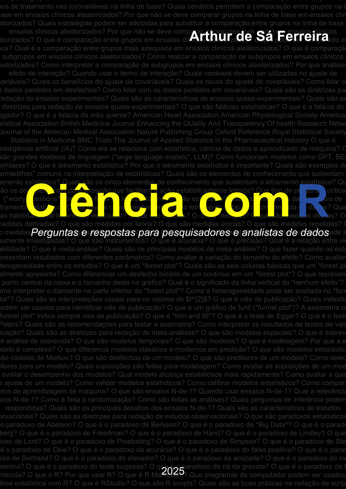

```{r, results = "hide", include = FALSE}
options(tinytex.compile.min_times = 3)
options(scipen = 999)
```

```{=latex}
\DisableFootNotes
```

```{r nojekyll, results = "hide", include = FALSE}
if(!file.exists(".nojekyll")) {
  file.create('.nojekyll')
}
```

```{r packages, echo = FALSE, results = 'hide', include = FALSE}
require("bookdown")
require("officedown")
require("flextable")
require("ftExtra")
library("dplyr")
```

```{r sumario, echo = FALSE, results = "asis", eval = knitr::pandoc_to("docx")}
# Table of contents
cat("\\newpage")
officer::block_toc(level = 2)
cat("\\newpage")
```

```{r copy-file, echo = FALSE, results = "hide", include = FALSE}
# PPTX file
file.copy(
  from = "Ciencia-com-R.pptx",
  to = "Office/Ciencia-com-R.pptx",
  overwrite = TRUE,
  recursive = FALSE,
  copy.mode = TRUE
)
try(unlink("Ciencia-com-R.pptx"), silent = TRUE)

# DOCX file
file.copy(
  from = "Ciencia-com-R.docx",
  to = "Office/Ciencia-com-R.docx",
  overwrite = TRUE,
  recursive = FALSE,
  copy.mode = TRUE
)
try(unlink("Ciencia-com-R.docx"), silent = TRUE
)
```

```{r cover-generator, echo = FALSE, include = FALSE, eval = knitr::is_html_output()}
source("R/cover_1_2.R", local = knitr::knit_global())
source("R/cover_4.R", local = knitr::knit_global())
```

```{r sobre, echo = FALSE, results = "asis", eval = knitr::is_html_output()}
cat('# **Capa** {.unnumbered}')
```

```{r capa, fig.align = 'right', echo = FALSE, results = "asis", include = identical(knitr:::pandoc_to(), 'html'), eval = knitr::is_html_output()}
cat('\n\n')
cat('<center>')
cat('')
cat('\n\n')
cat('</center>')
```

```{=latex}
\clearpage
\markboth{}{}
```

```{=latex}
\vspace*{\fill}
```

<br>

```{r license, echo = FALSE, results = "asis"}
if(knitr::is_html_output()){
  cat('<a rel="license" href="http://creativecommons.org/licenses/by-nc/4.0/"></a>')
  cat('<br>')
  cat('A versão online desta obra está licenciada com uma Licença <a rel="license" href="http://creativecommons.org/licenses/by-nc/4.0/">Creative Commons Atribuição-NãoComercial 4.0 Internacional.</a>')
  cat('<br>')
  cat('<br>')
  cat('<b>Ciência com R</b> por <b>Arthur de Sa Ferreira</b> está licenciada sob a <a rel="license" data-spdx="Apache-2.0></a>" href="https://www.apache.org/licenses/LICENSE-2.0">Apache License 2.0</a>.<br>')
  cat(paste0(' Atualizado em ', format(Sys.Date(), "%d/%m/%Y")))
  cat('<br>')
  cat('<br>')
}
```

```{r post, echo = FALSE, results = FALSE, warning = FALSE, message = FALSE, eval = FALSE}
# delete .PNG files from posts folder
delete_files <- list.dirs("posts", full.names = TRUE)
unlink(delete_files, recursive = TRUE)
# create folder "posts"
dir.create("posts", showWarnings = FALSE)

# source scripts
source(file.path("R", "parseRmd.R"), local = knitr::knit_global())
source(file.path("R", "savePost.R"), local = knitr::knit_global())

# read all file chapters
rmd_files <- list.files("rmd", pattern = "\\.Rmd$", full.names = TRUE)

# remove specific chapters
rmd_files <- rmd_files[!grepl("dedicatoria.Rmd", rmd_files)]
rmd_files <- rmd_files[!grepl("agradecimentos.Rmd", rmd_files)]
rmd_files <- rmd_files[!grepl("apresentacao.Rmd", rmd_files)]
rmd_files <- rmd_files[!grepl("autor.Rmd", rmd_files)]
rmd_files <- rmd_files[!grepl("parte-1.Rmd", rmd_files)]
rmd_files <- rmd_files[!grepl("parte-2.Rmd", rmd_files)]
rmd_files <- rmd_files[!grepl("parte-3.Rmd", rmd_files)]
rmd_files <- rmd_files[!grepl("parte-4.Rmd", rmd_files)]
rmd_files <- rmd_files[!grepl("parte-5.Rmd", rmd_files)]
rmd_files <- rmd_files[!grepl("parte-6.Rmd", rmd_files)]
rmd_files <- rmd_files[!grepl("parte-7.Rmd", rmd_files)]
rmd_files <- rmd_files[!grepl("parte-8.Rmd", rmd_files)]
rmd_files <- rmd_files[!grepl("parte-9.Rmd", rmd_files)]
rmd_files <- rmd_files[!grepl("parte-10.Rmd", rmd_files)]
rmd_files <- rmd_files[!grepl("apendice.Rmd", rmd_files)]
rmd_files <- rmd_files[!grepl("scripts.Rmd", rmd_files)]
rmd_files <- rmd_files[!grepl("referencias.Rmd", rmd_files)]

# read bib file
bib <- RefManageR::ReadBib(file.path("./bib", "references.bib"))

# loop over all chapters
for (k in seq_along(rmd_files)) {
  ParseRmdContent(rmd_files, bib, k)
}
```

<br>

```{r, echo=FALSE, warning=FALSE, results='asis', eval=knitr::is_html_output()}
cat(readLines("citation.html"), sep = "\n")
```

<br>
